---
# Informació general del document
title: 1. Introducció i configuració
lang: ca
page-background: img/bg.png
linkcolor: blue

# Portada
titlepage: true
titlepage-rule-height: 2
titlepage-rule-color: eeeee4
titlepage-text-color: eeeee4
titlepage-background: img/U1v.png

# Taula de continguts
toc: true
toc-own-page: true
toc-title: Continguts

# Capçaleres i peus
header-left: 1. Introducció i configuració
header-right: Curs 2024-2025
footer-left: CEFIRE FP
footer-right: \thepage/\pageref{LastPage}

# Imatges
float-placement-figure: H
caption-justification: centering

# Llistats de codi
listings-no-page-break: true
listings-disable-line-numbers: false

header-includes:
- |
  ```{=latex}
  \usepackage{lastpage}
  \usepackage{awesomebox}
  \usepackage{caption}
  \usepackage{array}
  \usepackage{tabularx}
  \usepackage{ragged2e}
  \usepackage{multirow}
  \usepackage{xcolor}

  ```
pandoc-latex-environment:
  noteblock: [note]
  tipblock: [tip]
  warningblock: [warning]
  cautionblock: [caution]
  importantblock: [important]
...

<!-- \awesomebox[violet]{2pt}{\faRocket}{violet}{Lorem ipsum…} -->

<!-- \awesomebox[violet]{2pt}{\faRobot}{violet}{Lorem ipsum…} -->

<!-- IMATGE { width=50% } -->

<!-- \textbf{greatest} -->

\vspace*{\fill}

{ width=30% }
Aquest document està subjecte a una llicència creative commons que permet la seua difusió i ús comercial reconeixent sempre l'autoria del seu creador. Aquest document es troba per a ser modificat al següent repositori de github:
<!-- CANVIAR L'ENLLAÇ -->
[https://github.com/arvicenteboix/kdenliveiobs_curs](https://github.com/arvicenteboix/kdenliveiobs_curs)
\newpage

# Introducció

<!-- Mòdul 1: Introducció i Configuració
Instal·lació i configuració inicial de Kdenlive i OBS
Introducció a les interfícies i eines bàsiques d'ambdós programes
Configuració de projectes i ajustos bàsics<br>
Mòdul 2: Gravació i Producció
Tècniques de gravació de pantalla amb OBS
Configuració de fonts de vídeo i àudio
Producció de contingut en temps real i gestió d'escenes<br>
Mòdul 3: Edició i Publicació
Importació de material gravat en Kdenlive
Edició bàsica de vídeo: talls, transicions i efectes
Exportació de vídeos en diferents formats i publicació en plataformes en línia -->

La creació de videotutorials es una ferramenta necessària per a la realizació de cursos en format semipresencial i moltes vegades en presencial també ja que es queden com una referència del que realment es vol realitzar.

En este mòdul començarem amb una introducció de los dos eines que anem a utilitzar en este curs: Kdenlive i OBS. A més, veurem com instal·lar-les i configurar-les per a començar a treballar amb elles. Farem un repàs de les interfícies i eines bàsiques de cada programa i veurem com configurar projectes i ajustos bàsics.

En aquest curs no ens centrarem en tots els aspectes que ens oferix OBS ni Kdenlive ja que són ferramentes molt poderoses i presentem moltíssimes característiques. Ens centrarem en com crear un videotutorial i en les ferramentes necessàries que ens poden fer falta per a realizar-lo. No espereu dominar el kdenlive ni elk OBS de manera profesional, este no és el propòsit d'este curs ja que existeixen ofertes sobre estes ferramente de manera espcífica. Al final del curs simplement vos demanarem que creeu un xicotet videotutorial que tracte algun aspecte de la vostra especialitat i el compartiu als vostres companys.

Hem de tenir en compte les caractrístiques fonamental de cadascun d'ells.

* OBS Studio: OBS Studio és un programari lliure i gratuït que ens permet gravar i retransmetre en directe. És una eina molt potent que ens permet gravar la pantalla del nostre ordinador.
* Kdenlive: Kdenlive és un editor de vídeo lliure i gratuït que ens permet editar vídeos de manera senzilla i intuïtiva. És una eina molt potent que ens permet editar vídeos de manera professional.

# Instal·lació de OBS Studio

El primer que hem de fer és instal·lar OBS. Per a instal·lar-lo simplement anem a la seua [pàgina web](https://obsproject.com/es) i descarreguem la versió que ens corresponga. 

{ width=50% }

En el cas d'una distribució Linux simplement podem instal·lar-lo des dels repositoris de la nostra distribució. Per exemple, en Ubuntu simplement hem d'executar la següent comanda:

```bash
sudo apt install obs-studio
```
:::note
Amb linux pots utilizar flathub per a instal·lar OBS Studio. Simplement has d'executar la següent comanda:

```bash
flatpak install flathub com.obsproject.Studio
```
:::

Si disposes d'un Mac has de tenir en compte que en funció del processador que tingues hauràs de descarregar una versió o una altra.

{ width=50% }

Quan comence el procçes d'instal·lació simplement hem de seguir els passos que ens indica el programa. Com que es tracta d'un programa on es poden realitzar tant sessions en directe com gravar sessions ens farà una sèrie de questions. En el nostra cas simplement hem de configurar-lo per a gravar sessions.

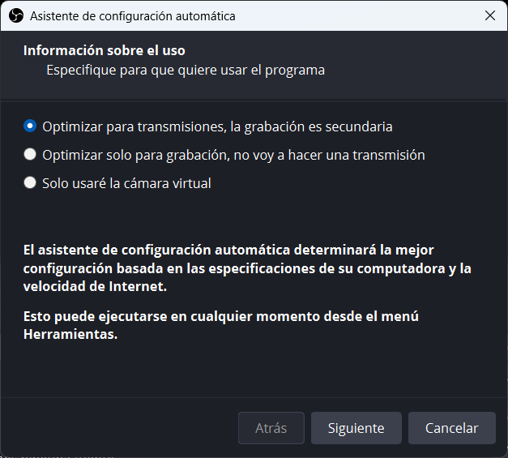{ width=50% }

{ width=50% }

{ width=50% }

# Instal·lació de Kdenlive

Per a instal·lar Kdenlive simplement anem a la seua [pàgina web](https://kdenlive.org/) i descarreguem la versió que ens corresponga. Fem clic en Download:

{ width=50% }

Opcions de descàrrega:

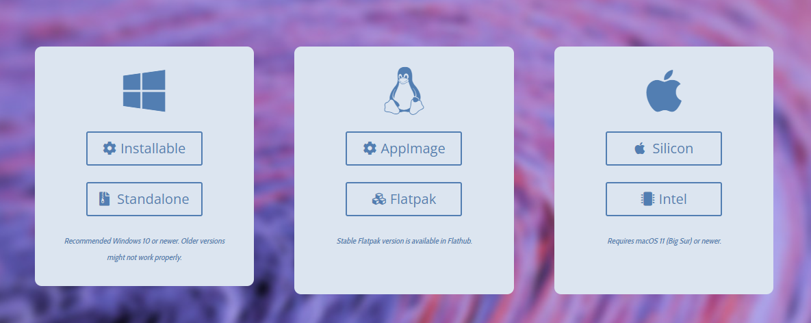{ width=50% }

Tenim diferennts opciones per a instal·lar Kdenlive als diferents sistemes operatius. En Windows tenim dos versions:

* Installable: És una versió que s'instal·la en el nostre sistema operatiu.
* Standalone: És una versió portable que no requereix instal·lació.

:::caution
Standalone ens pot servir per a fer ús del programa en aquells entorns que no s'ens permet instal·lar programari. Sempre és recomanables instal·lar la versió installable. És necessari dispossar d'un Sistema Operatiu actualitzat (Windows 10 o superior).
:::

En el cas d'una distribució Linux simplement podem instal·lar-lo des dels repositoris de la nostra distribució. Per exemple, en Ubuntu simplement hem d'executar la següent comanda:

```bash
sudo apt install kdenlive
```

La versió portable per a linux s'anomena AppImage. Simplement hem de descarregar l'arxiu i donar-li permisos d'execució:

```bash
chmod +x kdenlive-*.appimage
```

Existeix la versió flatpak de Kdenlive. Simplement hem d'executar la següent comanda:

```bash
flatpak install flathub org.kde.kdenlive
```

O fer clic en el botó Flatpak.

# Interfície de OBS

Quan inciem OBS per primera vegada ens apareixerà una pantalla com la següent:

{ width=80% }

A la imatge podem distingir diversos elements, els que anem a utilizar en aquest curs principalment seran:

* Escenes: Les escenes són conjunts de fonts de vídeo i àudio que podem mostrar en directe o gravar. Podem configurar diferents escenes per a mostrar diferents elements en cada moment.
* Fonts (elements de l'escena): Les fonts són els elements que podem mostrar en una escena. Poden ser des de la pantalla del nostre ordinador fins a una càmera web o un vídeo.
* Àudio: En aquesta secció podem configurar les fonts d'àudio que volem utilitzar en la nostra gravació.
* Previsualització: En aquesta secció podem veure com es veurà la nostra gravació en directe o com es veurà el vídeo que estem gravant.
* Controls: Ací hem resaltat dos botons que seran els que utilitzarem principalment, *Iniciar gravació* i *Iniciar càmera virtual*. El primer ens permetrà començar a gravar la nostra pantalla i el segon ens permetrà començar a utilitzar la càmera virtual.

:::tip
La càmera virtual ens permetrà afegir efectes en les sessions que fem en directe. També ens és útil per a gravar sessions, però en aquest cas la postedició ens pot facilitar més les coses.
:::

# Interfície de Kdenlive

La interfície de Kdenlive és un poc més complexa que la d'OBS. Quan obrim Kdenlive per primera vegada ens apareixerà una pantalla com la següent:

{ width=80% }

A la imatge podem distingir diversos elements, els que anem a utilitzar en aquest curs principalment seran:

* [1] Bandeja de projectes: Ací podem veure els projectes que tenim oberts i els que podem obrir.
* [2] Monitor de clips: Visualitzes el clip seleccionat.
* [3] Monitor de projecte: Visualitzes el projecte que estàs editant.
* [4] Composicions i efectes: Ací podem veure les composicions i efectes que podem afegir al nostre projecte. En el seu momento veurem quines diferències hi ha en cadascuna d'elles.
* [5] Línia de temps: Ací és on realitzarem la majoria de les nostres tasques. En la línia de temps podem afegir clips, efectes, transicions, etc.
* [6] Es tracta d'una panell on veurem els efectes i composicions afegits a un element del nostre projecte. Podem escollir elements como Audio, efectes/composicions[7], subtítols.
* [8] Barra de ferramentes de la línia de temps: Ací tenim les eines bàsiques per a editar la nostra línia de temps.

L'exemple mostrat està en anglès, pots canviar l'interfície a l'idioma que desitges en el menú de configuració.

{ width=50% }

## Barra de ferrametes

La barra de ferramentes de la línia de temps és una de les eines més importants de Kdenlive. Ací tenim les eines bàsiques per a editar la nostra línia de temps. Les eines més importants són:

{ width=80% }

Per altra banda, és recomanable que actives la barra de ferramentes general i addicional.

{ width=50% }

D'aquesta manera podrem veure la barra de ferramente general:

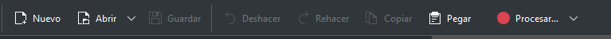{ width=70% }

Esta barra no té molt de misteri, però ens dona un accés directe a Procesar... que és l'última part del procés de creació d'un vídeo, renderitzar el projecte.

## Conceptes de Kdenlive

Hem vist ja un poc com és l'entorn del program, però hem de tenir clars una sèrie de conceptes bàsics per a poder realitzar les nostres tasques. Tots aquests cocneptes anireu tenint-los cada vegada més clars a messura que treballeu amb el programa.

* Composició: Es tracta d'efectes que afegim a la composició de la nostra línia de temps. Generalment es veuen implicats dos clips en estos efectes, necessiten d'un element per a fer l'altre. Els veurem representats per recuadres entre dos elements en un color morat:

{ width=50% }

* Efectes: Els efectes són transformacions que s'apliquen sobre un vídeo en concret de la línea de temps, retallar, difuminar, etc. Els veurem representats per una vareta amb el nom de l'efecte al costat. Quan seleccionem un video veurem que a la dreta ens apareixeran tots els efectes que té aplicats el vídeo:

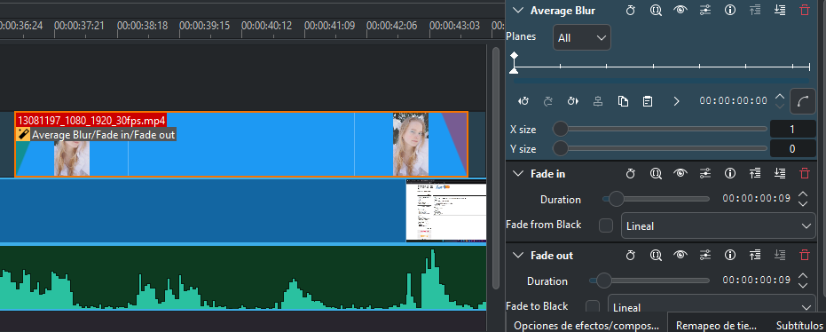{ width=50% }

Per a poder afegir efectes o composicions els seleccionem de la llista de composicions i efectes i els arrossegem a la línia de temps. Si volem afegir un efecte a un vídeo simplement hem de seleccionar el vídeo i arrossegar l'efecte a la línia de temps.

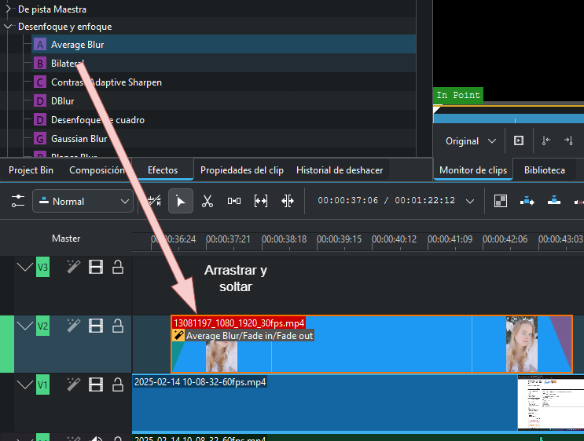{ width=50% }

# Configuracions inicials

En aquest punt anem a mostrar-vos com instal·lar una sèrie de complements que anem a utiltizar tant en kdenlive com en OBS. Hi ha moltíssima varietat de complements però ací hem seleccionat uns poc que pode ser útils.

Al curs anem a fer ús d'una sèrie de complements que ens permetran realitzar les nostres tasques de manera més eficient. Aquests complements són necessaris per a poder realitzar les tasques que ens proposem en el curs.

## OBS

### Background Removal

OBS disposa d'una pàgina on dispsossem diferent plugins que ens permeten realitzar tasques específiques. En el nostre cas necessitem el plugin Background Removal. Per a instal·lar-lo simplement hem de descarregar l'arxiu, depenent del sistema operatiu caldrà fer-ho d'una manera o altra. En primer lloc anem a la pàgina de [descàrrega](https://obsproject.com/forum/resources/background-removal-virtual-green-screen-low-light-enhance.1260/) i tenim una pàgina que ens duu a un repositori de github on teniu tota l'explicació del projecte i teniu un enllaç que vos durà a la descarrega d'uns arxius ja precompilats [ací](https://github.com/locaal-ai/obs-backgroundremoval/releases).

Si disposes del gestor de paqueteria flatpak simplement has d'executar la següent comanda. Recorda que en este cas has d'haver instal·lat el paquet de OBS Studio amb flatpak.

```bash
flatpak install com.obsproject.Studio.Plugin.BackgroundRemoval
```
### v4l2loopback (Linux)

Si disposes d'un sistema operatiu Linux necessitaràs instal·lar el paquet v4l2loopback. Aquest paquet ens permetrà crear dispositius de vídeo virtuals. Això ens permetrà utilitzar la càmera virtual en OBS.

```bash
sudo apt install v4l2loopback-dkms
```

Si tens alguna altra distribució simplement has de buscar el paquet en els repositoris de la teua distribució, per exemple en arch:

```bash
sudo pacman -S v4l2loopback-dkms
```

### LocalVocal

LocalVocal és un plugin que ens permetrà realitzar la transcripció de text en directe. És recomanable si teniu una GPU NVIDIA ja que fa ús de la tecnologia CUDA. Per a instal·lar-lo simplement anem a la pàgina de [descàrrega](https://obsproject.com/forum/resources/localvocal-local-live-captions-translation-on-the-go.1769/) i descarreguem l'arxiu corresponent al nostre sistema operatiu. Teniu l'enllaç en la mateixa pàgina.

:::note
OBS disposa de nombrosos plugins que vos poden ajudar a fer tasques concretes. Aquests plugins estan en constant evolució, si els enllaços no funcionen simplement busqueu en la pàgina de [recursos](https://obsproject.com/forum/resources/) de OBS i els bsuque, ja que probablement els hagen actualitzat.
:::

:::warning
No recomanem la seua instal·lació si no es disposa d'un ordinador veritablement potent amb targeta gràfica dedicada i amb CUDA.
:::

## Kdenlive

### Whisper i VOSK

Un dels elements a tenir en compte a l'hora de generar videotutorials és el de la creació de subtítols, la generació de subtítols realitzats de manera automàtica ens pot ajudar a la creació de contingut. Per a això farem ús de dos complements: Whisper[^1] i VOSK[^2]. Ambdós són bastant exactes, perà la diferència més importannt que veig és que en Vosk has de descarregat un model per a cada llengua, amb Whisper no. Això sí, el model de Whisper és molt més pesat.

Vos recomanem que instal·leu els dos models si és possible, moltes vegades per temes de versions de python, confiugració de l'ordinador, etc... pot donar problemes. Per a instal·lar-los anem al següent menú:

{ width=50% }

[^1]: [Whisper](https://openai.com/index/whisper/) és un model creat per OpenAI.
[^2]: [VOSK](https://alphacephei.com/vosk/) és un model creat per Alphacephei.

Podràs veure la següent pantalla:

{ width=50% }

I farem clic en "Configure" i ens pareixerà la següent pantalla:

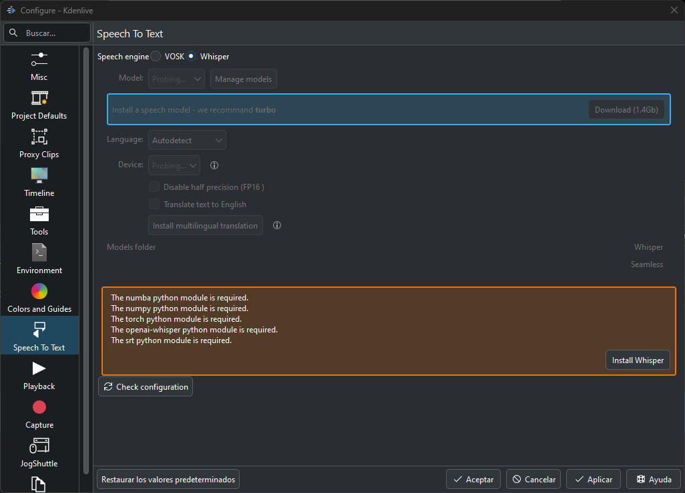{ width=50% }

:::tip
Si ja teniu instal·lat algun, cal que accediu a este menú des de Preferencias>Speech-to-text
:::

Vos apareixerà esta pantalla tant en VOSK com en Whisper on vos demanarà que instal·leu les dependències necessàries. Feu clic i el sistema ja vos instal·larà el que necessite per a poder cofigurar (compte que no instal·larà el model):

{ width=50% }

En el cas de VOSK, el model l'heu de configurar a mà, disposeu d'un enllaç que vos duu al lloc on podeu descarregar el model corresponent a la vostra llengua.

# Practiquem un poc

En aquest apartat no anem a realitzar cap projecte com a tal, sino que anem a practicar un poc amb el kdenlive i l'OBS.

## Grabem la pantalla amb OBS

Per a gravar la pantalla amb OBS el primer que fem es crear un nova escena. Ho fem fent clic eal botó "+" de la secció d'escenes:

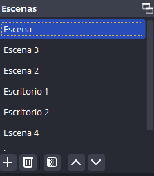{ width=50% }

Després a l'apartat de fonts afegim una nova font. En el nostre cas afegirem la pantalla del nostre ordinador:

{ width=50% }

Ens apareixerà una pantalla com la següent on podem donar un nom a la font:

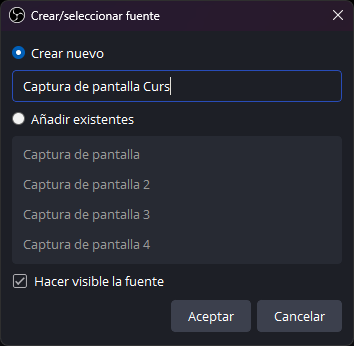{ width=50% }

Depenent de la quantitat de monitors que tingues pots seleccionar un o altre. En el nostre cas tenim 3 monitors.

{ width=50% }

:::tip
Pot resultar un tema baladí però recomane tenir al menys dos monitors per a treballar de manera adequada quan vas a editar vídeos.
:::

Ens assegurem que el so està actiu i que la pantalla es veu correctament. Si tot està correcte simplement hem de fer clic en "Iniciar gravació".

{ width=50% }

{ width=50% }

El vídeo grabat es guardarà en la carpeta de vídeos de l'usuari amb el nom que representa la data i l'hora de la gravació.

## Editem el nostre vídeo amb Kdenlive

Per a gravar amb kdenlive en primer lloc el qeu farem serà escollir el perfil del vídeo que volem crear. Per a això anem a "Opcions de projecte" i seleccionem el perfil que més s'ajuste a les nostres necessitats. En el nostre cas seleccionarem "HD 1080p 25fps".

{ width=50% }

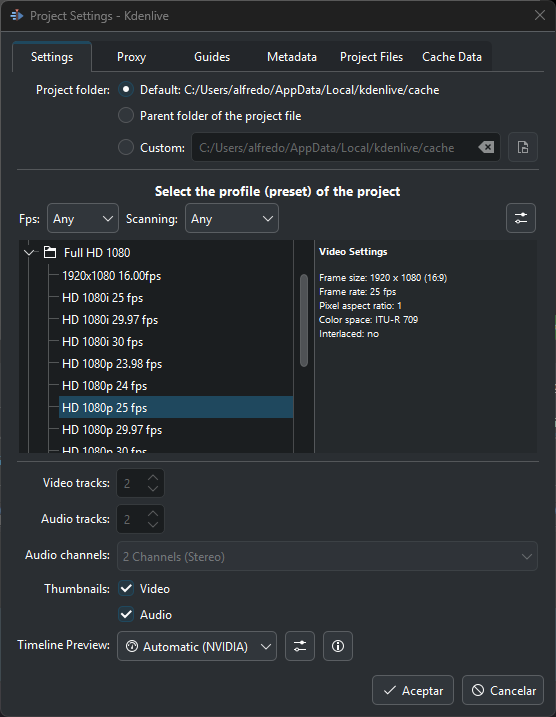{ width=50% }

:::tip
Què significa HD 1080p 25fps? HD significa que la resolució del vídeo serà de 1920x1080 píxels. 25fps significa que el vídeo tindrà 25 fotogrames per segon. És important modificar aquestes opcions en funció de les nostres necessitats, una opció que recomane si vas a gravar videotutorials és la de 16fps (a no ser que aparega algun vídeo). Per a mostrar el que fas en la pantalla és suficient i el pes del vídeo serà molt menor.
:::

:::warning
És molt important que aneu guardant el vostre projecte de manera regular. Els programes de edició de vídeo són molt pesats i poden donar problemes si no els guardem de manera regular.
:::

Ara ja podem arrastrar i soltar el nostre vídeo en la línea de temps:

{ width=50% }

Fixem-nos que moltes vegades ens apareixerà baix un recuadre que ens pregunta si volem adaptar el projecte al vídeo. En este cas OBS ha gravat el vídeo a 60 fps i ens recomana cambiar el perfil del nostre projecte a 60fps, li diguem que no. Una cosa que és mot recomanable és cambiar el vídeo a format editable:

{ width=50% }

Una cosa que podem fer si volem organitzar el vídeo en zones és extraure una zona del vídeo. Per a això simplement hem de seleccionar la zona que volem extraure i fer clic en "Extraure zona". Podem marcar el inici i el final de la zona que volem extraure:

{ width=50% }

{ width=50% }

Si en lloc d'extraure zona fem "zona a bandeja de projectes" la zona dependrà del vídeo original. Pots ser útil si volem delimitar varies zones d'un vídeo i tenim molts vídeos en el nostre projecte:

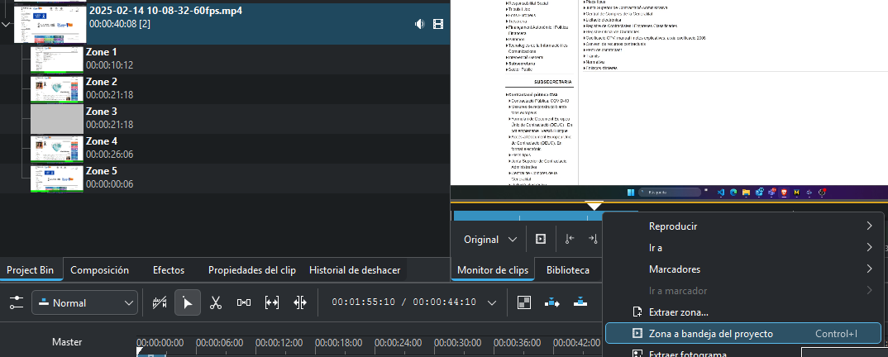{ width=70% }

El que anem a fer nosaltres serà simplement agafar el vídeo original i arrastrar-lo a la línia de temps. Després darrere afegirem dos zones aleatories:

{ width=70% }

Si volem afegir més pistes podem fer clic en el botó dret del ratolí i afegir una nova pista de vídeo o de so:

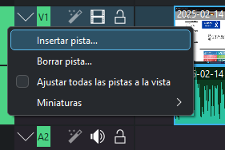{ width=50% }

**Com funcionen les pistes?**

Les pistes que están al capdamunt es veuran per damunt de les que estan més abaix. Les pistes no es poden arrastrar ni canviar d'ordre, però podem afegir una pista per damunt d'una altra i afegir-hi un element. Això farà que el nou element es veja per damunt de l'altre.

{ width=50% }

**La línia de temps**

Fixem-nos que tenim una guia que ens mostrarà la pantalla del com quedarà el vídeo al final una vegada aplicats els efectes. El resultat el podrem visualitzar en la pantalla de projecte (ubicada a la dreta):

{ width=50% }

Si ens fixem veurem que tenim el vídeo agrupat al so, podem desagrupar-los fent clic en el botó dret del ratolí i seleccionant "Desagrupar clips":

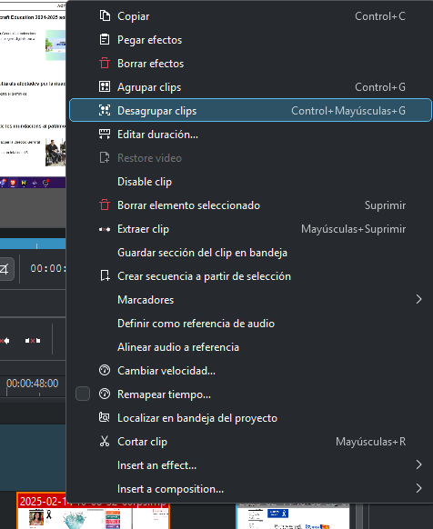{ width=50% }

Si posem un vídeo damunt d'altre veurem que el vídeo de dalt es veu per damunt del de baix.

{ width=50% }

La imatge que veiem és al següent:

{ width=50% }

Pero clar, això no és el que volem. El que volem fer és el següent:

* Llevar la part central del vídeo: per a això utilitzarem l'acció de tallar. Tal i com feien antigament quan tallaven el film de vídeo.
* Desplaçar el vídeo a l'esquerra: per a això utilitzarem l'acció de desplaçar. Es només seleccionar el video i moure'l.
* Afegir un efecte de transició: per a això utilitzarem l'acció de transició (fade in i fade out).
* Crear un difuminat al voltant del vídeo: per a això utilitzarem l'acció de **màscara forma alfa** i la composició **transformació**..

Per a tallar el vídeo simplement hem de fer clic en l'accio de tallar i seleccionar la part que volem tallar (veurem que ens apareix una línia roja):

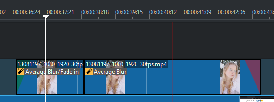{ width=50% }

:::caution
Quan tallem la ferramenta encara esta seleccionada, cal tornar a l'estat de selecció fent clic en la fletxa de la barra de ferramentes de la línia de temps o simplement polsant S. 
Cal tenir en compte també que quan tallem un vídeo que té efectes, les dos parts mantenen els efectes que hem aplicat.
:::

Ara ja podem seleccionar el clip tallat i desplaçar-lo a l'esquerra. També podem agrupar els dos clips per a que quan apliquem un efecte afecte a les dos parts. Això sím després cal editar cada efecte per separat (però podem copiar i pegar els efectes). Així que ens centrem en una de les dos parts del vídeo i després copiem i peguem els efectes.

Ara aplicarem els efectes fade-in i fade-out, que es enclarir i enfosquir el video. Com és un efecte molt utilitzat al cantó del vídeo seleccionat podem desplaçar una boleta i ja ens aplicacarà l'efecte:

{ width=50% }

Esta part és la més complexa i que explicarem més detalladament més endavant en el curs, així que no vos preoucupeu si ho vegeu massa complicat.

* Composició: Transformació

* Efecte: Màscara forma alfa

## Aplicant efectes de manera bàsica

Anem a cambiar un poc el que estàvem fent fins ara i començarem un projecte nou, vos recomane que seguiu el videotutorial que teniu penjat en Aules. Però hem agafat una base y una cara. ELs arrastrem i soltem a la nostra bandeja de projectes:

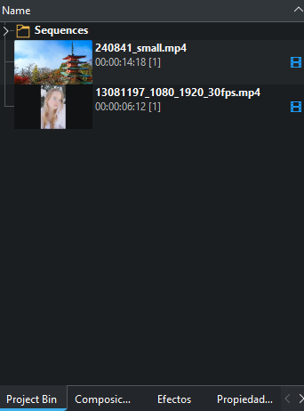{ width=50% }

Ara els arrastrem a la líne a de temps de la següent manera:

{ width=50% }

Una vegada tenim fet açò, apliquem l'efecte fade-in, fade-out com ja hem vist i arrastrem i soltem l'efecte de màscara forma alfa al vídeo de la xica:

{ width=50% }

Amb el requadre roig seleccionem com volem que s'aplique la màscara  i podem canviar la forma en **shape**, nosaltres li hem posat Ellipse.

{ width=50% }

Finalment en la Composició de de "Composició i transformació" podem variar la forma i la posició:

{ width=50% }

D'aquesta manera tindriem un projecte molt bàsic on ja hem tocat tots els elements esencials de Kdenlive.

### Generació de clips

Si fem clic en la "Crear títol" ens la bandeja de projecte ens apareixerà la següent pantalla:

{ width=50% }

{ width=50% }

Com vegeu, podem afegir text, imatges, etc. Això ens permetrà crear títols per a la nostra presentació. Si fem clic en "Crear títol" ens apareixerà un nou clip a la nostra bandeja de projectes. Nosaltres hem generat un text senzill i l'hem posat al centre de la pantalla. En background podem canviar el color del fons. L'afegim al principi del 

### Generació de vídeo

Finalment per a renderitzar el clip, fem clic en Procesar i ens apareixerà la següent pantalla. Pots fer clic en "More Options" per a que t'aparega completa:

{ width=50% }

Li diem on volem guardar el clip i amb quin nom i ja fem clic en "Render to file" i ja començarà a procesar el Vídeo. Es tracta d'un procés lent que pot tardar molt depenent dels efectes que hagem afegit al vídeo.

# Guardar projecte

Ja hem comentat que és important anar guardant el projecte de tant en tant, cal tenir en compte que quan es guarda un projecte es fa amb extensió .kdenlive, si compartixes eixe projecte, o tractes d'obrir-lo en un altre ordinador, cal que tingues en compte que el projecte ha de tindre tots els clips que has utilitzat en el projecte. Si no tens els clips en la mateixa ubicació que quan vas guardar el projecte, el projecte no es podrà obrir.

Per a evitar això pots "Arxivar" el projecte:

{ width=50% }

Quan aparega esta pantalla demana que et guarde el projecte en un arxiu .zip, d'eixa amnera ja tindràs el prokecte guardat amb tots els seus clips en un únic arxiu .zip. Podràs compartir-lo amb altres companys.

{ width=50% }

Finalment fas clic en "Archive" i ja tindràs el projecte guardat en un únic arxiu .zip.

# Repositoris de vídeos

Vos deixem una sèrie de repositoris on podeu trobar vídeos que vos poden ajudar a realitzar els vostres projectes:

* [Pexels](https://www.pexels.com/videos/)
* [Pixabay](https://pixabay.com/es/videos/)
* [Videvo](https://www.videvo.net/)
* [Coverr](https://coverr.co/)

:::caution
Fixeu-vos en les llicències del vídeos. Encara que gran part son de lliure ús, sempre és recomanable llegir-ne les condicions.
:::

[Efectes](https://docs.kdenlive.org/en/effects_and_filters/lists/video_effects_list.html)
[Composicions](https://docs.kdenlive.org/en/compositing/compositions.html)