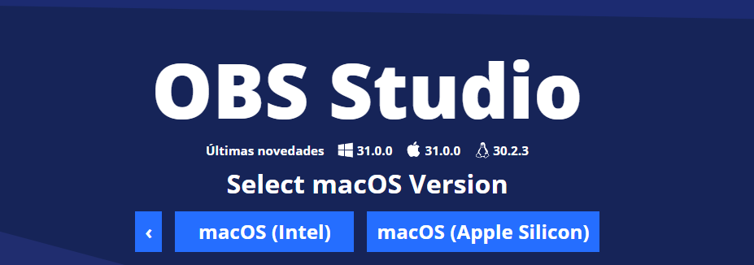
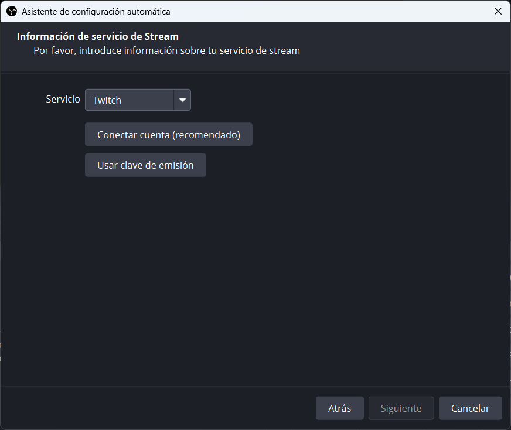
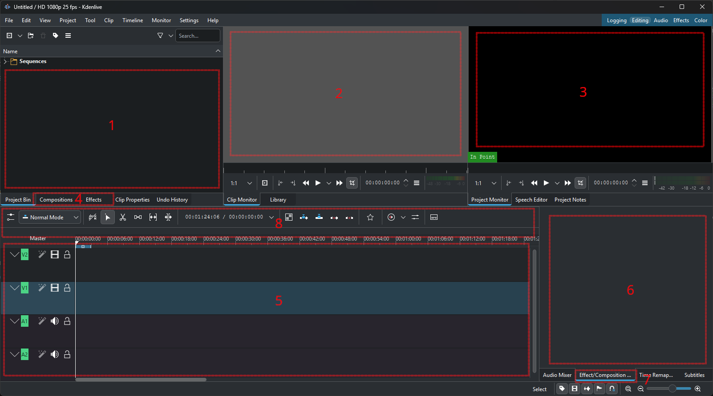
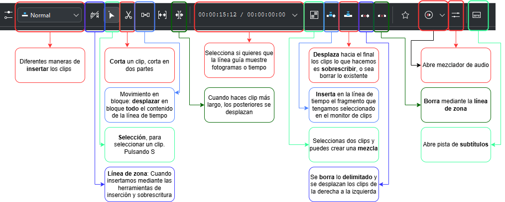
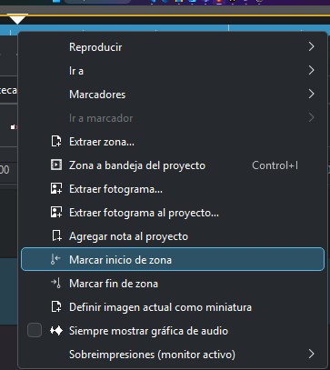
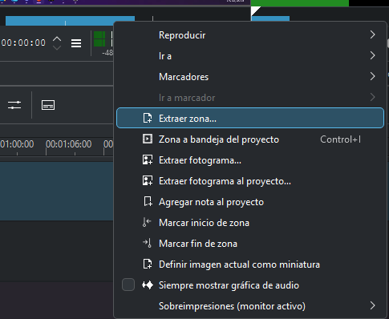
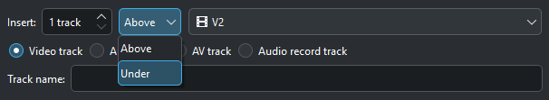
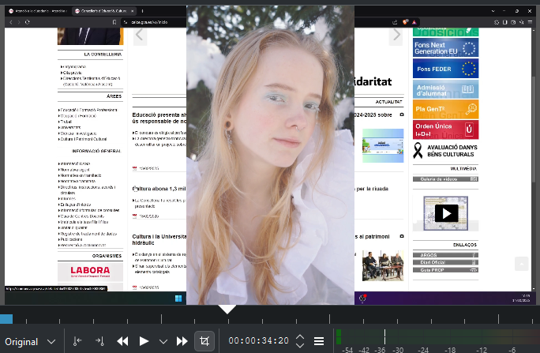

---
# Informació general del document
title: 1. Introducción y configuración
lang: es
page-background: img/bg.png
linkcolor: blue

# Portada
titlepage: true
titlepage-rule-height: 2
titlepage-rule-color: eeeee4
titlepage-text-color: eeeee4
titlepage-background: img/U1c.png

# Taula de continguts
toc: true
toc-own-page: true
toc-title: Contenidos

# Capçaleres i peus
header-left: 1. Introducción y configuración
header-right: Curso 2024-2025
footer-left: DGFP
footer-right: \thepage/\pageref{LastPage}

# Imatges
float-placement-figure: H
caption-justification: centering

# Llistats de codi
listings-no-page-break: true
listings-disable-line-numbers: false

header-includes:
- |
  ```{=latex}
  \usepackage{lastpage}
  \usepackage{awesomebox}
  \usepackage{caption}
  \usepackage{array}
  \usepackage{tabularx}
  \usepackage{ragged2e}
  \usepackage{multirow}
  \usepackage{xcolor}

  ```
pandoc-latex-environment:
  noteblock: [note]
  tipblock: [tip]
  warningblock: [warning]
  cautionblock: [caution]
  importantblock: [important]
...

<!-- \awesomebox[violet]{2pt}{\faRocket}{violet}{Lorem ipsum…} -->

<!-- \awesomebox[violet]{2pt}{\faRobot}{violet}{Lorem ipsum…} -->

<!-- IMATGE { width=50% } -->

<!-- \textbf{greatest} -->

\vspace*{\fill}

{ height=50px }
Este documento está sujeto a una licencia creative commons que permite su difusión y uso comercial reconociendo siempre la autoría de su creador. Este documento se encuentra para ser modificado en el siguiente repositorio de github:
<!-- CANVIAR L'ENLLAÇ -->
[https://github.com/arvicenteboix/kdenliveiobs_curs](https://github.com/arvicenteboix/kdenliveiobs_curs)
\newpage


# Introducción

<!-- Mòdul 1: Introducció i Configuració
Instal·lació i configuració inicial de Kdenlive i OBS
Introducció a les interfícies i eines bàsiques d'ambdós programes
Configuració de projectes i ajustos bàsics<br>
Mòdul 2: Gravació i Producció
Tècniques de gravació de pantalla amb OBS
Configuració de fonts de vídeo i àudio
Producció de contingut en temps real i gestió d'escenes<br>
Mòdul 3: Edició i Publicació
Importació de material gravat en Kdenlive
Edició bàsica de vídeo: talls, transicions i efectes
Exportació de vídeos en diferents formats i publicació en plataformes en línia -->
La creación de videotutoriales es una herramienta necesaria para la realización de cursos en formato semipresencial y muchas veces en presencial también puesto que se quedan como una referencia de lo que realmente se quiere realizar.

En este módulo empezaremos con una introducción de las dos herramientas que vamos a utilizar en este curso: Kdenlive y OBS. Además, veremos cómo instalarlas y configurarlas para empezar a trabajar con ellas. Haremos un repaso de las interfaces y herramientas básicas de cada programa y veremos cómo configurar proyectos y ajustes básicos.

En este curso no nos centraremos en todos los aspectos que nos ofrece OBS ni Kdenlive, ya que son herramientas muy poderosas y presentan muchísimas características. Nos centraremos en cómo crear un videotutorial y en las herramientas necesarias que pueden hacernos falta para realizarlo. No espere dominar el Kdenlive ni el OBS de forma profesional, éste no es el propósito de este curso ya que existen ofertas sobre estas herramientas de manera específica. Al final del curso simplemente le pediremos que cree un pequeño videotutorial que trate algún aspecto de su especialidad y lo comparta a sus compañeros.

Debemos tener en cuenta las características fundamentales de cada uno de ellos.

* OBS Studio: OBS Studio es un software libre y gratuito que nos permite grabar y retransmitir en directo. Es una herramienta muy potente que permite grabar la pantalla de nuestro ordenador.
* Kdenlive: Kdenlive es un editor de vídeo libre y gratuito que nos permite editar vídeos de forma sencilla e intuitiva. Es una herramienta muy potente que nos permite editar vídeos de forma profesional.

# Instalación de OBS Studio

Lo primero que debemos hacer es instalar OBS. Para instalarlo simplemente vamos a su [página web](https://obsproject.com/es) y descargamos la versión que nos corresponda.

{ width=50% }

En el caso de una distribución Linux, simplemente podemos instalarlo desde los repositorios de nuestra distribución. Por ejemplo, en Ubuntu simplemente debemos ejecutar el siguiente pedido:

```bash
sudo apt install obs-studio
```
:::note
Con linux puedes utilizar flathub para instalar OBS Studio. Simplemente debes ejecutar el siguiente pedido:

```bash
flatpak install flathub com.obsproject.Studio
```
:::

Si dispones de un Mac debes tener en cuenta que en función del procesador que tengas tendrás que descargar una versión u otra.

{ width=50% }

Cuando comience el proceso de instalación simplemente debemos seguir los pasos que nos indica el programa. Al tratarse de un programa donde se pueden realizar tanto sesiones en directo como grabar sesiones nos hará una serie de cuestiones. En nuestro caso simplemente debemos configurarlo para grabar sesiones.

{ width=50% }

{ width=50% }

{ width=50% }


# Instalación de Kdenlive

Para instalar Kdenlive simplemente vamos a su [página web](https://kdenlive.org/) y descargamos la versión que nos corresponda. Hacemos clic en Download:

{ width=50% }

Opciones de descarga:

{ width=50% }

Tenemos diferentes opciones para instalar Kdenlive en los distintos sistemas operativos. En Windows tenemos dos versiones:

* Instalable: Es una versión que se instala en nuestro sistema operativo.
* Standalone: ​​Es una versión portable que no requiere instalación.

:::caution
Standalone puede servirnos para hacer uso del programa en aquellos entornos que no se nos permite instalar software. Siempre es recomendable instalar la versión instalable. Es necesario disponer de un sistema operativo actualizado (Windows 10 o superior).
:::

En el caso de una distribución Linux, simplemente podemos instalarlo desde los repositorios de nuestra distribución. Por ejemplo, en Ubuntu simplemente debemos ejecutar el siguiente pedido:

```bash
sudo apt install kdenlive
```

La versión portable para linux se llama AppImage. Simplemente debemos descargar el archivo y darle permisos de ejecución:

```bash
chmod +x kdenlive-*.appimage
```

Existe la versión flatpak de Kdenlive. Simplemente debemos ejecutar el siguiente pedido:

```bash
flatpak install flathub org.kde.kdenlive
```

O hacer clic en el botón Flatpak.

# Interfaz de OBS

Cuando iniciemos OBS por primera vez nos aparecerá una pantalla como la siguiente:

{ width=80% }

En la imagen podemos distinguir varios elementos, los que vamos a utilizar en este curso principalmente serán:

* Escenas: Las escenas son conjuntos de fuentes de vídeo y audio que podemos mostrar en directo o grabar. Podemos configurar diferentes escenas para mostrar distintos elementos en cada momento.
* Fuentes (elementos de la escena): Las fuentes son los elementos que podemos mostrar en una escena. Pueden ser desde la pantalla de nuestro ordenador hasta una webcam o un vídeo.
* Audio: En esta sección podemos configurar las fuentes de audio que queremos utilizar en nuestra grabación.
* Previsualización: En esta sección podemos ver cómo se verá nuestra grabación en directo o cómo se verá el vídeo que estamos grabando.
* Controles: Aquí hemos destacado dos botones que serán los que utilizaremos principalmente, *Iniciar grabación* e *Iniciar cámara virtual*. El primero nos permitirá empezar a grabar nuestra pantalla y el segundo nos permitirá empezar a utilizar la cámara virtual.

:::tipo
La cámara virtual nos permitirá añadir efectos en las sesiones que realizamos en directo. También nos resulta útil para grabar sesiones, pero en este caso la postedición nos puede facilitar más las cosas.
:::

# Interfaz de Kdenlive

La interfaz de Kdenlive es algo más compleja que la de OBS. Cuando abramos Kdenlive por primera vez nos aparecerá una pantalla como la siguiente:

{ width=80% }

En la imagen podemos distinguir varios elementos, los que vamos a utilizar en este curso principalmente serán:

* [1] Bandeja de proyectos: Aquí podemos ver los elementos que tenemos abiertos y los que podemos abrir.
* [2] Monitor de clips: Visualizas el clip seleccionado.
* [3] Monitor de proyecto: Visualizas el proyecto que estás editando.
* [4] Composiciones y efectos: Aquí podemos ver las composiciones y efectos que podemos añadir a nuestro proyecto. En su momento veremos qué diferencias existen en cada una de ellas.
* [5] Línea de tiempo: Aquí es donde realizaremos la mayoría de nuestras tareas. En la línea de tiempo podemos añadir clips, efectos, transiciones, etc.
* [6] Se trata de una panel donde veremos los efectos y composiciones añadidos a un elemento de nuestro proyecto. Podemos elegir elementos como Audio, efectos/composiciones[7], subtítulos.
* [8] Barra de herramientas de la línea de tiempo: Aquí tenemos las herramientas básicas para editar nuestra línea de tiempo.

El ejemplo mostrado está en inglés, puedes cambiar el interfaz al idioma que desees en el menú de configuración.

{ width=50% }

## Barra de herramientas

La barra de herramientas de la línea de tiempo es una de las herramientas más importantes de Kdenlive. Aquí tenemos las herramientas básicas para editar nuestra línea de tiempo. Las herramientas más importantes son:

{ width=80% }

Por otra parte, es recomendable que active la barra de herramientas general y adicional.

{ width=50% }

De este modo podremos ver la barra de herramienta general:

{ width=70% }

Esta barra no tiene mucho misterio, pero nos da un acceso directo a Procesar... que es la última parte del proceso de creación de un vídeo, renderizar el proyecto.

## Conceptos de Kdenlive

Hemos visto ya algo como es el entorno del programa, pero debemos tener claros una serie de conceptos básicos para poder realizar nuestras tareas. Todos estos coneptos irán teniéndolos cada vez más claros a medida que trabaja con el programa.

* Composición: Se trata de efectos que añadimos a la composición de nuestra línea de tiempo. Generalmente se ven implicados dos clips en estos efectos, necesitan de un elemento para realizar el otro. Los veremos representados por recuadros entre dos elementos en un color morado:

{ width=50% }

* Efectos: Los efectos son transformaciones que se aplican sobre un vídeo en concreto de la línea de tiempo, recortar, difuminar, etc. Los veremos representados por una varilla con el nombre del efecto al lado. Al seleccionar un vídeo veremos que a la derecha nos aparecerán todos los efectos que tiene aplicados el vídeo:

{ width=50% }

Para poder añadir efectos o composiciones los seleccionamos de la lista de composiciones y efectos y los arrastramos a la línea de tiempo. Si queremos añadir un efecto a un vídeo simplemente debemos seleccionar el vídeo y arrastrar el efecto a la línea de tiempo.

{ width=50% }

# Configuraciones iniciales

En este punto vamos a mostrarle cómo instalar una serie de complementos que vamos a utilizar tanto en kdenlive como en OBS. Hay muchísima variedad de complementos pero aquí hemos seleccionado unos pocos que pueden ser útiles.

En el curso vamos a hacer uso de una serie de complementos que nos permitirán realizar nuestras tareas de forma más eficiente. Estos complementos son necesarios para poder realizar las labores que nos proponemos en el curso.

## OBS

### Background Removal

OBS dispone de una página en la que disponemos diferentes plugins que nos permiten realizar tareas específicas. En nuestro caso necesitamos el plugin Background Removal. Para instalarlo simplemente debemos descargar el archivo, dependiendo del sistema operativo habrá que hacerlo de una u otra forma. En primer lugar vamos a la página de [descarga](https://obsproject.com/forum/resources/background-removal-virtual-green-screen-low-light-enhance.1260/) y tenemos una página que nos lleva a un repositorio de github donde tienes la lista de archivos (https://github.com/locaal-ai/obs-backgroundremoval/releases).

Si dispones del gestor de paquetería flatpak simplemente debes ejecutar el siguiente pedido. Recuerda que en este caso debes instalar el paquete de OBS Studio con flatpak.

```bash
flatpak install com.obsproject.Studio.Plugin.BackgroundRemoval
```
### v4l2loopback (Linux)

Si dispones de un sistema operativo Linux necesitarás instalar el paquete v4l2loopback. Este paquete nos permitirá crear dispositivos de vídeo virtuales. Esto nos permitirá utilizar la cámara virtual en OBS.

```bash
sudo apt install v4l2loopback-dkms
```

Si tienes alguna otra distribución simplemente debes buscar el paquete en los repositorios de tu distribución, por ejemplo en arch:

```bash
sudo pacman -S v4l2loopback-dkms
```

### LocalVocal

LocalVocal es un plugin que nos permitirá realizar la transcripción de texto en directo. Es recomendable si tiene una GPU NVIDIA ya que hace uso de la tecnología CUDA. Para instalarlo simplemente vamos a la página de [descarga](https://obsproject.com/forum/resources/localvocal-local-live-captions-translation-on-the-go.1769/) y descargamos el archivo correspondiente a nuestro sistema operativo. Tiene el enlace en la misma página.

:::note
OBS dispone de numerosos plugins que pueden ayudarle a realizar tareas concretas. Estos plugins están en constante evolución, si los enlaces no funcionan simplemente busque en la página de [recursos](https://obsproject.com/forum/resources/) de OBS y los bsuque, ya que probablemente los hayan actualizado.
:::

:::warning
No se recomienda su instalación si no se dispone de un ordenador verdaderamente potente con tarjeta gráfica dedicada y con CUDA.
:::

## Kdenlive

### Whisper y VOSK

Uno de los elementos a tener en cuenta a la hora de generar videotutoriales es el de la creación de subtítulos, la generación de subtítulos realizados de forma automática nos puede ayudar a la creación de contenido. Para ello haremos uso de dos complementos: Whisper[^1] y VOSK[^2]. Ambos son bastante exactos, pero la diferencia más importante que veo es que en Vosk tienes que descargar un modelo para cada lengua, con Whisper no. Eso sí, el modelo de Whisper es mucho más pesado.

Le recomendamos que instale los dos modelos si es posible, muchas veces por temas de versiones de python, confiugración del ordenador, etc... puede dar problemas. Para instalarlos vamos al siguiente menú:

{ width=50% }

[^1]: [Whisper](https://openai.com/index/whisper/) es un modelo creado por OpenAI.
[^2]: [VOSK](https://alphacephei.com/vosk/) es un modelo creado por Alphacephei.

Podrás ver la siguiente pantalla:

{ width=50% }

Y haremos clic en "Configure" y nos parecerá la siguiente pantalla:

{ width=50% }

:::tipo
Si ya tiene instalado alguno, debe acceder a este menú desde Preferencias>Speech-to-text
:::

Le aparecerá esta pantalla tanto en VOSK como en Whisper donde le pedirá que instale las dependencias necesarias. Haga clic y el sistema ya le instalará lo que necesite para poder cofigurar (cuidado que no instalará el modelo):

{ width=50% }

En el caso de VOSK, el modelo debe configurarlo a mano, dispone de un enlace que se lleva al lugar donde puede descargar el modelo correspondiente a su lengua.

# Practicamos un poco
En este apartado no vamos a realizar ningún proyecto como tal, sino que vamos a practicar algo con el kdenlive y el OBS.

## Grabamos la pantalla con OBS

Para grabar la pantalla con OBS lo primero que hacemos es crear una nueva escena. Lo hacemos haciendo clic en el botón "+" de la sección de escenas:

{ width=50% }

Luego en el apartado de fuentes añadimos una nueva fuente. En nuestro caso añadiremos la pantalla de nuestro ordenador:

{ width=50% }

Nos aparecerá una pantalla como la siguiente donde podemos dar un nombre a la fuente:

{ width=50% }

Dependiendo de la cantidad de monitores que tengas puedes seleccionar uno u otro. En nuestro caso tenemos 3 monitores.

{ width=50% }

:::tipo
Puede resultar un tema baladí pero recomiendo tener al menos dos monitores para trabajar de manera adecuada cuando vas a editar vídeos.
:::

Nos aseguramos de que el sonido está activo y que la pantalla se ve correctamente. Si todo está correcto simplemente debemos hacer clic en "Iniciar grabación".

{ width=50% }

{ width=50% }

El vídeo grabado se guardará en la carpeta de vídeos del usuario con el nombre que representa la fecha y hora de la grabación.

## Editamos nuestro vídeo con Kdenlive

Para grabar con kdenlive en primer lugar lo que haremos será escoger el perfil del vídeo que queremos crear. Para ello vamos a "Opciones de proyecto" y seleccionamos el perfil que más se ajuste a nuestras necesidades. En nuestro caso seleccionaremos "HD 1080p 25fps".

{ width=50% }

{ width=50% }

:::tipo
¿Qué significa HD 1080p 25fps? HD significa que la resolución del vídeo será de 1920x1080 píxeles. 25fps significa que el vídeo tendrá 25 fotogramas por segundo. Es importante modificar estas opciones en función de nuestras necesidades, una opción que recomiendo si vas a grabar videotutoriales es la de 16fps (a menos que aparezca algún vídeo). Para mostrar lo que haces en la pantalla es suficiente y el peso del vídeo será mucho menor.
:::

:::warning
Es muy importante que vaya guardando su proyecto de forma regular. Los programas de edición de vídeo son muy pesados ​​y pueden dar problemas si no los guardamos de forma regular.
:::

Ahora ya podemos arrastrar y soltar nuestro vídeo en la línea de tiempo:

{ width=50% }

Fijémonos en que muchas veces nos aparecerá bajo un recuadro que nos pregunta si queremos adaptar el proyecto al vídeo. En este caso OBS ha grabado el vídeo a 60 fps y nos recomienda cambiar el perfil de nuestro proyecto a 60 fps, le digamos que no. Algo muy recomendable es cambiar el vídeo a formato editable:

{ width=50% }

Algo que podemos hacer si queremos organizar el vídeo en zonas es extraer una zona del vídeo. Para ello simplemente debemos seleccionar la zona que queremos extraer y hacer clic en "Extraer zona". Podemos marcar el inicio y el final de la zona que queremos extraer:

{ width=50% }

{ width=50% }

Si en lugar de extraer zona hacemos "zona a bandeja de proyectos" la zona dependerá del vídeo original. Puedes ser útil si queremos delimitar varias zonas de un vídeo y tenemos muchos vídeos en nuestro proyecto:

{ width=70% }

Lo que vamos a hacer nosotros será simplemente tomar el vídeo original y arrastrarlo a la línea de tiempo. Después detrás añadiremos dos zonas aleatorias:

{ width=70% }

Si queremos añadir más pistas podemos hacer clic en el botón derecho del ratón y añadir una nueva pista de vídeo o de sonido:

{ width=50% }

**¿Cómo funcionan las pistas?**

Las pistas que están en lo alto se verán por encima de las que están más abajo. Las pistas no pueden arrastrarse ni cambiarse de orden, pero podemos añadir una pista por encima de otra y añadir un elemento. Esto hará que el nuevo elemento se vea por encima del otro.

{ width=50% }
**La línea de tiempo**

Fijémonos en que tenemos una guía que nos mostrará la pantalla del cómo quedará el vídeo al final una vez aplicados los efectos. El resultado lo podremos visualizar en la pantalla de proyecto (ubicada a la derecha):

{ width=50% }

Si nos fijamos veremos que tenemos el vídeo agrupado en el sonido, podemos desagruparlos haciendo clic en el botón derecho del ratón y seleccionando "Desagrupar clips":

{ width=50% }

Si ponemos un vídeo encima de otro veremos que el vídeo de arriba se ve por encima del de abajo.

{ width=50% }

La imagen que vemos es lo siguiente:

{ width=50% }

Pero claro, esto no es lo que queremos. Lo que queremos hacer es lo siguiente:

* Quitar la parte central del vídeo: para ello utilizaremos la acción de cortar. Tal y como hacían antiguamente cuando cortaban el filme de vídeo.
* Desplazar el vídeo a la izquierda: para ello utilizaremos la acción de desplazar. Es sólo seleccionar el vídeo y moverlo.
* Añadir un efecto de transición: para ello utilizaremos la acción de transición (fade in y fade out).
* Crear un difuminado alrededor del vídeo: para ello utilizaremos la acción de **máscara forma alfa** y la composición **transformación**.

Para cortar el vídeo simplemente debemos hacer clic en la acción de cortar y seleccionar la parte que queremos cortar (veremos que nos aparece una línea roja):

{ width=50% }

:::caution
Cuando cortamos la herramienta todavía está seleccionada, es necesario volver al estado de selección haciendo clic en la flecha de la barra de herramientas de la línea de tiempo o simplemente pulsando S.
Hay que tener en cuenta también que al cortar un vídeo que tiene efectos, ambas partes mantienen los efectos que hemos aplicado.
:::

Ahora podemos seleccionar el clip cortado y desplazarlo a la izquierda. También podemos agrupar los dos clips para que cuando apliquemos un efecto afecto a ambas partes. Esto sí después hay que editar cada efecto por separado (pero podemos copiar y pegar los efectos). Así que nos centramos en una de las dos partes del vídeo y después copiamos y pegamos los efectos.

Ahora aplicaremos los efectos fade-in y fade-out, que escalrece y oscurece el video. Como es un efecto muy utilizado en la esquina del vídeo seleccionado podemos desplazar una bolita y ya nos aplicará el efecto:

{ width=50% }

Esta parte es la más compleja y que explicaremos más detalladamente más adelante en el curso, así que no se preocupe si lo ve demasiado complicado.

* Composición: Transformación

* Efecto: Máscara forma alfa

## Aplicando efectos de forma básica

Vamos a cambiar un poco lo que estábamos haciendo hasta ahora y empezaremos un proyecto nuevo, le recomiendo que siga el videotutorial que tiene colgado en Aules. Hemos cogido una base y una cara. Las arrastramos y soltamos en nuestra bandeja de proyectos:

{ width=50% }

Ahora los arrastramos en la línea a de tiempo de la siguiente manera:

{ width=50% }

Una vez tenemos hecho esto, aplicamos el efecto fade-in, fade-out como ya hemos visto y arrastramos y soltamos el efecto de máscara forma alfa en el vídeo de la chica:

{ width=50% }

Con el recuadro rojo seleccionamos cómo queremos que se aplique la máscara y podemos cambiar la forma en **shape**, nosotros le hemos puesto Ellipse.

{ width=50% }

Por último en la Composición de de "Composición y transformación" podemos variar la forma y la posición:

{ width=50% }

De esta forma tendríamos un proyecto muy básico en el que ya hemos tocado todos los elementos esenciales de Kdenlive.

### Generación de clips

Si hacemos clic en la "Crear título" nos la bandeja de proyecto nos aparecerá la siguiente pantalla:

{ width=50% }

{ width=50% }

Como veis, podemos añadir texto, imágenes, etc. Esto nos permitirá crear títulos para nuestra presentación. Si hacemos clic en "Crear título" nos aparecerá un nuevo clip en nuestra bandeja de proyectos. Nosotros hemos generado un texto sencillo y lo hemos puesto en el centro de la pantalla. En background podemos cambiar el color del fondo.

### Generación de vídeo

Por último para renderizar el clip, hacemos clic en Procesar y nos aparecerá la siguiente pantalla. Puedes hacer clic en "More Options" para que te aparezca completa:

{ width=50% }

Le decimos dónde queremos guardar el clip y con qué nombre y ya hacemos clic en "Render to file" y ya empezará a procesar el vídeo. Se trata de un proceso lento que puede tardar mucho dependiendo de los efectos que hayamos añadido al vídeo.

# Guardar proyecto

Ya hemos comentado que es importante ir guardando el proyecto de vez en cuando, hay que tener en cuenta que cuando se guarda un proyecto se realiza con extensión .kdenlive, si compartes ese proyecto, o tratas de abrirlo en otro ordenador, debes tener en cuenta que el proyecto debe tener todos los clips que has utilizado en el proyecto. Si no tienes los clips en la misma ubicación que cuando guardaste el proyecto, el proyecto no podrá abrirse.

Para evitar esto puedes "Archivar" el proyecto:

{ width=50% }

Cuando aparezca esta pantalla pide que te guarde el proyecto en un archivo .zip, de esa manera ya tendrás el proyecto guardado con todos sus clips en un único archivo .zip. Podrás compartirlo con otros compañeros.

{ width=50% }

Por último haces clic en "Archive" y ya tendrás el proyecto guardado en un único archivo .zip.

# Repositorios de vídeos

Os dejamos una serie de repositorios donde puede encontrar vídeos que le pueden ayudar a realizar sus proyectos:

* [Pexels](https://www.pexels.com/videos/)
* [Pixabay](https://pixabay.com/es/videos/)
* [Videvo](https://www.videvo.net/)
* [Coverr](https://coverr.co/)

:::caution
Fíjese en las licencias de vídeos. Aunque gran parte son de libre uso, siempre es recomendable leer sus condiciones.
:::

[Efectos](https://docs.kdenlive.org/en/effects_and_filters/lists/video_effects_list.html)
[Composiciones](https://docs.kdenlive.org/en/compositing/compositions.html)
