---
# Información general del documento
title: 1. Introducción. Conceptos iniciales
lang: es
page-background: img/bg.png
linkcolor: blue

# Portada
titlepage: true
titlepage-rule-height: 2
titlepage-rule-color: eeeee4
titlepage-text-color: eeeee4
titlepage-background: img/U1c.png

# Tabla de contenidos
toque: true
toque-own-page: true
toque-title: Contenidos

# Cabeceras y pies
header-left: 1. Introducción. Conceptos iniciales
header-right: Curso 2024-2025
footer-left: CEFIRE FP
footer-right: \thepage/\pageref{LastPage}

# Imágenes
float-placement-figuro: H
caption-justification: centering

# Listados de código
listings-no-page-break: true
listings-disable-line-numbers: false

header-includes:
- |
  ```{=latex}
  \usepackage{lastpage}
  \usepackage{awesomebox}
  \usepackage{caption}
  \usepackage{array}
  \usepackage{tabularx}
  \usepackage{ragged2e}
  \usepackage{multirow}
  \usepackage{xcolor}

  ```
pandoc-latex-environment:
  noteblock: [note]
  tipblock: [tip]
  warningblock: [warning]
  cautionblock: [caution]
  importantblock: [important]
...

<!-- \awesomebox[violet]{2pt}{\faRocket}{violet}{Lorem ipsum…} -->

<!-- \awesomebox[violet]{2pt}{\faRobot}{violet}{Lorem ipsum…} -->

<!-- IMATGE  -->

<!-- \textbf{greatest} -->

\vspace{\fill}

{ height=50px }

Este documento está sujeto a una licencia creative commons que permite su difusión y uso comercial reconociendo siempre la autoría de su creador. Este documento se encuentra para ser modificado en el siguiente repositorio de github:
<!-- CANVIAR L'ENLLAÇ -->
[https://github.com/arvicenteboix/AICurs25](https://github.com/arvicenteboix/AICurs25)
\newpage

# Introducción

Seguramente muchos de vosotros ya habéis oído hablar de la inteligencia artificial y de todo lo que puede hacer. Algunos ya habéis empezado a utilizarla en vuestro día a día y sabéis distinguir algunos conceptos sobre qué es la IA. En este curso trataremos de haceros una introducción sobre las diferentes herramientas que existen y cómo sacarles provecho.

Se trata de un curso de iniciación y es posible que os sintáis abrumados por toda la información que veis, pero no se os pide que profundicéis en muchas de las utilidades que os presentaremos. El curso será breve pero intenso, y trataremos de ayudaros con todas las dudas que se planteen. Todo el texto escrito está redactado sin utilizar inteligencia artificial, aunque algunas imágenes son la excepción. En muchos casos os proporcionaremos un prompt[^1] y la respuesta que obtendréis. Trataremos de limitar la extensión a lo que realmente necesitéis. Os lo presentaremos con el siguiente icono.

[^1]: Prompt es el texto que escribes en la plataforma para que interprete lo que realmente necesitas. Entraremos en más detalle en la próxima unidad.

\awesomebox[violet]{2pt}{\faRobot}{violet}{\textbf{¡Bienvenidos al curso de Introducción a la Inteligencia Artificial! Este curso de 30 horas está diseñado para aquellos que desean aprender los fundamentos de la IA y sus aplicaciones prácticas. A través de seis módulos, cubrimos una amplia gama de temas, desde conceptos básicos hasta herramientas más avanzadas.}\hfill \break

¡Bienvenidos al curso de Introducción a la Inteligencia Artificial! Este curso de 30 horas está diseñado para aquellos que desean aprender los fundamentos de la IA y sus aplicaciones prácticas. A través de seis módulos, cubrimos una amplia gama de temas, desde conceptos básicos hasta herramientas más avanzadas.

La IA es una de las áreas más emocionantes e innovadoras de la informática, con el potencial de transformar muchos aspectos de nuestra sociedad. Aprenderás a crear modelos de lenguaje natural, utilizar Microsoft Copilot para escribir código más eficiente y aplicar la IA en la educación.

Este curso está diseñado para estudiantes con conocimientos previos en programación, matemáticas discretas y álgebra lineal. No se requiere experiencia previa en IA, aunque se recomienda tener nociones de estadística y cálculo. El curso será impartido en valenciano, con material complementario en inglés.}

:::note
Se trata de una respuesta de inteligencia artificial. Debido a la complejidad del trabajo, no sería posible escribir un modelo desde cero sin mucho tiempo y esfuerzo.
:::

:::warning
Se recomienda crear un cuenta de correo electrónico específica para experimentar con estas herramientas y servicios. Esto permitirá mantener tu cuenta principal libre de correos electrónicos no deseados y proteger tu privacidad. Puedes utilizar proveedores de correo electrónico como Gmail, Outlook o cualquier otro servicio gratuito para este propósito.
:::

# Qué es y qué no es la inteligencia artificial?

Podemos pensar que todo lo que hacemos en el ordenador tiene que ver con la inteligencia artificial, pero obviamente no es así. Los ordenadores utilizan algoritmos con lenguajes de programación para poder automatizar tareas o realizar programas. Los algoritmos son una serie de pasos que se siguen para realizar una tarea. Aquí tenéis un ejemplo de diagrama de flujo sencillo que muestra un proceso::

<!-- DIAGRAMA DE FLUJO -->
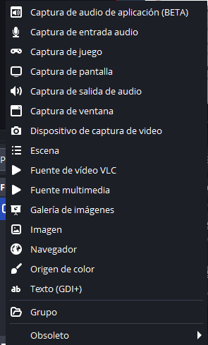{ height=300px }

Estas funciones llevan una lógica detrás, en cambio las IA utilizan un modo de programación diferente que mezcla muchas más posibilidades para dar una respuesta más creativa basándose en entradas más complejas, a esto lo llamamos redes neuronales. Aquí tenemos un ejemplo de red neuronal

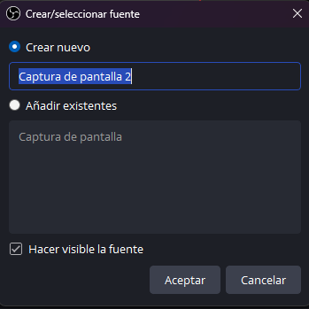{ height=300px }

Existe una clase de arquitectura llamada **modelos de transformadores** que se basan en redes neuronales. Estos modelos son capaces de aprender patrones en los datos y generar respuestas más complejas. Aunque no profundizaremos en cómo funcionan, es importante que sepáis que existen.

:::note
La Inteligencia Artificial (IA) es un campo amplio que incluye diferentes técnicas y algoritmos para crear sistemas que puedan simular la inteligencia humana. Las redes neuronales son una de las técnicas de IA que imitan el funcionamiento del cerebro humano para resolver problemas
:::

Dentro del mismo campo de la inteligencia artificial nos podemos encontrar diferentes categorías que iremos viendo a lo largo de los próximos años.

| Tipo de IA | Descripción | Ejemplos |
| --- | --- | --- |
| **Inteligencia Artificial Estrecha (IAE)** | La IAE está programada para realizar una sola tarea, ya sea verificar el clima, jugar al ajedrez o analizar datos para escribir informes periodísticos. Los sistemas IAE pueden atender una tarea en tiempo real, pero extraen información de un conjunto de datos específico. No funcionan fuera de la única tarea para la cual están diseñados. | Asistentes virtuales como Siri o Alexa, sistemas de reconocimiento facial, coches autónomos. |
| **Inteligencia Artificial General (IAG)** | La IAG es una forma de IA que puede aprender y entender cualquier tarea intelectual que un ser humano pueda realizar. La IAG es capaz de razonar, planificar, aprender, comprender lenguajes naturales e integrar diversos conocimientos para resolver problemas complejos. | Aún en desarrollo, objeto de investigación académica. |
| **Inteligencia Artificial Superintelectual (IAS)** | La IAS se refiere a una IA que sobrepasa la inteligencia y capacidades cognitivas de todos los humanos en prácticamente todos los campos, incluyendo creatividad científica, sabiduría general y habilidades sociales. | Teóricamente posible, pero aún no existe; concepto popularizado por científicos e futuristas como Nick Bostrom[^2]. |

[^2]: https://es.wired.com/articulos/nick-bostrom-hizo-al-mundo-temer-por-la-ia-ahora-pregunta-y-si-es-la-solucion-a-todos-nuestros-problemas

## Modelos de Lenguaje a Gran Escala

Los Modelos de Lenguaje a Gran Escala (LLM, por las siglas en inglés, Large Language Models) son modelos de inteligencia artificial que han sido entrenados con enormes cantidades de datos textuales para aprender patrones, estructuras y representaciones del lenguaje natural. Estos modelos son capaces de realizar tareas relacionadas con el procesamiento del lenguaje, como entender el significado de frases, generar texto coherente y responder preguntas.

Algunos de los modelos de lenguaje a gran escala más conocidos son:

1. **RoBERTa (Robustly Optimized BERT Approach)**: Una variante de BERT desarrollada por Facebook AI, que está optimizada para obtener mejor rendimiento en diversas tareas del lenguaje natural.
   
2. **XLNet**: Creado por Google Brain, este modelo combina los mejores elementos de BERT y autoencoders secuenciales para mejorar la comprensión de contextos largos en tareas de lenguaje natural.

3. **ALBERT (A Lite BERT)**: Desarrollado por Google Research, es una versión más ligera de BERT que utiliza menos recursos computacionales manteniendo el rendimiento.

4. **DistilBERT**: Creado por Hugging Face, este modelo es una versión más pequeña y eficiente de BERT que conserva el 97% del rendimiento con solo el 60% del peso del modelo original.

5. **Electra**: También desarrollado por Google, este modelo utiliza una nueva técnica de entrenamiento para hacer modelos más eficientes y con un rendimiento mejor en tareas de lenguaje natural.

6. **GPT-Neo**: Un modelo de código abierto desarrollado por EleutherAI como alternativa a GPT-3, disponible para la comunidad de investigación y desarrollo.

7. **Megatron-LM**: Desarrollado por NVIDIA, es un modelo de gran escala entrenado con una versión mejorada de transformers, optimizado para GPU de NVIDIA.

8. **Turing-NLG**: Desarrollado por Microsoft, este modelo es uno de los modelos más poderosos de lenguaje natural de gran escala creado para tareas complejas de IA.

9.  **GPT-3 y 4** (Generative Pre-trained Transformer) de OpenAI
    
10. **BERT** (Bidirectional Encoder Representations from Transformers) de Google
    
11. **T5** (Text-to-Text Transfer Transformer) de Google.

12. **Llama** de Meta: Un modelo de lenguaje a gran escala desarrollado por Meta (anteriormente Facebook) que se centra en la eficiencia y la sostenibilidad.

:::note
No es importante que conozcáis estos Nombres pero cuando usemos diferentes modelos en el próximo módulo veremos como usarlos. 
:::

Estos son solo algunos de los muchas versiones de LLM que están ayudando a avanzar la investigación y aplicaciones en el campo de la inteligencia artificial.

Algunas aplicaciones destacadas de los LLM son:

1. **Generación de Texto Creativo**: LLM como GPT-3 pueden usarse para generar contenido textual creativo, desde poesía hasta narrativa.
2. **Asistentes Virtuales Avanzados**: LLM se integran en asistentes virtuales para mejorar la capacidad de comprensión y generación de respuestas en lenguaje natural.
3. **Traducción Automática Mejorada**: Modelos como T5 han demostrado mejoras significativas en tareas de traducción automática.
4. **Generación de Resúmenes Automáticos**: LLM son empleados para resumir automáticamente textos largos, extrayendo información clave.
5. **Preguntas y Respuestas**: Modelos como BERT se utilizan en sistemas de preguntas y respuestas para entender y responder consultas en lenguaje natural.
6. **Análisis de Sentimiento Avanzado**: LLM pueden mejorar la capacidad de analizar el sentimiento en grandes cantidades de texto, beneficiando aplicaciones en redes sociales y comentarios en línea.
7. **Autocompletado de Texto Mejorado**: Herramientas de autocompletado, como las utilizadas en correos electrónicos o búsquedas en la web, se benefician de la capacidad predictiva de los LLM.
8. **Creación de Contenido Multimedio**: LLM pueden combinarse con otros modelos de inteligencia artificial para crear contenido multimedió, como imágenes, vídeos o audio, a partir de texto.

9. **Creación de Contenido para Redes Sociales**: Los LLM se utilizan para generar contenido relevante y atractivo en plataformas de redes sociales.

10. **Reconocimiento de Entidades Mejorado**: Modelos como GPT-3 pueden ayudar en la identificación y clasificación precisa de entidades en textos.

11. **Personalización de Recomendaciones**: Los LLM contribuyen a mejorar la personalización en sistemas de recomendación en áreas como streaming y comercio electrónico.

Estas aplicaciones resaltan cómo los LLM están transformando la forma en que las máquinas interactúan con el lenguaje humano, abriendo nuevas posibilidades en diversas áreas.


## Modelos de Difusión

Los modelos de difusión, como DALL-E, son modelos generativos avanzados que utilizan técnicas de difusión para generar imágenes. Estos modelos se basan en la difusión probabilística, que es un proceso estocástico para generar datos complejos paso a paso. En lugar de generar directamente píxeles de una imagen, los modelos de difusión generan una imagen al "difundiendo" gradualmente información a través de múltiples pasos, lo que permite capturar patrones complejos y estructuras en los datos.

## Modelos de difusión

Los modelos de difusión, como DALL-E, son modelos generativos avanzados que utilizan técnicas de difusión para generar imágenes. Estos modelos se basan en la difusión probabilística, que es un proceso estocástico para generar datos complejos paso a paso. En lugar de generar directamente píxeles de una imagen, los modelos de difusión generan una imagen "difundiendo" gradualmente información a través de múltiples pasos, lo cual permite capturar patrones complejos y estructuras en los datos.

Ejemplos de modelos de difusión incluyen:

| Modelo de Difusión | Descripción |
| --- | --- |
| **DALL-E** | Desarrollado por OpenAI, DALL-E es conocido por generar imágenes creativas a partir de descripciones textuales. Puede crear imágenes realistas y únicas a partir de conceptos específicos. |
| **MidJourney** | Otro modelo de difusión que se centra en la generación de imágenes a través de procesos de difusión probabilística. Puede utilizarse para crear imágenes realistas y detalladas. |
| **Stable Diffusion** | Un enfoque de difusión que busca lograr una difusión más estable y eficiente en términos de entrenamiento y generación de imágenes. |
| **Imagen** | Desarrollado por Google Research, es un modelo de difusión que genera imágenes a partir de descripciones textuales con una calidad de alta fidelidad. Utiliza técnicas de difusión avanzadas para mejorar la nitidez y el detalle de las imágenes generadas. |
| **VQ-VAE-2** | Un modelo de difusión basado en VQ-VAE (Vector Quantized Variational Autoencoder), utilizado para la generación de datos visuales de alta calidad. Es conocido por su capacidad de generar imágenes con detalle fino y colores vivos. |
| **BigGAN** | Desarrollado por Google, BigGAN es un modelo de red adversaria generativa que utiliza técnicas de difusión para generar imágenes de alta calidad con resoluciones elevadas. Es utilizado para aplicaciones donde se requieren imágenes realistas y detalladas. |
| **DDPM** | Denoising Diffusion Probabilistic Models (DDPM) son modelos de difusión probabilística que eliminan el ruido de manera progresiva para generar imágenes nítidas. Se utilizan en diversas aplicaciones de generación de imágenes. |

Estos modelos de difusión tienen aplicaciones en varias áreas, incluyendo:

1. **Generación de Imágenes Artísticas y Creativas**: Los modelos de difusión como DALL-E se utilizan para generar imágenes artísticas y creativas basadas en descripciones textuales.

2. **Reconstrucción y Mejora de Imágenes**: Pueden aplicarse para reconstruir o mejorar imágenes existentes, generando versiones más detalladas o modificadas.

3. **Generación de Contenido Visual Personalizado**: Se pueden emplear en la creación de contenido visual personalizado para aplicaciones de diseño gráfico, publicidad y marketing.

4. **Simulación y Entrenamiento en Realidad Virtual**: Estos modelos pueden generar escenarios visuales realistas para aplicaciones de realidad virtual, simulación y entrenamiento.

5. **Síntesis de Datos para la Investigación**: En ámbitos como la investigación científica y médica, los modelos de difusión pueden sintetizar datos visuales para fines experimentales.

6. **Generación de Contenido para Videojuegos**: Pueden utilizarse en la creación de mundos y elementos visuales en videojuegos, ofreciendo variedad y realismo.

7. **Creación de Ilustraciones y Arte Digital**: Los artistas digitales pueden emplear modelos de difusión para crear ilustraciones y arte digital único.

Estas aplicaciones destacan la versatilidad de los modelos de difusión en la generación de contenido visual, desde la creación de arte hasta la simulación de entornos complejos. Su capacidad para manejar datos de manera probabilística y generar resultados detallados los hace valiosos en diversas disciplinas creativas y tecnológicas.

## Ejemplos de Uso para Empezar a Experimentar

### Teachable Machine de Google

Teachable Machine de Google es una plataforma que permite a los usuarios crear modelos de aprendizaje automático sin necesidad de escribir código. Los usuarios pueden entrenar modelos de clasificación de imágenes, sonidos o posiciones utilizando una interfaz amigable, facilitando la incorporación de inteligencia artificial en proyectos creativos.

Esta herramienta nos permite entrenar a pequeña escala nuestro modelo de inteligencia artificial para un propósito, por ejemplo el de reconocer objetos, sonidos o posturas. Solo necesitamos una webcam para hacerlo. Pueden acceder a la plataforma desde aquí: [https://teachablemachine.withgoogle.com/]

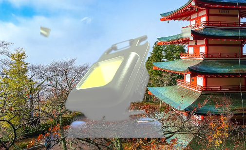{ width=13cm }

Y creamos nuestro primer proyecto

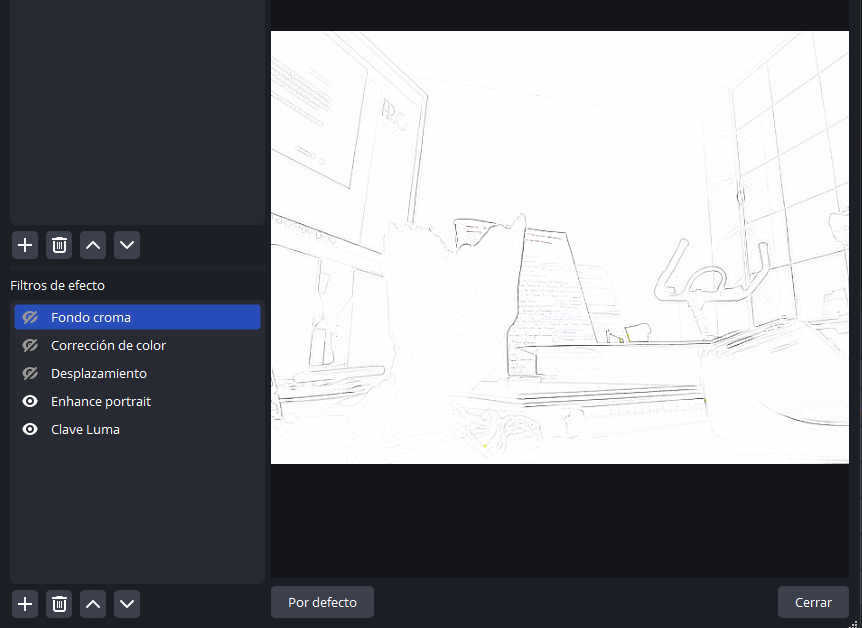{ width=13cm }

¡Nosotros hemos preparado un modelo para distinguir entre un bolígrafo y unas tijeras, subiendo imágenes de cada uno!

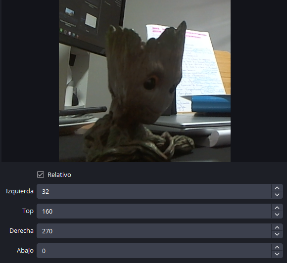{ width=13cm }

Este modelo lo podemos exportar y compartir. Obviamente el modelo que he creado no es muy interesante, pero puedes entrenar mejores modelos con muchas fotos, de objetos específicos y crear tu propio reconocedor de objetos. Puedes descargar el modelo desde [aquí](https://teachablemachine.withgoogle.com/models/9OqM8E4An/)

### Autodraw

La función principal de AutoDraw es facilitar la creación de dibujos reconocibles incluso para aquellos que no son hábiles en el dibujo. La herramienta ofrece una variedad de ícones y formas que coinciden con el contenido aproximado del dibujo original, permitiendo a los usuarios mejorar y refinar sus creaciones de manera intuitiva.

[https://www.autodraw.com/](https://www.autodraw.com/)

Por ejemplo, si dibujamos un barco lo mejor que sabemos

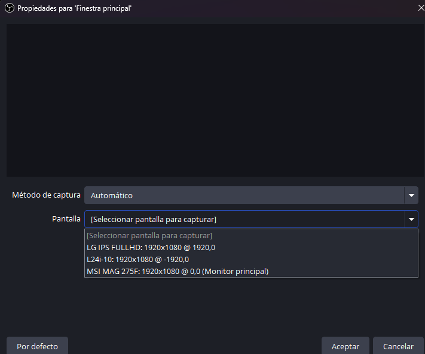{ width=13cm }

La barra de menú superior de la plataforma cambiará intentando adivinar qué hemos dibujado y nos proporcionará una imagen un poco mejor dibujada de lo que hemos hecho.

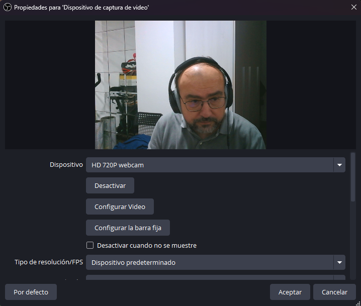{ width=13cm }


### Quickdraw

Quick, Draw! es un juego en línea desarrollado por Google que utiliza inteligencia artificial para reconocer y clasificar dibujos realizados por los usuarios en un tiempo limitado. El funcionamiento básico del juego es el siguiente:

1. **Dibujar Rápido**: El jugador recibe una palabra sugerida y tiene un tiempo limitado (generalmente 20 segundos) para dibujar el objeto o concepto asociado en una pantalla digital.

2. **Reconocimiento en Tiempo Real**: Mientras el jugador dibuja, la inteligencia artificial intenta adivinar lo que está representando en tiempo real. Utiliza algoritmos de aprendizaje automático y redes neuronales para analizar el trazo del dibujo.

3. **Retroalimentación Instantánea**: Una vez que se completa el tiempo de dibujo, el juego proporciona retroalimentación instantánea sobre si la inteligencia artificial ha reconocido correctamente el dibujo o no. Además, muestra ejemplos de cómo otros usuarios han representado la misma palabra.

4. **Contribución al Conjunto de Datos de Entrenamiento**: Los dibujos realizados por los usuarios no solo son parte del juego, sino que también contribuyen al conjunto de datos utilizado para entrenar y mejorar los algoritmos de reconocimiento de Google.

En resumen, Quick, Draw! a través del entretenimiento de un juego en línea recopila nuestros datos para mejorar los modelos de inteligencia artificial de reconocimiento de patrones.

[https://quickdraw.withgoogle.com/](https://quickdraw.withgoogle.com/)

:::note
Se trata de un juego sencillo que nos permitirá experimentar con una red neuronal. Esta tratará de adivinar qué es lo que estamos dibujando con un tiempo de 20 segundos.
:::

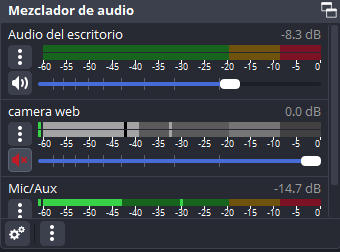{ width=13cm }

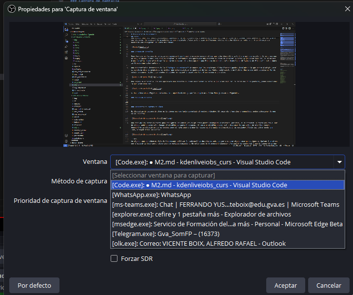{ width=13cm }

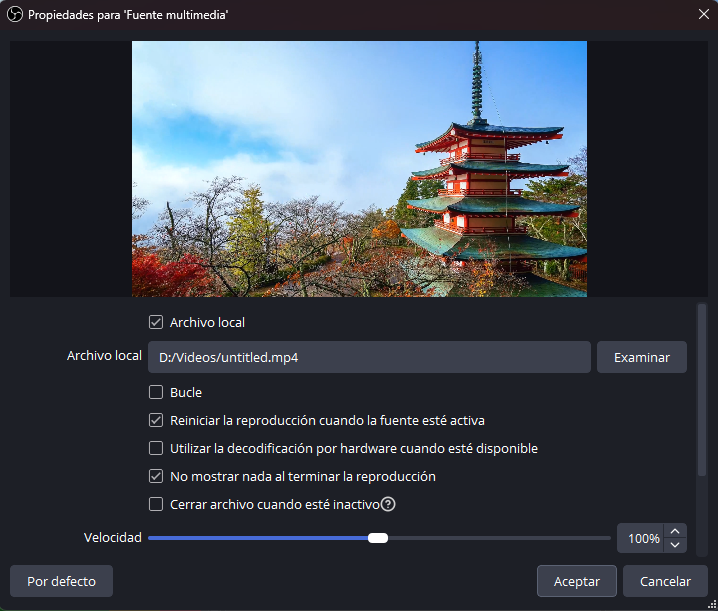{ width=13cm }

Así seguirá durante 6 imágenes. Es un buen ejercicio para entender cómo funcionan las redes neuronales.

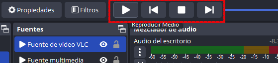{ width=13cm }

### Labs Google

Google ofrece [Labs Google](https://labs.google/), una serie de laboratorios en línea para experimentar con la inteligencia artificial y otras tecnologías. Estos laboratorios proporcionan herramientas interactivas y guías paso a paso para aprender conceptos clave y aplicarlos en proyectos prácticos. Algunos de los laboratorios donde se puede practicar son:

#### Gentype

Gentype es un laboratorio interactivo que nos permite explorar y experimentar con la generación de textos creativos utilizando modelos de lenguaje a gran escala. El laboratorio ofrece herramientas para generar textos, modificarlos y compartilos con otros usuarios. También proporciona información sobre los modelos de lenguaje utilizados y cómo funcionan. Puedes acceder a Gentype desde [aquí](https://labs.google/gentype)

Tendremos que logearnos con una cuenta de google para poder acceder a la plataforma. Luego podemos darle una descripción del tipo de texto que queremos generar:

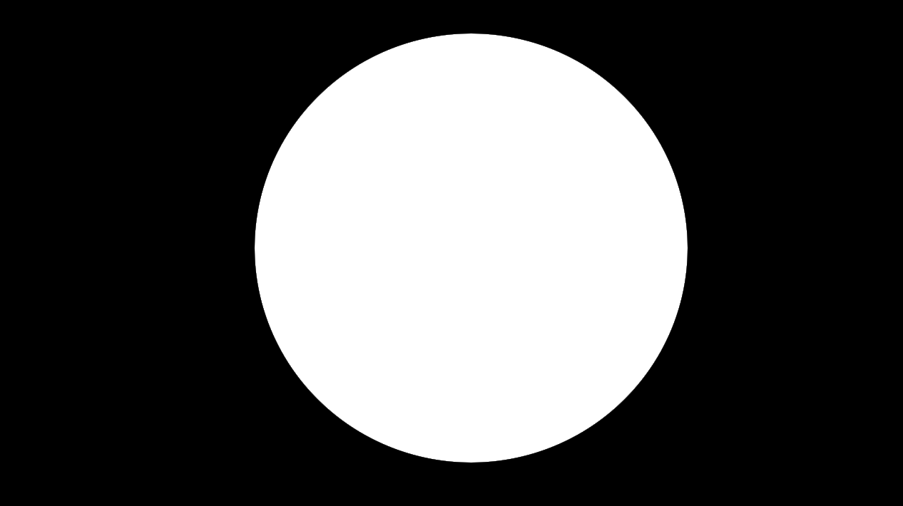{ width=13cm }

Luego podremos generar un texto con la nueva tipografía y descargarlo con una imagen que podré utilizat:

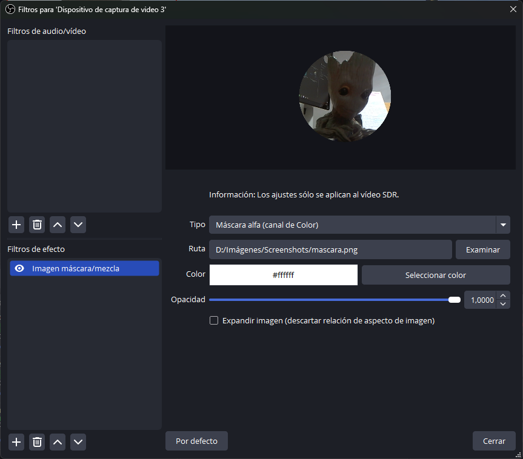{ width=13cm }

Imagen generada:

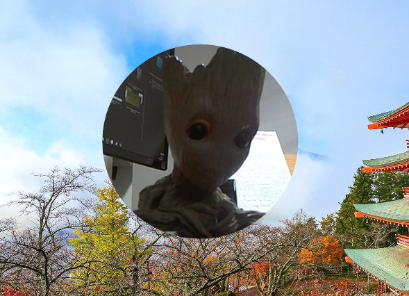{ width=13cm }

#### Say what you see

*Say what you see* es un laboratorio que prueba tu capacidad de describir imágenes con palabras. El laboratorio muestra una serie de imágenes y te pide que las describas con frases cortas y concisas. Además, puedes comparar tus descripciones con las de otros usuarios y ver cómo la inteligencia artificial interpreta las imágenes. Puedes acceder a *Say what you see* desde [aquí](https://artsandculture.google.com/experiment/say-what-you-see/jwG3m7wQShZngw)

:::warning
Uno de los principales inconvenientes de esta herramienta es que está en inglés, pero es importante practicarla ya que los prompts para generar imágenes es mejor hacerlos en inglés. Esta herramienta nos permitirá mejorar la creación de nuestros prompts para generar imágenes ya que nos da feedback de qué estamos haciendo bien y qué no.
:::

En este caso hemos probado el nivel 1, donde nos piden describir algunas imágenes, luego nos dice un feedback del prompt que hemos creado:

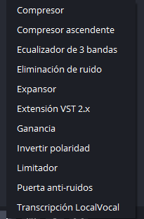{ width=13cm }

Entramos al nivel 1:

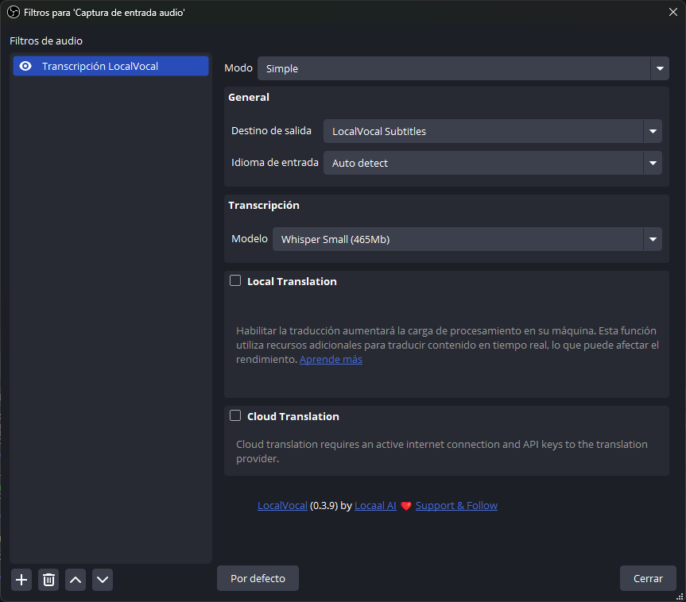{ width=13cm }

Y aquí tenéis dos ejemplos de dos imágenes con sus prompts. Fijaros que abajo nos da un feedback del prompt que hemos creado:

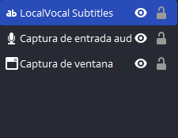{ width=13cm }

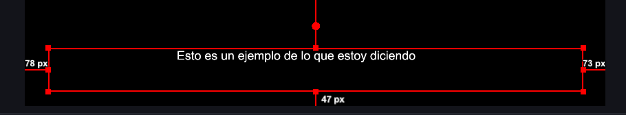{ width=13cm }


:::note
En este módulo hemos visto una pequeña introducción a las posibilidades que nos ofrece la IA y las tecnologías que se están desarrollando en ese sentido.
Además, una serie de conceptos muy básicos para tener en cuenta, pero... ¿Cuándo nos ponemos a hacer prompts? Esto lo veremos en el próximo módulo...
:::


