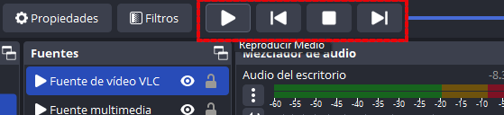
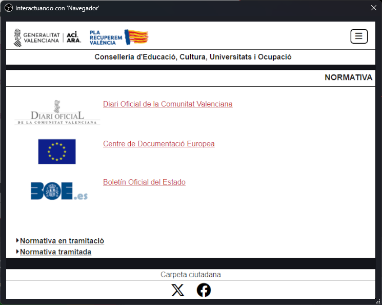
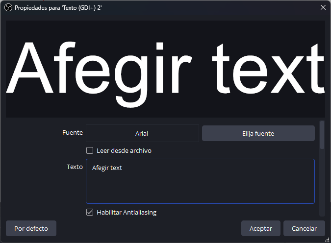
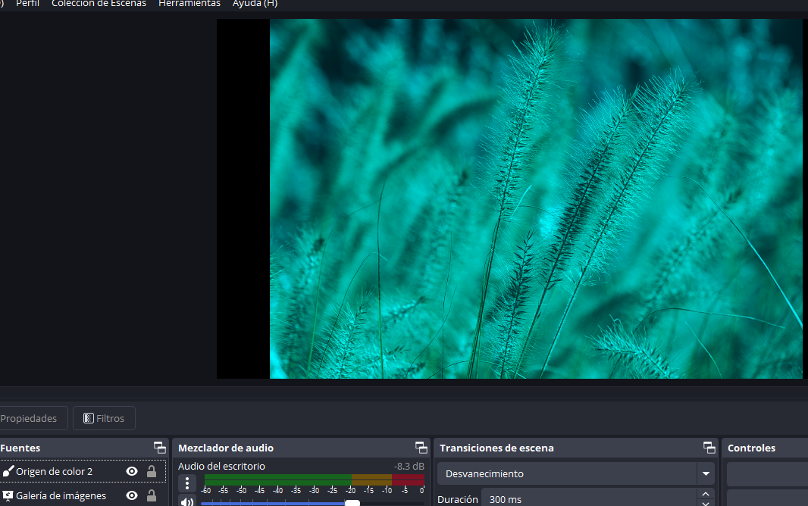

---
# Informació general del document
title: 2. Gravació i Producció
lang: ca
page-background: img/bg.png
linkcolor: blue

# Portada
titlepage: true
titlepage-rule-height: 2
titlepage-rule-color: eeeee4
titlepage-text-color: eeeee4
titlepage-background: img/U2v.png

# Taula de continguts
toc: true
toc-own-page: true
toc-title: Continguts

# Capçaleres i peus
header-left: Gravació i Producció
header-right: Curs 2024-2025
footer-left: CEFIRE FP
footer-right: \thepage/\pageref{LastPage}

# Imatges
float-placement-figure: H
caption-justification: centering

# Llistats de codi
listings-no-page-break: true
listings-disable-line-numbers: false

header-includes:
- |
  ```{=latex}
  \usepackage{lastpage}
  \usepackage{awesomebox}
  \usepackage{caption}
  \usepackage{array}
  \usepackage{tabularx}
  \usepackage{ragged2e}
  \usepackage{multirow}
  \usepackage{xcolor}

  ```
pandoc-latex-environment:
  noteblock: [note]
  tipblock: [tip]
  warningblock: [warning]
  cautionblock: [caution]
  importantblock: [important]
...

<!-- \awesomebox[violet]{2pt}{\faRocket}{violet}{Lorem ipsum…} -->

<!-- \awesomebox[violet]{2pt}{\faRobot}{violet}{Lorem ipsum…} -->

<!-- IMATGE  -->

<!-- \textbf{greatest} -->

\vspace*{\fill}

{ height=50px }

Aquest document està subjecte a una llicència creative commons que permet la seua difusió i ús comercial reconeixent sempre l'autoria del seu creador. Aquest document es troba per a ser modificat al següent repositori de github:
<!-- CANVIAR L'ENLLAÇ -->
[https://github.com/arvicenteboix/AICurs25](https://github.com/arvicenteboix/AICurs25)
\newpage

# Introducció

En esta unitat ja ens centrarem concretament en un exemple concret de producció d'un videotutorial. No anem a centrar-noc en cap aspecte concret i tractarem de donar diverses opcions per a que cadascú puga adaptar-ho a les seues necessitats.

# Preparació de la Gravació

Normalment un videotutorial pots estar compost d'una explicació d'una pantalla del teu ordinador, la teua cara i la teua veu. I elements de reforç que ens permetran. Preparar un directe no és una tasca senzilla però es pot fer perfectamente amb una persona, si tens una segona persona que está controlant el OBS molt millor. Abans de preparar qualsevol cosa amb OBS cal tenir clar els següent conceptes:

* Escena: Una escena és un conjunt de fonts que es mostren en un moment determinat. Pots tenir tantes escenes com vulgues i pots canviar d'una a una al moment que vulgues.
* Fonts i les seues propietats: Una font és un element que es mostra en una escena. Pots tenir fonts de diferents tipus: pantalla, càmera, imatge, text, etc.
* Filtres: Un filtre és un efecte que pots aplicar a una font.

## Fonts

Recordem que per a fegir una font cal fer clic en el botó "+" i seleccionar el tipus de font que volem afegir. Cal tenir en compte que les fonts s'afegixen a una escena. Quan les tenim seleccionades apareixeran en un recuadre roig i podrem moure eixa font cap on volem de l'escena, també podrem fer-les més gran o més xicotetes. La posició i la grandària, no són propietats d'eixa la font sino de l'escena, així si vinculem diferents fonts no .  A continuació vos mostrarem com configurar les fonts més comuns.


### Captura de pantalla 

Quan fem clic en Captura de pantalla ens apareixerà una finestra on podem escolir el nom que volem donar-li a la font o afegir una existent, esta característica és comuna a totes les fonts. Si en crees una de nou, li donem un nom i fem clic en acceptar. A continuació ens apareixerà una finestra on podem seleccionar la pantalla que volem capturar. Si tenim més d'una pantalla, podem seleccionar la que volem capturar. Si volem capturar una finestra en concret, seleccionem la opció "Captura de finestra" i seleccionem la finestra que volem capturar.

Una característica interessant és la d'**Afegir una existent** de manera que les propietats d'eixa finestra queden vinculades a la que acabem d'afegir, així si canviarem dins de propietats el monitor que estem utilitzem en qualsevol de les dos fonts, també canviarà en l'altre. Una manera molt senzilla de fer el mateix de manera ràpida i que queden vinculades és copiant i pegant una font d'una escena a una altra.


Una vegada seleccionat el nom ens apareixerà una finestra on podem seleccionar la pantalla que volem capturar. Si tenim més d'una pantalla, podem seleccionar la que volem capturar.


Si has seleccionat Afegir una existent, no t'apareixerà res ja que les propietats d'eixa font ja estan configurades.

### Capura de finestra

Quan fem clic en Captura de finestra ens apareixerà una finestra on podem seleccionar la finestra que volem capturar. Si tenim més d'una finestra oberta, podem seleccionar la que volem capturar. Quan capturem una finestra cal tenir en compte varies coses:

* Si canviem el tamnany de la finestra, la font es redimensionarà automàticament.
* Si la finestra es minimitza, la font es desactivarà.
* Si la finestra es tanca, la font es desactivarà.


:::tip
És bastant interessant utiltizar la captura de finestra si volem explicar algun procediment que utilitze diversos programes, d'eixa manera només es vorà la finestra i no es vorà el que tenim en l'escriptori.
:::

### Dispositiu de captura de vídeo

El dispositiu de captura de vídeo és la càmera web que tenim connectada al nostre ordinador. Si tenim més d'una càmera connectada, podem seleccionar la que volem utilitzar.


Una cosa que cal tenir en compte quan configurem una càmera web es que estes porten incorporat un micròfon, per tant, si seleccionem la càmera web com a font de vídeo, també estarem seleccionant el micròfon que porta incorporat. Si tenim un micròfon extern, cal seleccionar-lo com a font de micròfon. Sempre dependrà de la situació en que es trobem, però si només anem a grabar la nostra veu i l'àudio de l'escriptori, al mesclador d'àudio cal deixar només una font, mutejant totes les altres:


:::tip
En alguns tipus de videotutorials és interessant utilitzat la combinació de dos càmeres web, una per a mostrar alguna cosa que estigues manipulant i un altra per a mostrar la teua cara o altra cosa que estigues manipulant. En estos casos és interessant dispossar d'un suport de càmera web i que la càmera tinga una rosca incorporada per al braç. Si no disposeu d'una segona càmera sempre es pot utilitzar el mòbil com a càmera web amb l'aplicació Droidcam[^1], en eixe cas tindreu que utilitzat un plugin per a OBS que es pot descarregar des de la pàgina oficial de Droidcam.
:::

[^1]: [Droidcam](https://www.dev47apps.com/)

### Font multimèdia

Amb font multimèdia podem afegir un vídeo que es reproduirà automàticament cada vegada que entrem a l'escena. Podem cambiar alguens característiques com la velocitat de reproducció, si volem que siga en bucle, etc... Podem reproduir un arxiu local o un arxiu en streaming.


Un tipus de font semblant és **Font de vídeo VLC**, que és el mateix però amb una llista de vídeos que es reproduiran en bucle. Una característica que tenen estos elements multimèdia és que disposen d'un control per a poder reproduïr, pausar, avançar, etc... el vídeo.



### Galeria d'imatges

Amb la galeria d'imatges podem afegir una sèrie d'imatges que es reproduiran automàticament cada vegada que entrem a l'escena. Podem cambiar algunes característiques com la velocitat de reproducció, si volem que siga en bucle, etc...

Podem afegir una carpeta d'imatges o escollir si volem reproduïr-les amb bucle o anar passant-les nosaltres amb els controls multimèdia:


### Navegador

Amb la font navegador podem tindre un navegador integrat en las nostra escena. Això sí, si volem interactuar amb el navegador millor utilitzar una captura de finestra ja que és més senzill. 

Amb el navegador integrat d'OBS, hem de donar-li uan pàgina d'inici:


Després si volem interactuar amb el navegador hem de fer clic amb el botó interactuar:


I ens apareixerà la pantalla del navegador:



### Orige del color

Amb l'orige del color podem afegir un color a la nostra escena. Ens pot servir per tindre un color de fons diferent del negre.


### Text (GDI+)

Ens permet afegir text a la nostra escena. Podem canviar la font, el color, la mida, etc...



### Grup

Es tracta d'un element semblant a una carpeta on podem agrapar diferents fonts. D'eixa manera podem organitzar millor les fonts de la nostra escena.


### Captura de joc

Perquè hi ha una captura de joc i una captura de pantalla? La captura de joc és una captura de pantalla però amb una sèrie de característiques que ens permeten capturar el joc de manera més eficient. Això sí, no tots els jocs es poden capturar amb la captura de joc, per tant, si tenim problemes, millor utilitzar la captura de pantalla. OBS s'utilitza moltíssim en twitch per a retransmetre jocs en directe.

:::tip
Podem pensar que no és una característica important però té espcial relevància si volem fer algun videotutorial de *Minecraft for education* per exemple.
:::

### Escena (com a font)

Una característica bastant important a OBS és l'afegir una altra escena dins de la mateixa escena. En este cas només ens deixa l'opció d'afegir una escena que ja tenim creada. Això és molt útil per a tindre una escena amb la nostra cara que estiga compartida per totes elles.


### Posició de les fonts i interacció entre elles

L'orden de les fonts és veritablement important quan estem muntant una escena ja que les escenes que estan a sobre es veuran per damunt de les que estan per baix. Si fem clic en el botó dret d'una font veurem el menú contextual per a fer una sèrie d'accions. Tot i que no es important, existeix un tipus d'interacció que pot ser interessant en algun moment, com per exemple, el de modo de fusión.

Com a mode de exemple si volem llevar-li el roig a unes imatges que tenim en una escena, podem afegir una font de color roig per damunt de les imatges i seleccionar el mode de fusió de la font de color roig en "Restar". D'eixa manera les imatges es veuran sense el color roig.



Òbviament podem pensar en altre tipus de interaccions amb el mètode fussió.

## Filtres

Les escenes estan compostes per fonts i les fonts a la vegada són modificades pels filtres, que són efectes que podem aplicar a les fonts. Per a afegir un filtre a una font, fem clic en el botó dret de la font i seleccionem "Filtres". A continuació fem clic en el botó "+" i seleccionem el filtre que volem afegir.

Tenim una sèrie de filtres que venen per defecte en OBS, però podem afegir més filtres com hem vist ja en la unitat anterior. Una vegada afegim una font podem afegir un filtre fent clic sobre el botó filtres. Depenent de si la font té audio o no, tindrem filtres d'àudio o de vídeo. Anema a veure els filtres més comuns i alguns que poden resultar basta interessants.

Per a poder accedir als filtres farem clic en el botó Filtres quan seleccionem la font sobre la que volem aplicar el filtre.


Una vegada dins de la finestrade filtres podem veure els filtres que tenim aplicats i una previsualització de què anem a veure.


Podem veure dos seccions, els filtres d'àudio dalt i els de vídeo baix. Si fem clic en el botó "+" podrem afegir un filtre. A continuació veurem els filtres més comuns.


Hem tindre en compte que podem afegir tants filtres com vulguem, i al igual que en les escenes, els que estan per damunt tenen més prioritat que els que estan per baix.

### Filtres de vídeo

#### Background removal

El primer filtre que vorem que és molt interessant és el de Background removal. Aquest filtre ens permet eliminar el fons de la nostra càmera web. Aquest filtre és molt interessant per a fer videotutorials ja que podem tindre la nostra cara en una cantonada de la pantalla sense que es veja el fons.


En la previsualització es veu el fons negre, però en la pantalla de la càmera web es veurà sense fons.

#### Retallar

El filtre de retallar ens permet retallar la imatge de la nostra càmera web. Si només volem centrar l'atenció en un únic element.


#### Imatge màscara

Este filtre es bastant interessant ja que podem voler retallar la nostra càmera web per a que es veja en una forma concreta. Per exemple, si volem que la nostra càmera web es veja en forma de cercle, podem utilitzar una imatge màscara de forma circular. Per exemple podem crear-nos una imatge com esta (o qualsevol altra imatge que tinga un bon contrast de colors) i la carreguem com la nostra màscara.


La part blanca de la imatge serà la que es veja i la part negra serà la que no es veja. Encara que podem configurar qualsevol altre color:


D'esta manera podem tindre una imatge de la nostra càmera web en forma de cercle.


La màscara també accepta difumnació, per a que no es veja tan bruscament el retallat.

#### Fons croma

El fons croma és un filtre amb un efecte bastant complicat d'aconseguir a no ser que es dipose d'una tela verda o blava. El color ha de ser bastant homogeni i té que haver boba il·luminació. Has de posar un valor del color molt aproximat al que veus. En este cas he posat una carpeta blava:


Posant un video de fons aconseguim l'efecte croma, encara que amb una qualitat pèsima:


##### Clave Luma

Aquest filtre ens permet aconseguir un efecte semblant al del Croma però es bassa amb els objectes més iluminats que els que estan al voltant. Això és molt interessant per aconseguir un efecte de fons croma sense tindre una tela verda o blava, però has de saber jugar amb les llums.

##### Enhanced portrait

Podruix un efecte bastant interessant per a crear un efecte de dibuix a llapis, combionat amb la clave lluma es reforça el seu efecte.


#### Altres filtres

Existeixen molts filtres que podem utiltizar, i altres que podem descarregar, els altres filtres que venen per defecte són:

* Correcció de color: Com el seu nom indica ens pot ser útil per a modificar el color de la càmera.
* Desplaçament: Ens permet desplaçar la càmera en la pantalla creant un efecte com de sintonització de lacàmera.
* Escala/Relació d'aspecte: Ens permet canviar la mida de la càmera.
* Filtre de color: Ens permet aplicar un filtre de color a la càmera.
* Filtre d'enfocament: Ens permet augmentar la nitidesa de la imatge.
* Retardament en el procesament: Retrasa la emisió de la càmera fins 500ms.

### Filtres d'àudio


#### LocalVocal


# Mode Estudi

<!-- Introducción
Objetivos del Tema
Aprender las técnicas básicas de grabación y producción.
Entender cómo integrar OBS y Kdenlive en el flujo de trabajo.

1. Preparación de la Grabación
   
Configuración de OBS
Descarga e instalación de OBS.
Configuración de escenas y fuentes.
Ajustes de audio y video.
Planificación del Contenido
Creación de un guion o estructura del video.
Revisión del equipo y materiales necesarios.
Ambiente de Grabación
Ajuste de iluminación.
Preparación del fondo y escenario.
Pruebas de sonido.

1. Proceso de Grabación
Captura de Video con OBS
Grabación de la pantalla.
Uso de la cámara web.
Captura de audio de alta calidad.
Consejos y Buenas Prácticas
Cómo mantener una buena calidad de video.
Manejo de errores comunes durante la grabación.

1. Postproducción en Kdenlive
Importación del Material
Transferencia de archivos desde OBS a Kdenlive.
Organización del material grabado.
Edición Básica
Corte y recorte de clips.
Añadir transiciones y efectos básicos.
Mejoras de Audio
Limpieza y mejora de la calidad del audio.
Sincronización de audio y video.
Incorporación de Elementos Adicionales
Textos y títulos.
Música de fondo y efectos sonoros.
Imágenes y gráficos.

1. Exportación y Distribución
Configuración de Exportación en Kdenlive
Elección del formato de salida adecuado.
Ajustes de resolución y calidad.
Subida y Compartición del Video
Plataformas recomendadas para la distribución.
Consejos para optimizar la visibilidad del video.
Conclusión
Revisión del Proyecto Final
Evaluación y corrección de detalles finales.
Feedback y sugerencias para mejoras futuras.
Preguntas y Respuestas -->

