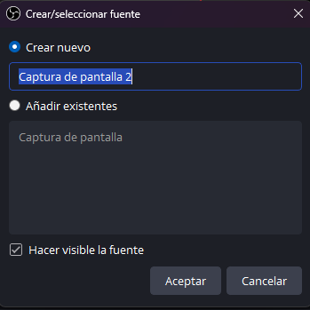
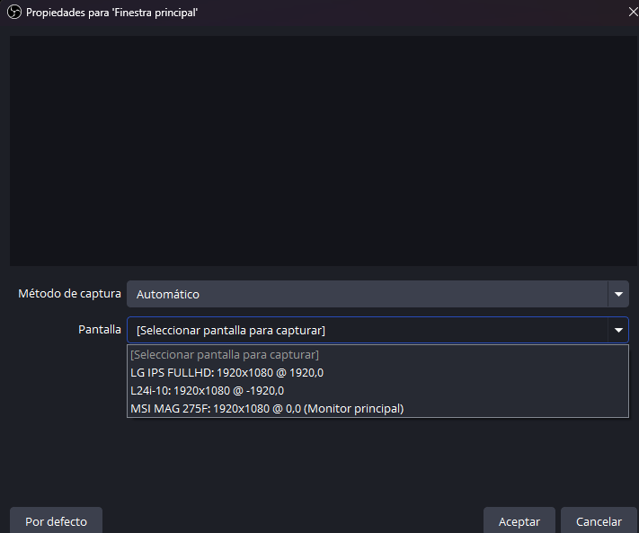
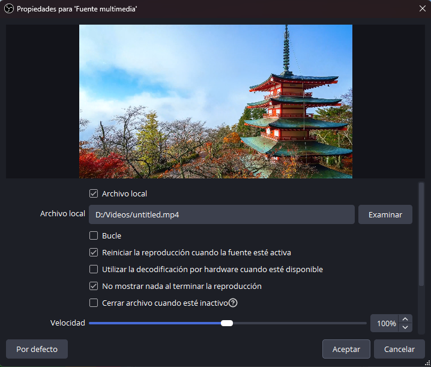
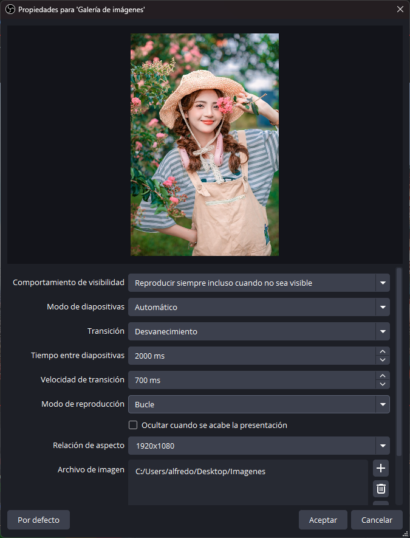
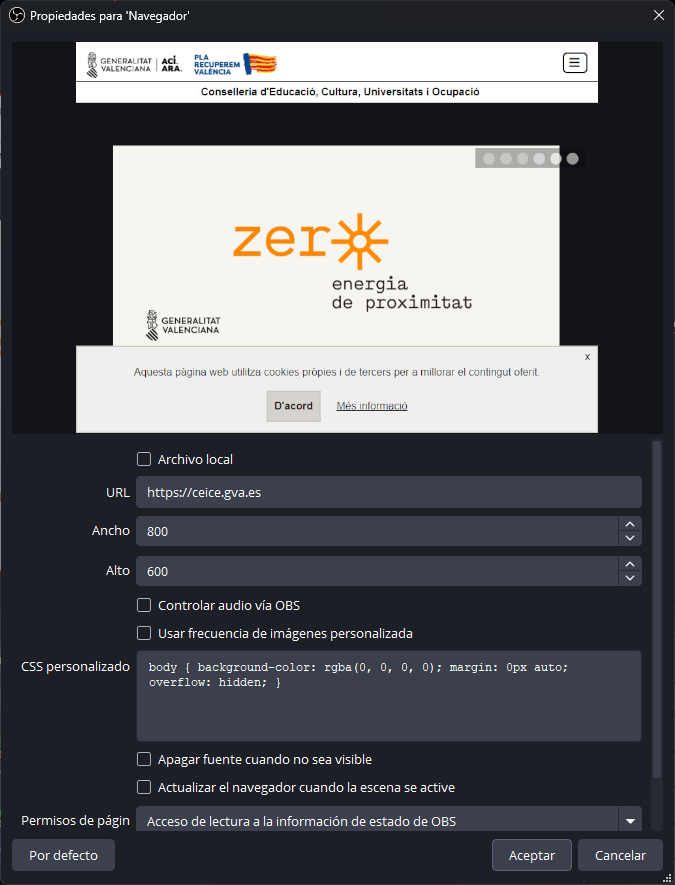
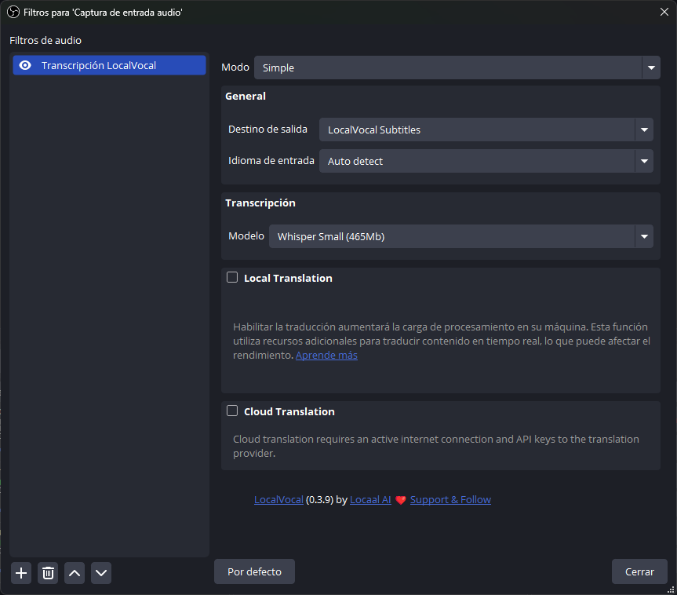
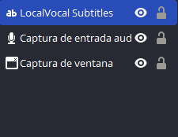
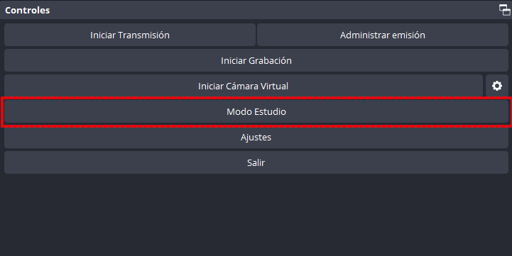

---
# Informació general del document
title: 2. Grabación y Producción. OBS.
lang: ca
page-background: img/bg.png
linkcolor: blue

# Portada
titlepage: true
titlepage-rule-height: 2
titlepage-rule-color: eeeee4
titlepage-text-color: eeeee4
titlepage-background: img/U2v.png

# Taula de continguts
toc: true
toc-own-page: true
toc-title: Contenidos

# Capçaleres i peus
header-left: Grabación y Producción
header-right: Curso 2024-2025
footer-left: DGFP
footer-right: \thepage/\pageref{LastPage}

# Imatges
float-placement-figure: H
caption-justification: centering

# Llistats de codi
listings-no-page-break: true
listings-disable-line-numbers: false

header-includes:
- |
  ```{=latex}
  \usepackage{lastpage}
  \usepackage{awesomebox}
  \usepackage{caption}
  \usepackage{array}
  \usepackage{tabularx}
  \usepackage{ragged2e}
  \usepackage{multirow}
  \usepackage{xcolor}

  ```
pandoc-latex-environment:
  noteblock: [note]
  tipblock: [tip]
  warningblock: [warning]
  cautionblock: [caution]
  importantblock: [important]
...

<!-- \awesomebox[violet]{2pt}{\faRocket}{violet}{Lorem ipsum…} -->

<!-- \awesomebox[violet]{2pt}{\faRobot}{violet}{Lorem ipsum…} -->

<!-- IMATGE  -->

<!-- \textbf{greatest} -->

\vspace*{\fill}

{ height=50px }
Este documento está sujeto a una licencia creative commons que permite su difusión y uso comercial reconociendo siempre la autoría de su creador. Este documento se encuentra para ser modificado en el siguiente repositorio de github:
<!-- CANVIAR L'ENLLAÇ -->
[https://github.com/arvicenteboix/kdenliveiobs_curs](https://github.com/arvicenteboix/kdenliveiobs_curs)
\newpage

# Introducción

En esta unidad ya nos vamos a centrar en un ejemplo concreto de producción de un videotutorial. No vamos a centrarnos en ningún aspecto concreto y trataremos de dar varias opciones para que cada uno pueda adaptarlo a sus necesidades.

# Preparación de la Grabación

Normalmente un videotutorial puede estar compuesto de una explicación de una pantalla de tu ordenador, tu cara y tu voz. Y elementos de refuerzo que nos van a permitir. Preparar un directo no es tarea sencilla pero se puede hacer perfectamente con una persona, si tienes una segunda persona que está controlando el OBS mucho mejor. Antes de preparar cualquier cosa con OBS es necesario tener claro los siguientes conceptos:

* Escena: Una escena es un conjunto de fuentes que se muestran en un momento determinado. Puedes tener tantas escenas como quieras y puedes cambiar de una a una en el momento que quieras.
* Fuentes y sus propiedades: Una fuente es un elemento que se muestra en una escena. Puedes tener fuentes de distintos tipos: pantalla, cámara, imagen, texto, etc.
* Filtros: Un filtro es un efecto que puedes aplicar a una fuente.

## Fuentes

Recordemos que para añadir una fuente es necesario hacer clic en el botón "+" y seleccionar el tipo de fuente que queremos añadir. Hay que tener en cuenta que las fuentes se añaden a una escena. Cuando las tenemos seleccionadas aparecerán en un recuadro rojo y podremos mover esa fuente hacia donde queremos de la escena, también podremos hacerlas de mayor o menor tamaño. La posición y el tamaño, no son propiedades de esa la fuente sino de la escena, así si vinculamos diferentes fuentes no . A continuación le mostraremos cómo configurar las fuentes más comunes.


### Captura de pantalla

Cuando hacemos clic en Captura de pantalla nos aparecerá una ventana en la que podemos escoger el nombre que queremos darle a la fuente o añadir una existente, esta característica es común a todas las fuentes. Si creas una nueva, le damos un nombre y hacemos clic en aceptar. A continuación nos aparecerá una ventana en la que podemos seleccionar la pantalla que queremos capturar. Si tenemos más de una pantalla, podemos seleccionar la que queremos capturar. Si queremos capturar una ventana en concreto, seleccionamos la opción "Captura de ventana" y seleccionamos la ventana que deseamos capturar.

Una característica interesante es la de **Añadir una existente** por lo que las propiedades de esa ventana quedan vinculadas a la que acabamos de añadir, así si cambiaremos dentro de propiedades el monitor que estamos utilizamos en cualquiera de las dos fuentes, también cambiará en el otro. Una forma muy sencilla de hacer lo mismo de forma rápida y que quedan vinculadas es copiando y pegando una fuente de una escena a otra.



Una vez seleccionado el nombre nos aparecerá una ventana en la que podemos seleccionar la pantalla que queremos capturar. Si tenemos más de una pantalla, podemos seleccionar la que queremos capturar.



Si has seleccionado Añadir una existente, no te aparecerá nada ya que las propiedades de esa fuente ya están configuradas.

### Capura de ventana

Cuando hacemos clic en Captura de ventana nos aparecerá una ventana en la que podemos seleccionar la ventana que queremos capturar. Si tenemos más de una ventana abierta, podemos seleccionar la que deseamos capturar. Cuando capturamos una ventana hay que tener en cuenta varias cosas:

* Si cambiamos el tamaño de la ventana, la fuente se redimensionará automáticamente.
* Si la ventana se minimiza, la fuente se desactivará.
* Si la ventana se cierra, la fuente se desactivará.


:::tipo
Es bastante interesante utilizar la captura de ventana si queremos explicar algún procedimiento que utilice varios programas, de esa manera sólo se verá la ventana y no se verá lo que tenemos en el escritorio.
:::


### Dispositivo de captura de vídeo

El dispositivo de captura de vídeo es la cámara web que tenemos conectada a nuestro ordenador. Si tenemos más de una cámara conectada, podemos seleccionar la que queremos utilizar.


Algo a tener en cuenta cuando configuramos una cámara web es que estas llevan incorporado un micrófono, por tanto, si seleccionamos la cámara web como fuente de vídeo, también estaremos seleccionando el micrófono que lleva incorporado. Si tenemos un micrófono externo, es necesario seleccionarlo como fuente de micrófono. Siempre dependerá de la situación en la que se encuentre, pero si sólo vamos a grabar nuestra voz y el audio del escritorio, en el mezclador de audio hay que dejar sólo una fuente, muteando todas las demás:


:::tipo
En algunos tipos de videotutoriales es interesante utilizar la combinación de dos cámaras web, una para mostrar algo que estés manipulando y otra para mostrar tu cara u otra cosa que estés manipulando. En estos casos es interesante disponer de un soporte de cámara web y que la cámara tenga una tuerca incorporada para el brazo. Si no dispone de una segunda cámara siempre se puede utilizar el móvil como cámara web con la aplicación Droidcam[^1], en ese caso tendrá que utilizar un plugin para OBS que se puede descargar desde la página oficial de Droidcam.
:::

[^1]: [Droidcam](https://www.dev47apps.com/)

### Fuente multimedia

Con fuente multimedia podemos añadir un vídeo que se reproducirá automáticamente cada vez que entremos en la escena. Podemos cambiar algunas características como la velocidad de reproducción, si queremos que sea en bucle, etc... Podemos reproducir un archivo local o un archivo en streaming.



Un tipo de fuente similar es **Fuente de vídeo VLC**, que es lo mismo pero con una lista de vídeos que se reproducirán en bucle. Una característica que poseen estos elementos multimedia es que disponen de un control para poder reproducir, pausar, avanzar, etc... el vídeo.


### Galería de imágenes

Con la galería de imágenes podemos añadir una serie de imágenes que se reproducirán automáticamente cada vez que entremos en la escena. Podemos cambiar algunas características como la velocidad de reproducción, si queremos que sea en bucle, etc...

Podemos añadir una carpeta de imágenes o escoger si queremos reproducirlas en bucle o ir pasándolas nosotros con los controles multimedia:



### Navegador

Con la fuente navegador podemos tener un navegador integrado en nuestra escena. Eso sí, si queremos interactuar con el navegador mejor utilizar una captura de ventana, ya que es más sencillo.

Con el navegador integrado de OBS, debemos darle una página de inicio:



Luego si queremos interactuar con el navegador debemos hacer clic con el botón interactuar:


Y nos aparecerá la pantalla del navegador:


### Origen del color

Con el origen del color podemos añadirle un color a nuestra escena. Nos puede servir para tener un color de fondo distinto al negro.


### Texto (GDI+)

Nos permite añadir texto a nuestra escena. Podemos cambiar la fuente, el color, el tamaño, etc...


### Grupo

Se trata de un elemento similar a una carpeta donde podemos agrupar diferentes fuentes. De esa forma podemos organizar mejor las fuentes de nuestra escena.


### Captura de juego

Porque hay una captura de juego y una captura de pantalla? La captura de juego es una captura de pantalla pero con una serie de características que nos permiten capturar el juego de forma más eficiente. Eso sí, no todos los juegos se pueden capturar con la captura de juego, por tanto, si tenemos problemas, mejor utilizar la captura de pantalla. OBS se utiliza muchísimo en twitch para retransmitir juegos en directo.

:::tipo
Podemos pensar que no es una característica importante pero tiene especial relevancia si queremos hacer algún videotutorial de Minecraft for education por ejemplo.
:::

### Escena (como fuente)

Una característica bastante importante en OBS es añadir otra escena dentro de la misma escena. En este caso, sólo nos deja la opción de añadir una escena que ya tenemos creada. Esto es muy útil para tener una escena con nuestra cara que esté compartida por todas ellas.


### Posición de las fuentes e interacción entre ellas

El orden de las fuentes es verdaderamente importante cuando estamos montando una escena puesto que las escenas que están encima se verán por encima de las que están por debajo. Si hacemos clic en el botón derecho de una fuente veremos el menú contextual para realizar una serie de acciones. Aunque no es importante, existe un tipo de interacción que puede ser interesante en algún momento, como por ejemplo, el modo de fusión.

Como modo de ejemplo si queremos quitarle el rojo a unas imágenes que tenemos en una escena, podemos añadir una fuente de color rojo por encima de las imágenes y seleccionar el modo de fusión de la fuente de color rojo en "Restar". De esa manera las imágenes se verán sin el color rojo.


Obviamente, podemos pensar en otro tipo de interacciones con el método fusión.

## Filtros

Las escenas están compuestas por fuentes y las fuentes a su vez son modificadas por los filtros, que son efectos que podemos aplicar a las fuentes. Para añadir un filtro a una fuente, hacemos clic en el botón derecho de la fuente y seleccionamos "Filtros". A continuación hacemos clic en el botón "+" y seleccionamos el filtro que queremos añadir.

Tenemos una serie de filtros que vienen por defecto en OBS, pero podemos añadir más filtros como hemos visto ya en la unidad anterior. Una vez añadimos una fuente podemos añadir un filtro haciendo clic sobre el botón filtros. Dependiendo de si la fuente tiene o no audio, tendremos filtros de audio o de vídeo. Vamos a ver los filtros más comunes y algunos que pueden resultar basta interesantes.

Para poder acceder a los filtros haremos clic en el botón Filtros cuando seleccionemos la fuente sobre la que queremos aplicar el filtro.


Una vez dentro de la ventana de filtros podemos ver los filtros que tenemos aplicados y una previsualización de la que vamos a ver.


Podemos ver dos secciones, los filtros de audio arriba y los de vídeo bajo. Si hacemos clic en el botón "+" podremos añadir un filtro. A continuación veremos los filtros más comunes.


Debemos tener en cuenta que podemos añadir tantos filtros como queramos, y al igual que en las escenas, los que están por encima tienen más prioridad que los que están por debajo.

## Filtros de vídeo

### Background removal

El primer filtro que veremos que es muy interesante es el de Background removal. Este filtro nos permite eliminar el fondo de nuestra webcam. Este filtro es muy interesante para realizar videotutoriales ya que podemos tener nuestra cara en una esquina de la pantalla sin que se vea el fondo.


En la previsualización se ve el fondo negro, pero en la pantalla de la webcam se verá sin fondo.

### Recortar

El filtro de recortar nos permite recortar la imagen de nuestra webcam. Si sólo queremos centrar la atención en un único elemento.


### Imagen máscara

Este filtro es bastante interesante ya que podemos querer recortar nuestra webcam para que se vea en una forma concreta. Por ejemplo, si queremos que nuestra webcam se vea en forma de círculo, podemos utilizar una imagen máscara de forma circular. Por ejemplo podemos crearnos una imagen como ésta (o cualquier otra imagen que tenga un buen contraste de colores) y la cargamos como nuestra máscara.


La parte blanca de la imagen será la que se vea y la parte negra será la que no se vea. Aunque podemos configurar cualquier otro color:


De esta forma podemos tener una imagen de nuestra cámara web en forma de círculo.


La máscara también acepta difuminación, para que no se vea tan bruscamente el recortado.

### Fondo croma

El fondo croma es un filtro con un efecto bastante complicado de conseguir a menos que se deponga de una tela verde o azul. El color debe ser bastante homogéneo y debe haber boba iluminación. Tienes que poner un valor del color muy aproximado a lo que ves. En este caso he puesto una carpeta azul:


Poniendo un vídeo de fondo conseguimos el efecto croma, aunque con una calidad pésima:


#### Clave Luma

Este filtro nos permite conseguir un efecto similar al del Croma pero se basa con los objetos más iluminados que los que están alrededor. Esto es muy interesante para conseguir un efecto de fondo croma sin tener una tela verde o azul, pero debes saber jugar con las luces.

#### Enhanced portrait

Produce un efecto bastante interesante para crear un efecto de dibujo a lápiz, combinado con la clave **Lluma** se refuerza su efecto.


### Otros filtros

Existen muchos filtros que podemos utilizar, y otros que podemos descargar, los otros filtros que vienen por defecto son:

* Corrección de color: Como su nombre indica nos puede ser útil para modificar el color de la cámara.
* Desplazamiento: Nos permite desplazar la cámara en la pantalla creando un efecto como de sintonización de la cámara.
* Escala/Relación de aspecto: Nos permite cambiar el tamaño de la cámara.
* Filtro de color: Nos permite aplicar un filtro de color a la cámara.
* Filtro de enfoque: Nos permite aumentar la nitidez de la imagen.
* Retraso en el procesamiento: Retrasa la emisión de la cámara hasta 500ms.

## Filtros de audio

Los filtros de audio, tal y como su nombre indica, sirven para modificar el audio. Ese audio quizás de una fuente externa que tenemos conectada a nuestro ordenador o puede ser el audio de nuestra webcam. Así cuando tengamos una fuente que tenga audio, podremos añadir filtros de audio. A modo de ejemplo, partiendo de una fuente de captura de audio se aparecen los siguientes filtros:


No vamos a entrar en detalle en todos los filtros de audio, pero aquellos que nos pueden resultar interesantes son los siguientes:

### Eliminación de ruido

Elimina el ruido de fondo de nuestro micrófono. Debemos tener cuidado porque puede eliminar también nuestra voz.

:::caution
En nuestro parecer, si realiza muchos videotutoriales, es mejor utilizar un micrófono externo que no tenga ruido de fondo que utilizar este filtro. Puede encontrar ofertas de vez en cuando por unos 25 €, y valen la pena.
:::

### Puerta anti-ruido

Semejante a lo anterior, pero en este caso sólo se escuchará el audio cuando hablemos. Si no hablamos, nada se escuchará. Puesto que crea un umbral de ruido en un determinado valor.

### Compresor

El compresor es un filtro que permite ajustar el volumen de nuestra voz. Si hablamos muy bajo, el compresor aumentará el volumen de nuestra voz. Si hablamos muy alto, el compresor disminuirá el volumen de nuestra voz.

### Ganancia

El filtro de ganancia nos permite aumentar o disminuir el volumen de nuestra voz. Si hablamos muy bajo podemos aumentar el volumen de nuestra voz. Si hablamos muy alto podemos disminuir el volumen de nuestra voz.

### LocalVocal

Por último, tenemos el filtro LocalVocal que hemos instalado el plugin en la unidad anterior. Este filtro crea subtítulos en directo de nuestra voz. Eso sí, es necesario disponer de un ordenador bastante potente ya que consume muchos recursos. Para configurarlo sólo debemos añadirlo y configurarlo. Las opciones que recomendamos para configurarlo son las siguientes:



Fijémonos que hemos escogido el modelo Whisper Small, es un modelo que pesa poco y funciona bastante bien, en idioma de entrada lo hemos dejado con "Auto-detect" pero es recomendable que elija el idioma con el que va a hablar. Este filtro también nos permite realizar traducciones simultáneas de los subtítulos, de manera que podemos hacer una charla en castellano y que los subtítulos estén en inglés.

Una vez que tenemos configurado el filtro, nos aparecerá un elemento texto en nuestra escena:



Este elemento texto es el que mostrará los subtítulos de nuestra voz. Si queremos cambiar la posición del texto, debemos hacerlo desde la ventana de la fuente.


# Modo Estudio

El modo de estudio es un modo que nos permite tener una previsualización de nuestra escena y una emisión de nuestra escena. Esto es muy útil para poder ver cómo se ve nuestra escena antes de hacerla pública. Para activar el modo estudio, hacemos clic en el botón "Estudio" que se encuentra en la parte inferior derecha de la pantalla.



Cuando tenemos activado el modo estudio, veremos una pantalla con la previsualización de nuestra escena y una pantalla con la emisión de nuestra escena. Esto nos permite cambiar nuestra escena sin que se vea en la emisión. Además, podemos cambiar la posición de las fuentes, filtros, etc... y ver cómo se ve en la previsualización. Es necesario tener mucha destreza, y disponer de dos pantallas como mínimo para poder utilizar este modo, de manera eficiente.


Los botones principales son:

* Transición: Nos permite cambiar de la previsualización a la emisión. Podemos elegir el método de transición.
* Corte: Nos permite cambiar la previsualización a la emisión y la emisión a la previsualización sin transición suave.
* Tenemos dos botones que podemos personalizar, siempre es conveniente tener un oscurecimiento a negro para cortar alguna emisión de forma suave.
* Finalmente tenemos una barra de desplazamiento que nos permite realizar una transición manual entre escenas.