---
# Informació general del document
title: 1. Introducció. Conceptes inicials
lang: ca
page-background: img/bg.png
linkcolor: blue

# Portada
titlepage: true
titlepage-rule-height: 2
titlepage-rule-color: eeeee4
titlepage-text-color: eeeee4
titlepage-background: img/U1v.png

# Taula de continguts
toc: true
toc-own-page: true
toc-title: Continguts

# Capçaleres i peus
header-left: 1. Introducció. Conceptes inicials
header-right: Curs 2024-2025
footer-left: CEFIRE FP
footer-right: \thepage/\pageref{LastPage}

# Imatges
float-placement-figure: H
caption-justification: centering

# Llistats de codi
listings-no-page-break: true
listings-disable-line-numbers: false

header-includes:
- |
  ```{=latex}
  \usepackage{lastpage}
  \usepackage{awesomebox}
  \usepackage{caption}
  \usepackage{array}
  \usepackage{tabularx}
  \usepackage{ragged2e}
  \usepackage{multirow}
  \usepackage{xcolor}

  ```
pandoc-latex-environment:
  noteblock: [note]
  tipblock: [tip]
  warningblock: [warning]
  cautionblock: [caution]
  importantblock: [important]
...

<!-- \awesomebox[violet]{2pt}{\faRocket}{violet}{Lorem ipsum…} -->

<!-- \awesomebox[violet]{2pt}{\faRobot}{violet}{Lorem ipsum…} -->

<!-- IMATGE  -->

<!-- \textbf{greatest} -->

\vspace*{\fill}

{ height=50px }

Aquest document està subjecte a una llicència creative commons que permet la seua difusió i ús comercial reconeixent sempre l'autoria del seu creador. Aquest document es troba per a ser modificat al següent repositori de github:
<!-- CANVIAR L'ENLLAÇ -->
[https://github.com/arvicenteboix/AICurs25](https://github.com/arvicenteboix/AICurs25)
\newpage

# Introducció

De segur que molts de vosaltres ja heu sentit parlar de la intel·ligència artificial y de tot allò que pot fer, alguns ja heu començat a utilitzar-lo en el vostre dia a dia i cal distingir alguns conceptes sobre el que és la IA. En aquest curs tractarem de fer-vos una introducció sobre les diferents ferramentes que existeixen i com traure'ls profit. 

Cal tenir en compte que es tracta d'un curs d'iniciació i és possible que us sentiu aclaparats de tota la informació que aneu a veure, òbviament per la durada del curs no anem a poder aprofundir en moltes de les utilitats que us presentarem, això ja us ho deixarem a vosaltres i/o a futurs cursos que pugueu fer.

Els mòduls seran breus però intensos, tractarem d'ajudar-vos en tots els dubtes que se us plantegen, pràcticament tot el text escrit està redactat i no s'ha utilitzat la IA, algunes imatges són la excepció, en molts casos us presentarem el prompt[^1] i la resposta que ens donarà, tractarem de limitar l'extensió al que realment necessiteu. Us ho presentarem amb la següent icona.

[^1]: Prompt, és el text que escrius a la plataforma per a que interprete el que realment necessites. Entrarem amb més detall a la propera unitat.

\awesomebox[violet]{2pt}{\faRobot}{violet}{\textbf{Benvinguts al curs de Introducció a la Intel·ligència Artificial! Aquest curs de 30 hores està dissenyat per a aquells que vulguin aprendre els fonaments de la IA i les seves aplicacions pràctiques. A través de sis mòduls, cobrirem una àmplia gamma de temes, des dels conceptes bàsics fins a les eines més avançades.}\hfill \break

Benvinguts al curs de Introducció a la Intel·ligència Artificial. Aquest curs de 30 hores està dissenyat per a aquells que vulguin aprendre els fonaments de la IA i les seves aplicacions pràctiques. A través de sis mòduls, cobrirem una àmplia gamma de temes, des dels conceptes bàsics fins a les eines més avançades.

La IA és una de les àrees més emocionants i innovadores de la informàtica, amb el potencial de transformar molts aspectes de la nostra societat. Aprendràs a crear models de llenguatge natural, a utilitzar Microsoft Copilot per escriure codi més eficientment i a aplicar la IA en l'educació.

Aquest curs està dissenyat per a estudiants amb coneixements previs de programació, matemàtiques discretes i àlgebra lineal. No es requereix experiència prèvia en IA, tot i que es recomana tenir nocions d'estadística i càlcul. El curs  s'impartirà en valencià, amb material complementari en anglès.}

:::note
Es tracta d'una resposta de inteligència artificial. Òbviament crear models des de 0 é sun tasca molt complexa i que requereix moltes hores de treball. Aquesta resposta és una resposta estàndard que no s'ens hauria ocorregut escriure.
:::

:::warning
Es recomana crear un compte de correu electrònic específic per a experimentar amb aquestes eines i serveis. Això permetrà mantenir el vostre compte principal lliure de correu no desitjat i protegir la vostra privacitat. Podeu utilitzar serveis com Gmail, Outlook o qualsevol altre proveïdor de correu electrònic gratuït per a aquest propòsit.
:::

# Que és i què no és la intel·ligència artificial?

Podem pensar que tot el que fem a l'ordinador té a veure amb la intel·ligència artificial i òbviament no és així, els ordinadors utilitzen algoritmes amb llenguatges de programació per a poder automatitzar tasques o realitzar programes. Els algoritmes són una sèrie de passos a seguir que automatitza alguna tasca. Ací teniu un digrama de flux senzill que mostra un procés::

<!-- DIAGRAMA FLUXE -->
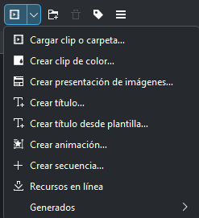{ height=300px }

Aquestes funcions porten una lògica enrere, en canvi les IA utilitzen una manera de programar diferent que baralla moltíssimes més possibilitats per a donar una resposta més creativa basant-se en entrades més complexes que anomenem xarxes neuronals. Ací tenim un exemple de xarxa neuronal

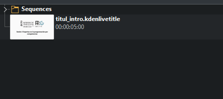{ height=300px }

Existeix una classe d'arquitectura anomenada **models de transformadors** que es basen en xarxes neuronals. Aquests models són capaços d'aprendre patrons en les dades i generar respostes més complexes. Encara que no aprofundirem en com funcionen, és important que sapigueu que existeixen.

:::note
La Intel·ligència Artificial (IA) és un camp ampli que inclou diferents tècniques i algoritmes per a crear sistemes que puguen simular la intel·ligència humana. Les xarxes neuronals són una de les tècniques d’IA que imiten el funcionament del cervell humà per a resoldre problemes
:::

Dins de la mateixa intel·ligència artificial ens podem trobar diferents categories que anirem veient al llarg dels propers anys.

| Tipus d'IA | Descripció | Exemples |
| --- | --- | --- |
| **Intel·ligència Artificial Estreta (IAE)** | La IAE està programada per a realitzar una sola tasca, ja siga verificar el clima, jugar als escacs o analitzar dades per a escriure informes periodístics. Els sistemes IAE poden atendre una tasca en temps real, però extreuen informació d'un conjunt de dades específic. No funcionen fora de l'única tasca per a la qual estan dissenyats. | Assistents virtuals com Siri o Alexa, sistemes de reconeixement facial, cotxes autònoms. |
| **Intel·ligència Artificial General (IAG)** | La IAG és una forma d'IA que pot aprendre i entendre qualsevol tasca intel·lectual que un ésser humà pot realitzar. La IAG és capaç de raonar, planificar, aprendre, comprendre llenguatges naturals i integrar diversos coneixements per resoldre problemes complexos. | Encara en desenvolupament, objecte de recerca acadèmica. |
| **Intel·ligència Artificial Superintelectual (IAS)** | La IAS es refereix a una IA que supera la intel·ligència i capacitats cognitives de tots els humans en pràcticament tots els camps, incloent creativitat científica, saviesa general i habilitats socials. | Teòricament possible, però encara no existeix; concepte popularitzat per científics i futuristes com Nick Bostrom[^2]. |

[^2]: https://es.wired.com/articulos/nick-bostrom-hizo-al-mundo-temer-por-la-ia-ahora-pregunta-y-si-es-la-solucion-a-todos-nuestros-problemas

## Models de llenguatge a gran escala

Els Models de Llenguatge a Gran Escala (MLL, per les seues sigles en anglès, Large Language Models) són models d'intel·ligència artificial que han sigut entrenats amb enormes quantitats de dades textuals per a aprendre patrons, estructures i representacions del llenguatge natural. Estos models són capaços de realitzar tasques relacionades amb el processament del llenguatge, com entendre el significat de frases, generar text coherent i respondre preguntes.

Exemples de MLL inclouen:

1. **RoBERTa (Robustly Optimized BERT Approach)**: Una variant de BERT desenvolupada per Facebook AI, que està optimitzada per a obtenir millor rendiment en diverses tasques de llenguatge natural.
   
2. **XLNet**: Creat per Google Brain, aquest model combina els millors elements de BERT i transformers autoregressius per millorar la comprensió de contextos llargs en tasques de llenguatge natural.

3. **ALBERT (A Lite BERT)**: Desenvolupat per Google Research, és una versió més lleugera de BERT que utilitza menys recursos computacionals mantenint el rendiment.

4. **DistilBERT**: Creat per Hugging Face, aquest model és una versió més petita i eficient de BERT que conserva el 97% del rendiment amb només el 60% del pes del model original.

5. **Electra**: També desenvolupat per Google, aquest model utilitza una nova tècnica d'entrenament per fer models més eficients i amb un rendiment millor en tasques de llenguatge natural.

6. **GPT-Neo**: Un model de codi obert desenvolupat per EleutherAI com a alternativa a GPT-3, disponible per a la comunitat de recerca i desenvolupament.

7. **Megatron-LM**: Desenvolupat per NVIDIA, és un model de gran escala entrenat amb una versió millorada de transformers, optimitzat per a GPU de NVIDIA.

8. **Turing-NLG**: Desenvolupat per Microsoft, aquest model és un dels models de llenguatge natural de gran escala més potents creats per a tasques complexes d'IA.

9.  **GPT-3 y 4** (Generative Pre-trained Transformer) d'OpenAI
    
10. **BERT** (Bidirectional Encoder Representations from Transformers) de Google
    
11. **T5** (Text-to-Text Transfer Transformer) de Google.

12. **Llama** de Meta: Un model de llenguatge a gran escala desenvolupat per Meta (anteriorment Facebook) que se centra en l'eficiència i la sostenibilitat.

:::note
No és important que conegueu aquests noms, però quan usem diferents models en el proper mòdul veurem com utilitzar-los.
:::

Aquestes són només algunes de les moltes versions de MLL que estan ajudant a avançar la investigació i aplicacions en el camp de la intel·ligència artificial.

Algunes aplicacions destacades dels MLL són:

1. **Generació de Text Creatiu**: MLL com GPT-3 poden ser utilitzats per a generar contingut textual creatiu, des de poesia fins a narrativa.
2. **Assistents Virtuals Avançats**: MLL s'integren en assistents virtuals per a millorar la seua capacitat de comprensió i generació de respostes en llenguatge natural.
3. **Traducció Automàtica Millorada**: Models com T5 han demostrat millores significatives en tasques de traducció automàtica.
4. **Generació de Resums Automàtics**: MLL són empleats per a resumir automàticament textos llargs, facilitant l'extracció d'informació clau.
5. **Preguntes i Respostes**: Models com BERT són utilitzats en sistemes de preguntes i respostes per a entendre i respondre consultes en llenguatge natural.
6. **Anàlisi de Sentiment Avançat**: MLL poden millorar la capacitat d'analitzar el sentiment en grans quantitats de text, beneficiant aplicacions en xarxes socials i comentaris en línia.
7. **Autocompletat de Text Millorat**: Eines d'autocompletat, com les utilitzades en correus electrònics o cerques en la web, es beneficien de la capacitat predictiva dels MLL.
8. **Creació de Contingut Multimèdia**: MLL poden ser combinats amb altres models d'intel·ligència artificial per a crear contingut multimèdia, com imatges, vídeos o àudio, a partir de text.

9. **Creació de Contingut per a Xarxes Socials**: Els MLL són utilitzats per a generar contingut rellevant i atractiu en plataformes de xarxes socials.

10. **Reconeixement d'Entitats Millorat**: Models com GPT-3 poden ajudar en la identificació i classificació precisa d'entitats en textos.

11. **Personalització de Recomanacions**: Els LLM contribueixen a millorar la personalització en sistemes de recomanació en àrees com streaming i comerç electrònic.

Estes aplicacions ressalten com els MLL estan transformant la forma en què les màquines interactuen amb el llenguatge humà, obrint noves possibilitats en diverses àrees.

## Models de difusió

Els models de difusió, com DALL-E, són models generatius avançats que utilitzen tècniques de difusió per a generar imatges. Aquests models es basen en la difusió probabilística, que és un procés estocàstic per a generar dades complexes pas a pas. En lloc de generar directament píxels d'una imatge, els models de difusió generen una imatge al "difondre" gradualment informació a través de múltiples passos, la qual cosa permet capturar patrons complexos i estructures en les dades.

Exemples de models de difusió inclouen:

| Model de Difusió | Descripció |
| --- | --- |
| **DALL-E** | Desenvolupat per OpenAI, DALL-E és conegut per generar imatges creatives a partir de descripcions textuals. Pot crear imatges realistes i úniques a partir de conceptes específics. |
| **MidJourney** | Un altre model de difusió que es centra en la generació d'imatges a través de processos de difusió probabilística. Pot utilitzar-se per a crear imatges realistes i detallades. |
| **Stable Diffusion** | Un enfocament de difusió que busca aconseguir una difusió més estable i eficient en termes d'entrenament i generació d'imatges. |
| **Imagen** | Desenvolupat per Google Research, és un model de difusió que genera imatges a partir de descripcions textuals amb una qualitat d'alta fidelitat. Utilitza tècniques de difusió avançades per millorar la nitidesa i el detall de les imatges generades. |
| **VQ-VAE-2** | Un model de difusió basat en VQ-VAE (Vector Quantized Variational Autoencoder), utilitzat per a la generació de dades visuals de gran qualitat. És conegut per la seua capacitat de generar imatges amb detall fi i colors vius. |
| **BigGAN** | Desenvolupat per Google, BigGAN és un model de xarxa adversària generativa que utilitza tècniques de difusió per generar imatges d'alta qualitat amb resolucions elevades. És utilitzat per a aplicacions on es requereixen imatges realistes i detallades. |
| **DDPM** | Denoising Diffusion Probabilistic Models (DDPM) són models de difusió probabilística que eliminen el soroll de manera progressiva per generar imatges nítides. S'utilitzen en diverses aplicacions de generació d'imatges. |

Aquests models de difusió tenen aplicacions en diverses àrees, incloent:

1. **Generació d'Imatges Artístiques i Creatives**: Els models de difusió com DALL-E s'utilitzen per a generar imatges artístiques i creatives basades en descripcions textuals.

2. **Reconstrucció i Millora d'Imatges**: Poden aplicar-se per a reconstruir o millorar imatges existents, generant versions més detallades o modificades.

3. **Generació de Contingut Visual Personalitzat**: Es poden emprar en la creació de contingut visual personalitzat per a aplicacions de disseny gràfic, publicitat i màrqueting.

4. **Simulació i Entrenament en Realitat Virtual**: Aquests models poden generar escenaris visuals realistes per a aplicacions de realitat virtual, simulació i entrenament.

5. **Síntesi de Dades per a la Investigació**: En àmbits com la recerca científica i mèdica, els models de difusió poden sintetitzar dades visuals per a fins experimentals.

6. **Generació de Contingut per a Videojocs**: Poden utilitzar-se en la creació de mons i elements visuals en videojocs, oferint varietat i realisme.

7. **Creació d'il·lustracions i Art Digital**: Els artistes digitals poden emprar models de difusió per a crear il·lustracions i art digital únic.

Aquestes aplicacions destaquen la versatilitat dels models de difusió en la generació de contingut visual, des de la creació d'art fins a la simulació d'entorns complexos. La seua capacitat per a manejar dades de manera probabilística i generar resultats detallats els fa valuosos en diverses disciplines creatives i tecnològiques.

## Exemples d'ús per a començar a experimentar

### Teachable Machine de Google

Teachable Machine de Google és una plataforma que permet als usuaris crear models d'aprenentatge automàtic sense necessitat d'escriure codi. Els usuaris poden entrenar models de classificació d'imatges, sons o posicions utilitzant una interfície amigable, facilitant la incorporació d'intel·ligència artificial en projectes creatius.

Aquesta ferramenta ens permet entrenar a xicoteta escala el nostre model d'intel·ligència artificial per a un propòsit, per exemple el de reconèixer objectes, sons o postures. Només ens cal una webcam per a fer-ho. Podem accedir a la plataforma des d'ací: [https://teachablemachine.withgoogle.com/](https://teachablemachine.withgoogle.com/)

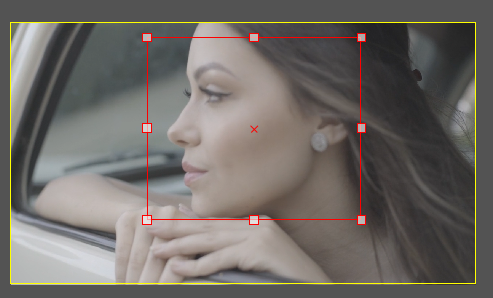{ width=13cm }

I creem el nostre primer projecte

{ width=13cm }

Nosaltres hem preparat un model per a distingir entre un bolígraf i unes tisores, hem anant pujant imatges de cadascun.

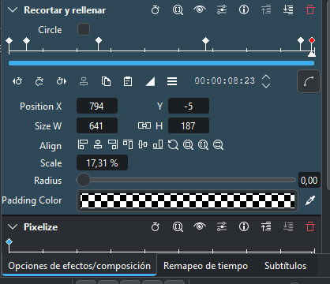{ width=13cm }

Aquest model el podem exportar i el podem compartir. Òbviament el model que he creat no és massa interessant, però pots entrenar millors models amb moltes fotografies, d'objectes de la classe i crear el teu propi reconeixedor de d'objectes. Podeu descarregar el model des [d'ací](https://teachablemachine.withgoogle.com/models/9OqM8E4An/)

### Autodraw

La funció principal d'AutoDraw és facilitar la creació de dibuixos reconeixibles fins i tot per a aquells que no són hàbils en el dibuix. La eina ofereix una varietat d'icones i formes que coincideixen amb el contingut aproximat del dibuix original, permetent als usuaris millorar i refinar les seues creacions de manera intuitiva.

[https://www.autodraw.com/](https://www.autodraw.com/)

Per exemple, si dibuixem un vaixell de la millor manera que sabem

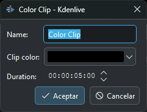{ width=13cm }

La barra de menú superior de la plataforma canviarà intentant descobrir què hem dibuixat i ens proporcionarà una imatge un poc millor dibuixada del que hem fet.

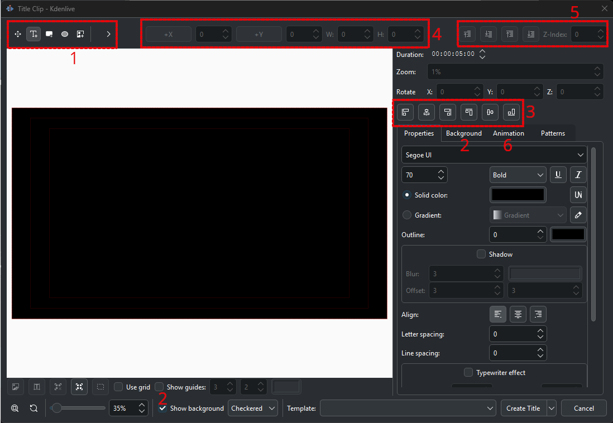{ width=13cm }

### Quickdraw

Quick, Draw! és un joc en línia desenvolupat per Google que utilitza intel·ligència artificial per a reconèixer i classificar dibuixos realitzats pels usuaris en un temps limitat. El funcionament bàsic del joc és el següent:

1. **Dibuix Ràpid**: El jugador rep una paraula suggerida i té un temps limitat (generalment 20 segons) per a dibuixar l'objecte o concepte associat en un llenç digital.

2. **Reconeixement en Temps Real**: Mentre el jugador dibuixa, la intel·ligència artificial intenta endevinar el que està representant en temps real. Utilitza algoritmes d'aprenentatge automàtic i xarxes neuronals per a analitzar el traç del dibuix.

3. **Retroalimentació Instantània**: Una vegada que es completa el temps de dibuix, el joc proporciona retroalimentació instantània sobre si la intel·ligència artificial ha reconegut correctament el dibuix o no. A més, mostra exemples de com altres usuaris han representat la mateixa paraula.

4. **Contribució a Conjunt de Dades d'Entrenament**: Els dibuixos realitzats pels usuaris no només són part del joc, sinó que també contribueixen al conjunt de dades utilitzat per a entrenar i millorar els algoritmes de reconeixement de Google.

En resum, Quick, Draw! a través de la diversió d'un joc en línia recopila les nostres dades per a millorar els models d'intel·ligència artificial de reconeixement de patrons.

[https://quickdraw.withgoogle.com/](https://quickdraw.withgoogle.com/)

:::note
Es tracta d'un joc senzill que ens permetrà experimentar amb una xarxa neuronal. Aquesta tractarà d'esbrinar què és el que estem dibuixant amb un temps de 20 segons.
:::

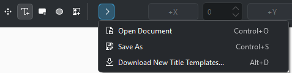{ width=13cm }

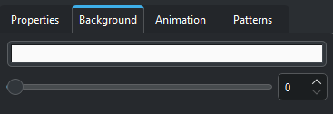{ width=13cm }

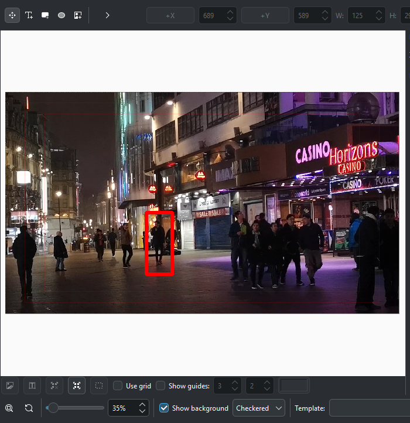{ width=13cm }

Així anirà fent durant 6 imatges. És un bon exercici per a entendre com funcionen les xarxes neuronals.

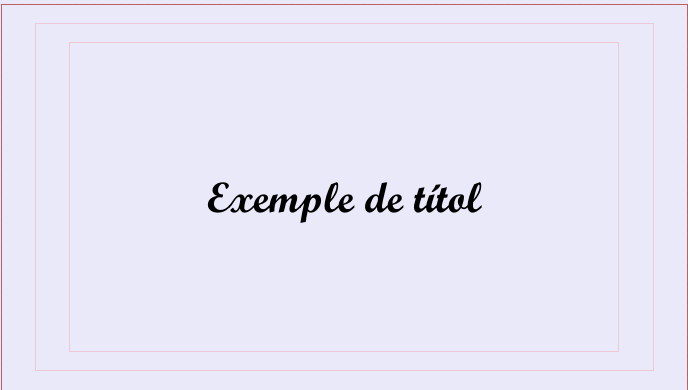{ width=13cm }

### Labs Google

Google ofereix [Labs Google](https://labs.google/), una sèrie de laboratoris en línia per a experimentar amb la intel·ligència artificial i altres tecnologies. Aquests laboratoris proporcionen eines interactives i guies pas a pas per a aprendre conceptes clau i aplicar-los en projectes pràctics. Alguns dels laboratoris per poder practicar són:

#### Gentype

Gentype és un laboratori interactiu que permet als usuaris explorar i experimentar amb la generació de textos creatius utilitzant models de llenguatge a gran escala. El laboratori ofereix eines per a generar textos, modificar-los i compartir-los amb altres usuaris. A més, proporciona informació sobre els models de llenguatge utilitzats i com funcionen. Pots accedir a Gentype des [d'ací](https://labs.google/gentype)

Hem de logar-nos amb un compte de google per a poder accedir a la plataforma. Després podem donar-li una descripció del tipus de text que volem generar:

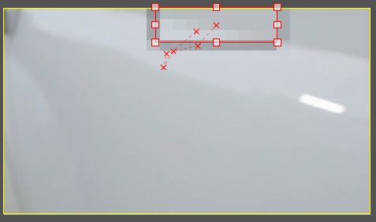{ width=13cm }

Després podrem generar un text amb la nova tipogrfia i descarregar-lo amb una imatge que podrem utilitzat:

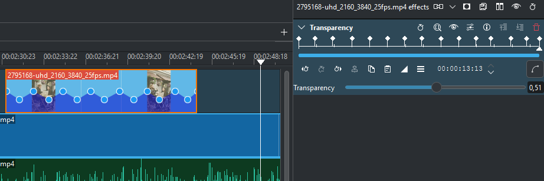{ width=13cm }

Imatge generada:

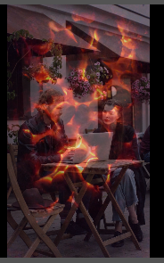{ width=13cm }

#### Say what you see

*Say what you see* és un laboratori que posa a prova la teua capacitat de descriure imatges amb paraules. El laboratori mostra una sèrie d'imatges i et demana que les descrius amb frases curtes i concises. A més, pots comparar les teues descripcions amb les d'altres usuaris i veure com la intel·ligència artificial interpreta les imatges. Pots accedir a *Say what you see* des [d'ací](https://artsandculture.google.com/experiment/say-what-you-see/jwG3m7wQShZngw)

:::warning
Un dels principals inconvenients d'aquesta ferramnta és que està en anglès, però és important practicar-la ja que els prompts per a generar imatges és millor fer-los en anglès. Aquesta ferramenta ens permetrà millorar la creació dels nostres prompts per a generar imatges ja que ens dona feedback del que estem fent bé i del que no.
:::

En aquest cas hem provat el nivell 1, on ens demanen descriure algunes imatges, després nes dona un feedback del prompt que hem creat:

{ width=13cm }

Entrem al nivell 1:

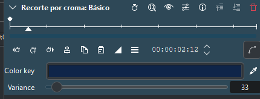{ width=13cm }

I ací tenim dos exemple de dos imatges amb els seus prompts. Fixeu-vos que baix ens dona un feedback del prompt que hem creat:

{ width=13cm }

{ width=13cm }

:::note
En aquesta unitat hem vist una petita introducció a les possibilitats que ens ofereix la IA i les tecnologies que s'estan desenvolupant al respecte.
A més, una sèrie de conceptes molt bàsics a tenir en compte, però... Quan ens posem a fer prompts? Això ho vorem al proper mòdul...
:::


