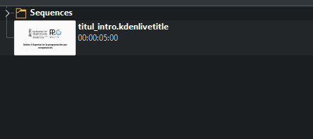
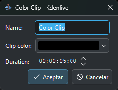
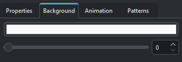
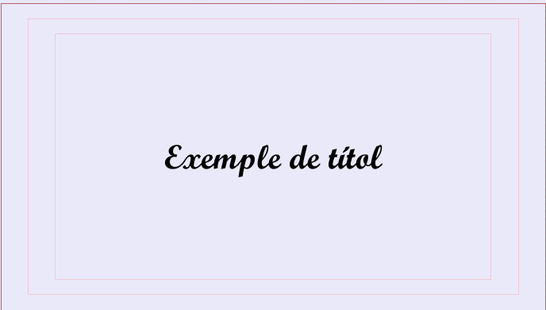
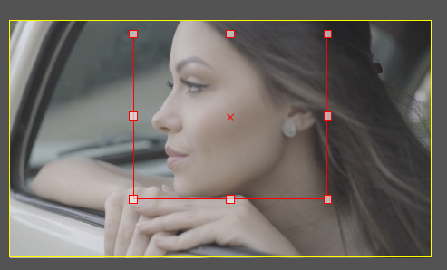
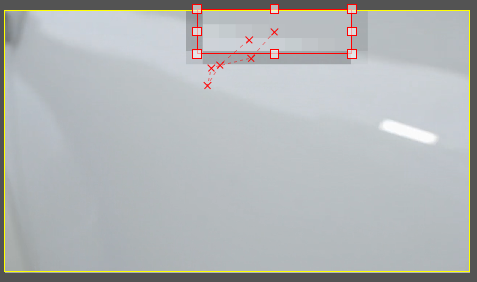

---
# Informació general del document
title: 3. Edició i Publicació. KDEnlive
lang: ca
page-background: img/bg.png
linkcolor: blue

# Portada
titlepage: true
titlepage-rule-height: 2
titlepage-rule-color: eeeee4
titlepage-text-color: eeeee4
titlepage-background: img/U3v.png

# Taula de continguts
toc: true
toc-own-page: true
toc-title: Continguts

# Capçaleres i peus
header-left: 3. Edició i Publicació. KDEnlive
header-right: Curs 2024-2025
footer-left: DGFP
footer-right: \thepage/\pageref{LastPage}

# Imatges
float-placement-figure: H
caption-justification: centering

# Llistats de codi
listings-no-page-break: true
listings-disable-line-numbers: false

header-includes:
- |
  ```{=latex}
  \usepackage{lastpage}
  \usepackage{awesomebox}
  \usepackage{caption}
  \usepackage{array}
  \usepackage{tabularx}
  \usepackage{ragged2e}
  \usepackage{multirow}
  \usepackage{xcolor}

  ```
pandoc-latex-environment:
  noteblock: [note]
  tipblock: [tip]
  warningblock: [warning]
  cautionblock: [caution]
  importantblock: [important]
...

<!-- \awesomebox[violet]{2pt}{\faRocket}{violet}{Lorem ipsum…} -->

<!-- \awesomebox[violet]{2pt}{\faRobot}{violet}{Lorem ipsum…} -->

<!-- IMATGE  -->

<!-- \textbf{greatest} -->

\vspace*{\fill}

{ height=50px }

Aquest document està subjecte a una llicència creative commons que permet la seua difusió i ús comercial reconeixent sempre l'autoria del seu creador. Aquest document es troba per a ser modificat al següent repositori de github:
<!-- CANVIAR L'ENLLAÇ -->
[https://github.com/arvicenteboix/AICurs25](https://github.com/arvicenteboix/AICurs25)
\newpage

# Introducció

En aquest mòdul anem a centrar-nos en la part de l'edició del vídeo. Aprendrem a utilitzar KDEnlive per a editar vídeos de manera professional. A més, veurem com exportar el nostre projecte i com publicar-lo a plataformes com Youtube. Recordem que OBS és un programa centrat en la captura de vídeo o emissions en directe, mentre que KDEnlive és un editor de vídeo. I un editor bastant potent. Així com en OBS hem pogut veure més o menys quasi totes les possibilitats que ens ofereix, en KDEnlive només veurem una xicoteta part de les seues possibilitats. Coneixerem el funcionament genèric dels efectes i les composicions, però òbviament no podrem veure tots els tipus de filtres que venen amb el programa.

Vos recomanem, si no esteu familiaritzats un poc amb els editors de video que reviseu el mòdul I on disposeu d'una introducció bàsica a l'entorn de Kdenlive.

# Repositoris de vídeos

Abans de començar anem a veure una sèrie de repositoris de vídeos que podrem utilitzar de manera gratuïta per a les nostres edicions. Ens poden ser útils per a utilitzar-los en els nostre projectes.

## Pexels

Pexels és un repositori de vídeos gratuïts que podem utilitzar en els nostres projectes. Els vídeos són de qualitat i els podem utilitzar sense cap problema.

[https://www.pexels.com/videos/](https://www.pexels.com/videos/)

## Pixabay

Pixabay és un altre repositori de vídeos gratuïts que podem utilitzar en els nostres projectes. Els vídeos són de qualitat i els podem utilitzar sense cap problema.

[https://pixabay.com/videos/](https://pixabay.com)

## Videvo

Videvo és un altre repositori de vídeos gratuïts que podem utilitzar en els nostres projectes. Els vídeos són de qualitat i els podem utilitzar sense cap problema.

[https://www.videvo.net/](https://www.videvo.net/)

:::caution
Recordeu que no tots aquests vídeos tenen una llicència Creative Commons que ens permet utilitzar-los en els nostres projectes. Per això sempre és recomanable llegir les condicions de la llicència abans de fer-ho. Trobar un vídeo susceptible de ser utilitzat en els nostres projectes no es una tasca senzilla.
:::

# Bandeja de projectes

Com ja hem comentat a la bandeja de projectes veiem tots els elements que tenim oberts per a composar el nostre projecte. El més habitual és que ací afegim vídeos, però hi han molts altres elements que podem afegir ací. Si fem clic a la icono d'afegir podem veure tots els elements que podem afegir:


## Carregar clip o carpeta. 

Es tracta d'un element molt interessant ja que podem tindre un clip creat amb Kdenlive (extensió .kdenlive) i afegir-lo al nostre projecte. Això sí, no el podem editar des del nostre projecte, però podem obrir un altra instància de Kdenlive i editar-lo. D'esta manera podem tindre un clip creat que ens servisca de plantilla per a diversos projectes, on ja tinguem els logos del nostre centre, o els colors corporatius, etc.



## Crear clip de color

Simplement crea un clip d'un color uniforme amb una durada determinada.



## Crear clip de títol

Crea un clip amb un títol. Tot i que semble una opció molt senzilla, aquest serà un dels elements que més utilitzarem ja que ens oferix moltíssimes possibilitats a l'hora de crear videotutorials. Quan fem clic en afegir clip de títol ens apareix una finestra on podem configurar el clip:


Podem veure diferents elements en la finestra, podem veure que hi ha un temporitzador que ens permetrà canviar la durada del clip. Trobem diferents elements que hem enumerat i passem a detallar a continuació:

[1] Barra de ferramentes. Podem veure que en esta barra podem afegir diferents elements al clip:


Per ordre d'esquerra a dreta, tenim la ferramenta de selecció que ens servis per a moure els diferents elements, la creació de text, la creació de rectangles, la creació de elipses (o cercles), afegir imatges i un desplegable que ens permet obrir altres clips, salvar el que estem editant o baixar-nos plantilles de la web de Kdenlive.

Quan seleccionem un element podem veure que les opcions de dreta canviem i podem modificar eixe element. Crear clips de títol ens permetrà per exemple crear elements per a resaltar alguna cosa del vídeo, això ho farem ajudant-nos del checkbox "Show background" [2], que juntament amb la pestanya Background, on desplaçarem el alfa a 0 amb el slider, podrem veure el que hi ha al nostre projecte. 



De manera que podrem afegir coses que ens facen falta. Per exemple si volem destacar un element d'un vídeo podem fer un recuadre i després arrastrar el clip a la línea de temps:


Aquest mateix procediment ho podem fer afegint text o buscant en un repositori d'imatges que siguen més vistoses que un simple recuadre. Si necessitem ajustar molt la posició d'un element (amb detall de píxel) tenim una sèrie de caselles que ens ho permeten fer, les hem numerades amb [4]. 

Si combinem diferents elements i es superposen uns amb els altres, podem escollir l'orde en que es superposen (o z-index) amb les opcions de [5].

No podem olvidar que podem crear un clip de títol, així per exemple si en creem un, podem alinear-lo ajudant-nos dels botons en [3] que ens permeten alinear-lo a la dreta de la pantalla, al centre, dalt, baix, etc.



Dos efectes interessants que té el clip de títols és el de "Typewriter effect" que fa que el text aparega com si estiguera sent escrit. I el d'Animation que es un poc més complexe.

Si fem clic en la pestanya d'Animation podrem vore la següent pantalla:


Podem veure que tenim dos botons:

* Edit start viewport: Ens permet editar la posició inicial del clip. Es representa per un recuadre verd.
* Edit end viewport: Ens permet editar la posició final del clip. Es representa per  un recuadre roig.

Estos botons ens permetran seleccionar l'inici i final del clip, hi ha dos paràmetres que podem modificar, la posició i el tamany. La posició la podem modificar moguent el recuadre que veiem en la pantalla i el tamany amb els botons que tenim (o modificant el tamany del recuadre).

Si hi ha algun recuadre seleccionat ho podrem veure en la pantalla, si volem tornar a modificar algun element del clip hem de desseleccionar els recuadres. Una vegada tenim definits l'inici i el final hi haurà "un moviment" de la càmera des de l'inici fins al final.

Per a entendre bé el funcionament de l'animació a mode d'exemple vos deixarem una animació molt senzilla. En primer lloc dibuixarem el següent. Simplement són recuadres i un text en xicotet al centre de la pantalla:


Després el Start viewport el deixarem com està i en el End viewport dibuixarem un xicotet recuadre que envolte el text:


Finalment per a donar-li un efecte un poc més interessant podem crear un fade-in, fade-out i allargar el final del clip per a que es veja el text un poc més de temps. L'efecte que es veu és com comença la càmera en la posició inicial i es mou fins a la posició final, fins que es veu el text en gran:


## Crear títol desde plantilla

Kdenlive ens ofereix una sèrie de plantilles que podem utilitzar per a crear títols. Aquestes plantilles són bastant interessants ja que ens permeten crear títols molt vistosos sense haver de gastar molt temps en la seua creació.

## Crear animació

Per a poder utilitzar esta funcionalitat caldrà que ens baixem un programa extern que permet crear animacions vectorials. El primer que ens demana és que li indiquem on està el programa:


El programa el podem baixar de la següent adreça: Glaxnimate [https://glaxnimate.mattbas.org/](https://glaxnimate.mattbas.org/)
Una vegada instal·lat el programa i indicat a Kdenlive on està, podrem crear animacions vectorials que després podrem importar a Kdenlive. El programa es troba dins de la carpeta bin una vegada descomprimit l'arxiu que ens hem de baixar.

No anem a entrar en més detall sobre animacions amb Glaxnimate però podeu trobar un xicotet videotutorial d'exemple al curs.

## Recursos en línia

Aquí podem buscar directament a alguns dels repositoris que vos hem comentat al principi.


## Generats

Tenim una sèri d'animacions estàndard que podem utilitzar. Aquestes animacions són molt senzilles i no tenen moltes opcions de configuració:

* Contador: es tracta d'una animació que ens permet crear un contador. Podem veure que tenim diferents opcions per a configurar el contador.
* Barres de color: ens permet crear un clip amb barres de color. Podem veure que tenim diferents opcions per a configurar les barres de color.


* Soroll blanc: ens permet crear un clip amb soroll blanc. Podem veure que tenim diferents opcions per a configurar el soroll blanc.

# Efectes

Els efectes són una de les parts més importants de l'edició de vídeo. Ens permeten donar-li un toc diferent al nostre vídeo. Recordem que els efectes s'apliquen sobre un vídeo, encara que també podem aplicar-los sobre clips de títol. Recordem que per a seleccionar un efecte hem d'arrastrar i soltar l'efecte sobre el clip que volem modificar. Si només volem aplicar-lo sobre un secció podem fer-ho de dos maneres, hem de retallar el vídeo i aplicar l'efecte sobre eixa secció o fer-ho sobre la línia de temps de l'efecte com ara veurem.

En general tots els efectes tenen una sèrie de paràmetres que podem modificar. Però tots tenen un patró semblant de funcionament. Per a entendre com funcionen els efectes vos deixarem un exemple amb l'efecte de "Pixelitzar".

## Efecte binaritzar

L'efecte binari és un efecte que ens permet simplificar un vídeo a la seua manera més binaria (blanc i negre). A priori sembla un efecte que no pot tindre poca utilitat. Però després d'explicar com funcionen els efectes en general vos donarem un exemple d'ús. Anem a partir d'un vídeo d'una figura de buda:


Arrastrarem i soltarem l'efecte sobre el clip, podem vore els paràmetres de l'efecte:


Este filtre només té un paràmetre que podem modificar (treshold value) que ens permet modificar en quin nivel de luminositat es convertix en negre o en blanc. Fixem-nos (en recuadre roig) que tenim una linea de temps que es desplaça al mateix temps que la línia de temps en el vídeo.

La línea de temps ens permet modificar els valors de l'efecte en el temps. Així per exemple si tenim un valor molt baix de treshold value el vídeo serà molt més clar (blanc). Si el valor és molt alt el vídeo serà molt més obscur (negre). Així podem veure com el vídeo va canviant en temps real:

Per a afegir un punt de canvi fem doble clic sobre la línea de temps i veurem que ens apareix un marcador dalt de la línia de temps i podem modificar el valor en eixe punt. 


L'efecte no canviarà de sobte d'un marcador a altre sino que anirà canviant de manera progressiva. En el següent exemple podem veure com a mitad de dos marcadors el Treshold value canvia automàticament des d'un marcador al mínim a un marcador al màxim:


En el següent exemple podem veure como d'un mínim passem a un màxim i després tornem al mínim:


Podrem afegir tant marcadors com vulguem i modificar-los a la nostra conveniència. A més podem afegir diferents efectes al mateix vídeo. Un dels efecte que podem aconseguir amb l'efecte binari és utilitzar la composició "Composició y transformació" amb el "Compositing" Darken i podem superposar els dos vídeos de manera que ens queda una superposició com fent alegoría de Buda en el desert:


També hem utilitzat l'efecte "Alpha" per a que el vídeo de buda siga semitransparent. Fem una xicoteta transició interessant.

## Pixelar cara

Cam hem vist en l'exemple anterior, mai tindre'm prou en utilitzar un únic efecte per a aconseguir el resultat que volem, sempre caldrà utilitzar diferents efectes i composicions. Un dels exemples que ilustren l'ús d'efectes és el de pixelar una cara. Anem a veure diversos exemples, una cara estàtica i una cara en moviment.

### Recuadre negre

Una manera molt senzilla de tapar un cara per exemple és amb un simple recuadre negre que tape els ulls, això ho podriem aconseguir amb un clip amb un recuadre negre. Si situem la la linea de temps en el video de la cara al afegir un clip i que mostre el fons podrem crear un recuadre:


És una manera senzilla però efectiva de poder tapar una cara. Sens dubte no és la que millor queda, però és ràpida d'implementar.

### Pixelar la cara amb els efectes pixelize i transformació

Fixem-nos que sempre juguem en que allò que està damunt és el que es veu i que l'efecte sempre s'aplica sobre tot el vídeo. Per tant, si utiltizem l'efecte Pixelize sobre un video, es pixela tot el video. El que podem fer es fer una còpia del video, posar-lo damunt del que tenim, retallar-lo fins que es veja només al cara i aplicar-li l'efecte pixelize.

En primer lloc podem veure com tenim la copia dalt de l'original (botó dret del ratolí: Copiar, botó dret pegar):


Després utilitzem l'efecte "Recortar y rellenar" i l'apliquem sobre el vídeo de dalt:



I ara afegim l'efecte Pixelize sobre el vídeo de dalt:


I podem vore que la cara està pixelada. Podem tenir el mateix cas amb moviment. Així per exemple iamginem que només volem pixelar els ulls que es mouen més. Ho podrem fer jugam amb la línia del temps de l'efecte de "Recortar y rellenar", de manera que anem ajustant diferents marcadors al moviments dels ulls. Podem veure que el nostre efecte quedaría de la següent manera:

 

Si tenim seleccionat l'efecte podrem veure amb diferents creus roges quin és el moviment que va fent la línia de temps de l'efecte:



## Efectes més comuns

* Fade in i fade out: per a fer que el vídeo comence o acabe de manera progressiva. Aquest efecte és molt útil per a evitar que el vídeo comence de manera sobtada o acabe de manera sobtada. Si fem clic en les vores superior dreta o esquerra podem aplicar directament aquest efecte.

* Transparència: per a jugar amb l'opacitat dels elements en pantalla. Si solapem dos vídeos podem veure que el de dalt podem fer-lo transparent per a que es veja el vídeo de baix. Podem ajustar els elements de transparència amb la línia de temps de l'efecte. En aquet cas una cosa que hem fet és supervisar unes brases i fem que la transparència del vídeo puge i baixe i podem aconsenguir un efecte de brases latents:


El resultat final és el següent on les brases van creixent i decreixent:


* Retallar per croma: permet eliminar el fons d'imatges o vídeos gravats sobre un fons de color croma. Això és molt útil per a eliminar el fons d'una imatge o vídeo i posar un altre fons. Per a utilitzar aquest efecte hem de seleccionar el color que volem eliminar i ajustar els paràmetres de l'efecte. En el següent exemple podem veure com hem eliminat el fons d'una imatge i hem posat un altre fons. Així per exemple podem partir del següent vídeo:


Podem veure que el vídeo té un color de cel bastant uniforme, hem d'escollir el "Color key" i eliminar el fons. Podem veure que el resultat final és el següent:


Despés possem un vídeo baix, que ens servirà de fons, per exemple, un cel estrellat:


I si juntem els dos vídeos podem veure que el resultat final és el següent:


Una cosa que caldria fer és aplicar un efecte per a traure luminisitat als nóvols per a fer-ho un poc més realista.

:::tip
És important per a aplicar Croma que la part a eliminar siga bastant uniforme. Si tenim una imatge amb molts colors diferents no podrem aplicar aquest efecte.
:::

* Retallar vores: en cas que necessitem eliminar part de la imatge que resulte innecessària. A diferència de l'efecte que hem utilitzat abans de retallar i emplenar. Retalla la imatge sense omplir res, de manera que l'imatge que desitgem queda ampliada i centrada. Este efecte no té línia de temps.

* Desenfocament gaussià (Gaussian Blur): aquest és el tipus de desenfocament més utilitzat i servirà per a agregar un efecte de difuminat sobre qualsevol element d'imatge que vulguem. Funciona de la mateixa manera que el filtre de Pixelize. És recomanable acompanyar-lo de l'efecte de Retallar i emplenar per a focalitzar l'atenció en una part de la imatge.

* Colorejar (Colorize): amb aquest efecte podrem canviar el toi al saturatció de la imatge, per a això haurem de realitzar canvis en tres paràmetres bàsics (to, saturació i brillantor). Tenim molts efectes de correcció del color i de la imatge. Si acompanyem aquest efecte amb l'efecte "Polvo" podem aconseguir un efecte de pel·lícula antiga.


* Posició i ampliació: resulta molt pràctic quan volem fer una ampliació en pantalla per a mostrar amb major detall alguna part de la mateixa. Podem utilitzar el recuadre roig per a ampliar una de les zones.


* Màscara: tenim diferents tipus de màscares que podem aplicar a la imatge. La màscara funciona de manera semblant al Croma però seleccionem el color que volem conservar. Si partim d'una imatge en blanc i negre en forma d'espiral, podem aconseguir un efecte com el següent:


Una màscara bastant interessant és la de rotoscopia, que ens permet seleccionar una part de la imatge i aplicar-li un efecte. Podem seleccionar una part per a retallar eixa part de la iamtge:


Dos filtres d'àudio bastant interessants són:

* Netejador de soroll (denoiser): aquest efecte és aplicable a aquells elements que compten amb un àudio que té soroll en el fons i vulguem netejar.

* Volum: com el seu propi nom indica, ens permet modificar el volum de l'àudio del vídeo.

## Velocitat del video

Si fem clic amb el botó dret del ratolí sobre un vídeo, altre dels efectes que tenim és el d'augmentar/disminuir la velocitat d'un video:


# Composicions

Les composicions a Kdenlive serveixen per combinar clips, crear transicions i efectes visuals. Pots afegir-les arrossegant una composició des del menú corresponent. Opcions comunes inclouen “Composite and Transform” o “Wipe”. Les composicions permeten superposar vídeos, ajustar l’opacitat i personalitzar transicions. Has de tenir en compte que en les composicions sempre es veuran afectats al menys dos vídeo en la línia de temps.

Algunes de les composicions més comunes són:

## Wipe i semblants

En totes les seues variants, wipe down, wipe up, wipe left, wipe right, vertical o horizontal Barn Door Wipe (que obri del centre), rectangular wipe, circle wipe. En la següent imatge podem veure com es fa una transició d'un vídeo a un altre:


Una composició similar és Slide up que ens dona un efecte similar a una porta que s'obre de dalt a baix. Slide down ens dona un efecte similar a una porta que s'obre de baix a dalt. Slide left ens dona un efecte similar a una porta que s'obre de esquerra a dreta. Slide right ens dona un efecte similar a una porta que s'obre de dreta a esquerra. Barn Door Wipe ens dona un efecte similar a una porta que s'obre del centre.

Push up, right, down, left ens donen un efecte similar on el vídeo es desplaça en la direcció que indica el nom de la composició.

**Dissolve** ens dona un efecte de dissolució entre dos vídeos.

## Transformació

Aquest és una de les composicions més utilitzades ja que ens permet transformar un vídeo pràcticament de qualsevol manera. Ens permet modifcar el tamnanay, rotar-lo, cambia el alfa (transparència), etc. Disposa d'una línia de temps que ens permet crear transformacions de manera progressiva. En la següent imatge podem veure com hem fet una transformació d'un vídeo:


**Composició i transformació** és una composició molt semblant però ens permet aplicar més efectes a la trasnformació.

## Sustracció

Que ens permet restar un color a la imatge (pot ser la resta de un vídeo a un altre). En la següent imatge podem veure com hem fet una sustracció d'un vídeo utilitzant un clip de color:


## Composite

Ens permet fer transicions entre dos vídeo amb diferents mètodes. En la següent imatge podem veure com hem fet una composició entre dos vídeos:


:::tip
Has d'utilitzar el punt roig de la línia de temps per a ajustar l'efecte.
:::

# Altres

Els altres efectes de composició bàsicament es centren en la correció de la iamtge o en efectes que no anem a fer servir quan creen un videotutorial. Tot i que poden resultar interessants en algun àmbnit d'aplicació, no els anem a utilitzar en els nostres projectes.

Una de les coses que cal tenir en compte amb tots els efectes i composicions que tenim és que sempre podrem aconseguir efectes semblants per diferents camins. Cap d'ells és més o menys correcte, simplement són diferents maneres de fer el mateix. Per això és important que experimentem amb tots els efectes i composicions que tenim per aconseguir el resultat que volem i finalment escollir el que més ens agrada.