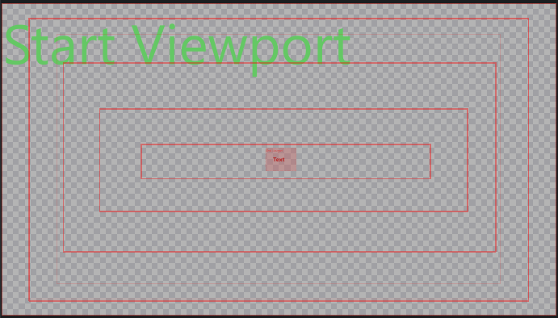
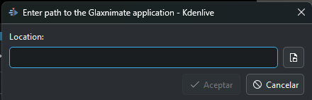
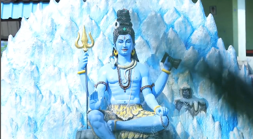
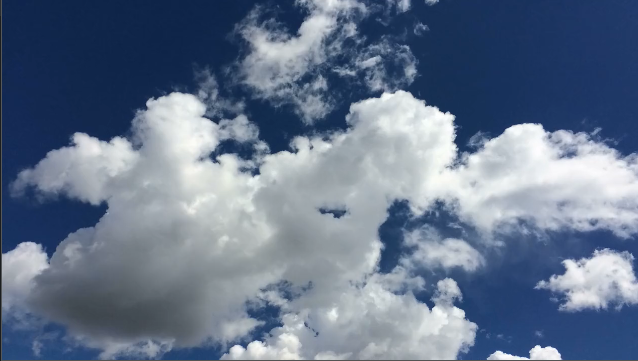
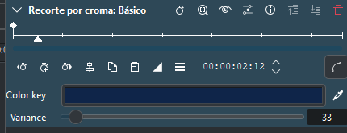
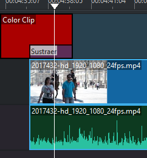

---
# Informació general del document
title: 3. Edición y Publicación. KDEnlive
lang: es
page-background: img/bg.png
linkcolor: blue

# Portada
titlepage: true
titlepage-rule-height: 2
titlepage-rule-color: eeeee4
titlepage-text-color: eeeee4
titlepage-background: img/U3c.png

# Taula de continguts
toc: true
toc-own-page: true
toc-title: Contenidos

# Capçaleres i peus
header-left: 3. Edición y Publicación. Kdenlive
header-right: Curso 2024-2025
footer-left: DGFP
footer-right: \thepage/\pageref{LastPage}

# Imatges
float-placement-figure: H
caption-justification: centering

# Llistats de codi
listings-no-page-break: true
listings-disable-line-numbers: false

header-includes:
- |
  ```{=latex}
  \usepackage{lastpage}
  \usepackage{awesomebox}
  \usepackage{caption}
  \usepackage{array}
  \usepackage{tabularx}
  \usepackage{ragged2e}
  \usepackage{multirow}
  \usepackage{xcolor}

  ```
pandoc-latex-environment:
  noteblock: [note]
  tipblock: [tip]
  warningblock: [warning]
  cautionblock: [caution]
  importantblock: [important]
...

<!-- \awesomebox[violet]{2pt}{\faRocket}{violet}{Lorem ipsum…} -->

<!-- \awesomebox[violet]{2pt}{\faRobot}{violet}{Lorem ipsum…} -->

<!-- IMATGE  -->

<!-- \textbf{greatest} -->

\vspace*{\fill}

{ height=50px }
Este documento está sujeto a una licencia creative commons que permite su difusión y uso comercial reconociendo siempre la autoría de su creador. Este documento se encuentra para ser modificado en el siguiente repositorio de github:
<!-- CANVIAR L'ENLLAÇ -->
[https://github.com/arvicenteboix/kdenliveiobs_curs](https://github.com/arvicenteboix/kdenliveiobs_curs)
\newpage


# Introducción

En este módulo vamos a centrarnos en la parte de la edición del vídeo. Aprenderemos a utilizar KDEnlive para editar vídeos de forma profesional. Además, veremos cómo exportar nuestro proyecto y cómo publicarlo en plataformas como Youtube. Recordamos que OBS es un programa centrado en la captura de vídeo o emisiones en directo, mientras que KDEnlive es un editor de vídeo. Y un editor bastante potente. Así como en OBS hemos podido ver más o menos casi todas las posibilidades que nos ofrece, en KDEnlive sólo veremos una pequeña parte de sus posibilidades. Conoceremos el funcionamiento genérico de los efectos y composiciones, pero obviamente no podremos ver todos los tipos de filtros que vienen con el programa.

Le recomendamos, si no está familiarizado un poco con los editores de video que revise el módulo I donde dispone de una introducción básica en el entorno de Kdenlive.

# Repositorios de vídeos

Antes de empezar vamos a ver una serie de repositorios de vídeos que podremos utilizar de forma gratuita para nuestras ediciones. Pueden sernos útiles para utilizarlos en nuestros proyectos.

## Pexels

Pexels es un repositorio de vídeos gratuitos que podemos utilizar en nuestros proyectos. Los vídeos son de calidad y podemos utilizarlos sin ningún problema.

[https://www.pexels.com/videos/](https://www.pexels.com/videos/)

## Pixabay

Pixabay es otro repositorio de vídeos gratuitos que podemos utilizar en nuestros proyectos. Los vídeos son de calidad y podemos utilizarlos sin ningún problema.

[https://pixabay.com/videos/](https://pixabay.com)

## Videvo

Videvo es otro repositorio de vídeos gratuitos que podemos utilizar en nuestros proyectos. Los vídeos son de calidad y podemos utilizarlos sin ningún problema.

[https://www.videvo.net/](https://www.videvo.net/)

:::caution
Recuerde que no todos estos vídeos tienen una licencia Creative Commons que nos permite utilizarlos en nuestros proyectos. Por eso siempre es recomendable leer las condiciones de la licencia antes de hacerlo. Encontrar un vídeo susceptible de ser utilizado en nuestros proyectos no es tarea sencilla.
:::

# Bandeja de proyectos

Como ya hemos comentado en la bandeja de proyectos, vemos todos los elementos que tenemos abiertos para componer nuestro proyecto. Lo habitual es que aquí añadamos vídeos, pero hay muchos otros elementos que podemos añadir aquí. Si hacemos clic en el icono de añadir podemos ver todos los elementos que podemos añadir:


## Cargar clip o carpeta.

Se trata de un elemento muy interesante puesto que podemos tener un clip creado con Kdenlive (extensión .kdenlive) y añadirlo a nuestro proyecto. Eso sí, no podemos editarlo desde nuestro proyecto, pero podemos abrir otra instancia de Kdenlive y editarlo. De esta forma podemos tener un clip creado que nos sirva de plantilla para varios proyectos, donde ya tengamos los logos de nuestro centro, o los colores corporativos, etc.


## Crear clip de color

Simplemente crea un clip de color uniforme con una duración determinada.


## Crear clip de título

Crea un clip con un título. Aunque parezca una opción muy sencilla, éste será uno de los elementos que más utilizaremos ya que nos ofrece muchísimas posibilidades a la hora de crear videotutoriales. Cuando hacemos clic en añadir clip de título nos aparece una ventana donde podemos configurar el clip:


Podemos ver distintos elementos en la ventana, podemos ver que existe un temporizador que nos permitirá cambiar la duración del clip. Encontramos diferentes elementos que hemos enumerado y pasamos a detallar a continuación:

[1] Barra de herramientas. Podemos ver que en esta barra podemos añadir distintos elementos al clip:


Por orden de izquierda a derecha, tenemos la herramienta de selección que nos sirve para mover los distintos elementos, la creación de texto, la creación de rectángulos, la creación de elipses (o círculos), añadir imágenes y un desplegable que nos permite abrir otros clips, salvar lo que estamos editando o bajarnos plantillas de la web de Kdenlive.

Al seleccionar un elemento podemos ver que las opciones de la derecha de la ventana cambian y podemos modificar ese elemento. Crear clips de título nos permitirá por ejemplo crear elementos para resaltar algo del vídeo, esto lo haremos ayudándonos del checkbox "Show background" [2], que junto con la pestaña Background, donde desplazaremos el alfa a 0 con el slider, podremos ver lo que existe en nuestro proyecto.


De modo que podremos añadir cosas que nos hagan falta. Por ejemplo, si queremos destacar un elemento de un vídeo podemos hacer un recuadro y después arrastrar el clip a la línea de tiempo:


Este mismo procedimiento podemos hacerlo añadiendo texto o buscando en un repositorio de imágenes que sean más vistosas que un simple recuadro. Si necesitamos ajustar mucho la posición de un elemento (con detalle de píxel) tenemos una serie de casillas que nos lo permiten, las hemos numerado con [4].

Si combinamos diferentes elementos y se superponen unos con otros, podemos escoger el orden en que se superponen (o z-index) con las opciones de [5].

No podemos olvidar que podemos crear un clip de título, así por ejemplo si creamos uno, podemos alinearlo ayudándonos de los botones en [3] que nos permiten alinearlo a la derecha de la pantalla, en el centro, arriba, abajo, etc.


Dos efectos interesantes que tiene el clip de títulos es el de "Typewriter effect" que hace que el texto aparezca como si estuviera siendo escrito. Y el de Animation que es algo más complejo.

Si hacemos clic en la pestaña de Animation podremos ver la siguiente pantalla:


Podemos ver que tenemos dos botones:

* Edit start viewport: Nos permite editar la posición inicial del clip. Se representa por un recuadro verde.
* Edit end viewport: Nos permite editar la posición final del clip. Se representa por un recuadro rojo.

Estos botones nos permitirán seleccionar el inicio y final del clip, existen dos parámetros que podemos modificar, la posición y el tamaño. La posición la podemos modificar mediante el recuadro que vemos en la pantalla y el tamaño con los botones que tenemos (o modificando el tamaño del recuadro).

Si hay algún recuadro seleccionado podremos verlo en la pantalla, si queremos volver a modificar algún elemento del clip debemos deseleccionar los recuadros. Una vez que tenemos definidos el inicio y el final habrá "un movimiento" de la cámara desde el inicio hasta el final.

Para entender bien el funcionamiento de la animación a modo de ejemplo os dejaremos una animación muy sencilla. En primer lugar dibujaremos lo siguiente. Simplemente son recuadros y un texto en pequeño en el centro de la pantalla:


Después el Start viewport lo dejaremos como está y en el End viewport dibujaremos un pequeño recuadro que rodee el texto:



Finalmente para darle un efecto algo más interesante podemos crear un fade-in, fade-out y alargar el final del clip para que se vea el texto algo más de tiempo. El efecto que se ve es cómo comienza la cámara en la posición inicial y se mueve hasta la posición final, hasta que se ve el texto a lo grande:


## Crear título desde plantilla

Kdenlive ofrece una serie de plantillas que podemos utilizar para crear títulos. Estas plantillas son bastante interesantes ya que nos permiten crear títulos muy llamativos sin tener que gastar mucho tiempo en su creación.

## Crear animación

Para poder utilizar esta funcionalidad será necesario que descarguemos un programa externo que permite crear animaciones vectoriales. Lo primero que nos pide es que le indiquemos dónde está el programa:



El programa lo podemos descargar de la siguiente dirección: Glaxnimate [https://glaxnimate.mattbas.org/](https://glaxnimate.mattbas.org/)
Una vez instalado el programa e indicado en Kdenlive donde está, podremos crear animaciones vectoriales que después podremos importar en Kdenlive. El programa se encuentra dentro de la carpeta bin una vez descomprimido el archivo que debemos descargarnos.

No vamos a entrar en más detalle sobre animaciones con Glaxnimate pero puede encontrar un pequeño videotutorial de ejemplo en el curso.

## Recursos online

Aquí podemos buscar directamente en algunos de los repositorios que os hemos comentado al principio.


## Generados

Tenemos una serie de animaciones estándar que podemos utilizar. Estas animaciones son muy sencillas y no tienen muchas opciones de configuración:

* Contador: se trata de una animación que nos permite crear un contador. Podemos ver que tenemos distintas opciones para configurar el contador.
* Barras de color: nos permite crear un clip con barras de color. Podemos ver que tenemos distintas opciones para configurar las barras de color.


* Ruido blanco: nos permite crear un clip con ruido blanco. Podemos ver que tenemos distintas opciones para configurar el ruido blanco.

# Efectos

Los efectos son una de las partes más importantes de la edición de vídeo. Nos permiten darle un toque distinto a nuestro vídeo. Recordemos que los efectos se aplican sobre un vídeo aunque también podemos aplicarlos sobre clips de título. Recordemos que para seleccionar un efecto debemos arrastrar y soltar el efecto sobre el clip que queremos modificar. Si sólo queremos aplicarlo sobre una sección podemos hacerlo de dos formas, debemos recortar el vídeo y aplicar el efecto sobre esa sección o hacerlo sobre la línea de tiempo del efecto como veremos.

Por lo general todos los efectos tienen una serie de parámetros que podemos modificar. Pero todos tienen un patrón similar de funcionamiento. Para entender cómo funcionan los efectos os dejaremos un ejemplo con el efecto de "Pixelizar".


## Efecto binarizar

El efecto binario es un efecto que nos permite simplificar un vídeo a su modo más binario (blanco y negro). A priori parece un efecto que puede tener poca utilidad pero en algunos casos puede resultar interesante. A mode de ejemplo vamos a partir de un vídeo de una figura de buda:



Arrastraremos y soltaremos el efecto sobre el clip, podemos ver los parámetros del efecto:


Este filtro sólo tiene un parámetro que podemos modificar (treshold value) que nos permite modificar en qué nivel de luminosidad se convierte en negro o blanco. Fijémonos (en recuadro rojo) que tenemos una línea de tiempo que se desplaza al tiempo que la línea de tiempo en el vídeo.

La línea de tiempo permite modificar los valores del efecto en el tiempo. Así por ejemplo si tenemos un valor muy bajo de treshold value el vídeo será mucho más claro (blanco). Si el valor es muy alto el vídeo será mucho más oscuro (negro). Así podemos ver cómo el vídeo va cambiando en tiempo real:

Para añadir un punto de cambio hacemos doble clic sobre la línea de tiempo y veremos que nos aparece un marcador en la línea de tiempo y podemos modificar el valor en ese punto.


El efecto no cambiará de repente de un marcador a otro sino que irá cambiando de forma progresiva. En el siguiente ejemplo podemos ver cómo a mitad de dos marcadores el Treshold value cambia automáticamente desde un marcador al mínimo a un marcador al máximo:


En el siguiente ejemplo podemos ver cómo de un mínimo pasamos a un máximo y después volvemos al mínimo:


Podremos añadir tantos marcadores como queramos y modificarlos a nuestra conveniencia. Además podemos añadir distintos efectos al mismo vídeo. Uno de los efectos que podemos conseguir con el efecto binario es utilizar la composición "Composición y transformación" con el "Compositing" Darken y podemos superponer los dos vídeos de forma que nos queda una superposición como haciendo alegoría de Buda en el desierto:


También hemos utilizado el efecto "Alpha" para que el vídeo de buda sea semitransparente. Hagamos una pequeña transición interesante.

## Pixelar cara

Como hemos visto en el ejemplo anterior, nunca me basta con utilizar un único efecto para conseguir el resultado que queremos, siempre habrá que utilizar diferentes efectos y composiciones. Uno de los ejemplos que ilustran el uso de efectos es el de pixelar una cara. Vamos a ver varios ejemplos, una cara estática y una cara en movimiento.

### Recuadro negro

Una forma muy sencilla de tapar un cara por ejemplo es con un simple recuadro negro que tape los ojos, esto podríamos conseguirlo con un clip con un recuadro negro. Si situamos la línea de tiempo en el video de la cara al añadir un clip y que muestre el fondo podremos crear un recuadro:


Es una forma sencilla pero efectiva de poder tapar una cara. Sin duda no es la que mejor queda, pero es rápida de implementar.


### Pixelar la cara con los efectos pixelize y transformación

Fijémonos en que siempre jugamos en que lo que está encima es lo que se ve y que el efecto siempre se aplica sobre todo el vídeo. Por tanto, si utilizamos el efecto Pixelize sobre un video, se pixela todo el video. Lo que podemos hacer es hacer una copia del video, ponerlo sobre lo que tenemos, recortarlo hasta que se vea sólo en la cara y aplicarle el efecto pixelize.

En primer lugar podemos ver cómo tenemos la copia en lo alto del original (botón derecho del ratón: Copiar, botón derecho pegar):


Después utilizamos el efecto "Recortar y rellenar" y lo aplicamos sobre el vídeo de arriba:


Y ahora añadimos el efecto Pixelize sobre el vídeo de arriba:


Y podemos ver que la cara está pixelada. Podemos tener el mismo caso en movimiento. Así por ejemplo y imaginemos que sólo queremos pixelar los ojos que se mueven más. Lo podremos hacer jugando con la línea del tiempo del efecto de "Recortar y rellenar", por lo que vamos ajustando diferentes marcadores a los movimientos de los ojos. Podemos ver que nuestro efecto quedaría de la siguiente forma:


Si tenemos seleccionado el efecto podremos ver con diferentes cruces rojas cuál es el movimiento que va haciendo la línea de tiempo del efecto:


## Efectos más comunes

* Fade in y fade out: para hacer que el vídeo empiece o termine de manera progresiva. Este efecto es muy útil para evitar que el vídeo comience de forma repentina o termine de manera repentina. Si hacemos clic en los bordes superior derecha o izquierda podemos aplicar directamente ese efecto.

* Transparencia: para jugar con la opacidad de los elementos en pantalla. Si solapamos dos vídeos podemos ver que el de arriba podemos hacerlo transparente para que se vea el vídeo de abajo. Podemos ajustar los elementos de transparencia con la línea de tiempo del efecto. En este caso algo que hemos hecho es supervisar unas brasas y hacemos que la transparencia del vídeo suba y baje y podemos conseguir un efecto de brasas latentes:


El resultado final es el siguiente donde las brasas van creciendo y decreciendo:


* Recortar por croma: permite eliminar el fondo de imágenes o vídeos grabados sobre un fondo de color croma. Esto es muy útil para eliminar el fondo de una imagen o vídeo y poner otro fondo. Para utilizar este efecto debemos seleccionar el color que queremos eliminar y ajustar los parámetros del efecto. En el siguiente ejemplo podemos ver cómo hemos eliminado el fondo de una imagen y puesto otro fondo. Así por ejemplo podemos partir del siguiente vídeo:



Podemos ver que el vídeo tiene un color de cielo bastante uniforme, debemos escoger el "Color key" y eliminar el fondo. Podemos ver que el resultado final es el siguiente:



Después ponemos un vídeo bajo, que nos servirá de fondo, por ejemplo, un cielo estrellado:


Y si juntamos ambos vídeos podemos ver que el resultado final es el siguiente:


Algo que habría que hacer es aplicar un efecto para sacar luminisidad a las nubes para hacerlo algo más realista.


:::tipo
Es importante para aplicar Croma que la parte a eliminar sea bastante uniforme. Si tenemos una imagen con muchos colores distintos no podremos aplicar este efecto.
:::

* Recortar bordes: en caso de que necesitemos eliminar parte de la imagen que resulte innecesaria. A diferencia del efecto que hemos utilizado antes de recortar y rellenar. Recorta la imagen sin llenar nada, por lo que la imagen que deseamos queda ampliada y centrada. Este efecto carece de línea de tiempo.

* Desenfoque gaussiano (Gaussian Blur): este es el tipo de desenfoque más utilizado y servirá para agregar un efecto de difuminado sobre cualquier elemento de imagen que queramos. Funciona al igual que el filtro de Pixelize. Es recomendable acompañarlo del efecto de recortar y rellenar para focalizar la atención en una parte de la imagen.

* Colorear (Colorize): con este efecto podremos cambiar el tono y la saturación de la imagen, para ello deberemos realizar cambios en tres parámetros básicos (tono, saturación y brillo). Tenemos muchos efectos de corrección del color y la imagen. Si acompañamos este efecto con el efecto Polvo podemos conseguir un efecto de película antigua.


* Posición y ampliación: resulta muy práctico cuando queremos hacer una ampliación en pantalla para mostrar con mayor detalle alguna parte de la misma. Podemos utilizar el recuadro rojo para ampliar una de las zonas.


* Máscara: tenemos diferentes tipos de máscaras que podemos aplicar a la imagen. La máscara funciona de forma similar al Croma pero seleccionamos el color que queremos conservar. Si partimos de una imagen en blanco y negro en forma de espiral, podemos conseguir un efecto como el siguiente:


Una máscara bastante interesante es la de rotoscopia, que nos permite seleccionar una parte de la imagen y aplicarle un efecto. Podemos seleccionar una parte para recortar esa parte de la imagen:


Dos filtros de audio bastante interesantes son:

* Limpiador de ruido (denoiser): este efecto es aplicable a aquellos elementos que cuentan con un audio que tiene ruido en el fondo y queramos limpiar.

* Volumen: como su propio nombre indica, nos permite modificar el volumen del audio del vídeo.

## Velocidad del video

Si hacemos clic con el botón derecho del ratón sobre un vídeo, otro de los efectos que tenemos es el de aumentar/disminuir la velocidad de un vídeo:


# Composiciones

Las composiciones en Kdenlive sirven para combinar clips, crear transiciones y efectos visuales. Puedes añadirlas arrastrando una composición desde el menú correspondiente. Opciones comunes incluyen “Composite and Transform” o “Wipe”. Las composiciones permiten superponer vídeos, ajustar la opacidad y personalizar transiciones. Debes tener en cuenta que en las composiciones siempre se verán afectados por lo menos dos vídeo en la línea de tiempo.

Algunas de las composiciones más comunes son:

## Wipe y similares

En todas sus variantes, wipe down, wipe up, wipe left, wipe right, vertical u horizontal Barn Door Wipe (que abre del centro), rectangular wipe, circle wipe. En la siguiente imagen podemos ver cómo se hace una transición de un vídeo a otro:


Una composición similar es Slide up que nos da un efecto similar a una puerta que se abre de arriba a abajo. Slide down nos da un efecto similar a una puerta que se abre de abajo a arriba. Slide left nos da un efecto similar a una puerta que se abre de izquierda a derecha. Slide right nos da un efecto similar a una puerta que se abre de derecha a izquierda. Barn Door Wipe nos da un efecto similar a una puerta que se abre del centro.

Push up, right, down, left nos dan un efecto similar en el que el vídeo se desplaza en la dirección que indica el nombre de la composición.

**Dissolve** nos da un efecto de disolución entre dos vídeos.

## Transformación

Éste es una de las composiciones más utilizadas ya que nos permite transformar un vídeo prácticamente de cualquier manera. Nos permite modificar el tamaño, rotarlo, cambiar el alfa (transparencia), etc. Dispone de una línea de tiempo que nos permite crear transformaciones de forma progresiva. En la siguiente imagen podemos ver cómo hemos hecho una transformación de un vídeo:


**Composición y transformación** es una composición muy similar pero nos permite aplicar más efectos a la transformación.

## Sustracción

Que nos permite restar un color a la imagen (puede ser el resto de un vídeo a otro). En la siguiente imagen podemos ver cómo hemos hecho una sustracción de un vídeo utilizando un clip de color:



## Composite

Nos permite realizar transiciones entre dos vídeo con diferentes métodos. En la siguiente imagen podemos ver cómo hemos hecho una composición entre dos vídeos:


:::tipo
Debes utilizar el punto rojo de la línea de tiempo para ajustar el efecto.
:::

# Otros

Los demás efectos de composición básicamente se centran en la corrección de la imagen o en efectos que no vamos a utilizar cuando creamos un videotutorial. Aunque pueden resultar interesantes en algún ámbito de aplicación, no vamos a utilizarlos en nuestros proyectos.

Una de las cosas a tener en cuenta con todos los efectos y composiciones que tenemos es que siempre podremos conseguir efectos similares por diferentes caminos. Ninguno de ellos es más o menos correcto, simplemente son diferentes formas de hacer lo mismo. Por eso es importante que experimentemos con todos los efectos y composiciones que tenemos para conseguir el resultado que queremos y finalmente escoger el que más nos gusta.